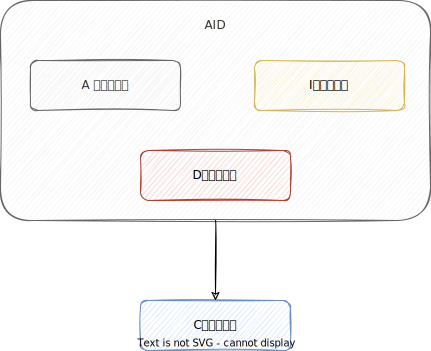
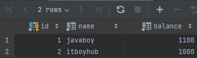

## 1. 什么是事务

事务是指作为单个逻辑工作单元执行的一系列操作，这些操作要么一起成功，要么一起失败，是一个不可分割的工作单元。  
说到事务最典型的案例就是转账了：

> 张三要给李四转账 500 块钱，这里涉及到两个操作，从张三的账户上减去 500 块钱，给李四的账户增加 500 块钱，这两个操作要么同时成功要么同时失败，如何确保他们同时成功或者同时失败呢？答案就是事务。


## 2. 事务的 ACID

事务具有四大特性：  原子性 (Atomicity)、一致性 (Consistency)、隔离性 (Isolation)、持久性 (Durability) 4 个特性，这 4 个特征也被称为 ACID 特性。  


> - 原子性：一个事务（transaction）中的所有操作，要么全部完成，要么全部不完成，不会结束在中间某个环节。事务在执行过程中发生错误，会被回滚（Rollback）到事务开始前的状态，就像这个事务从来没有执行过一样。即，事务不可分割、不可约简。
> - 一致性：指的是在数据库操作前后是完全一致的，保证数据的有效性，如果事务正常操作则系统会维持有效性，如果事务出现了错误，则回到最原始状态，也要维持其有效性，这样保证事务开始时和结束时系统处于一致状态。如在转账业务中，如果张三给李四转账成功，则保持其一致性，张三的钱减少，李四的钱增加；如果现在转账失败，则保持操作之前的一致性，即 张三的钱不会减少，李四的钱不会增加。
> - 隔离性：一个事务的执行不被其他事务干扰。即一个事务内部的操作以及使用的数据对其他并发事务来说是隔离的，并发执行的各个事务之间不能互相干扰。
> - 持久性：也称永久性，指一个事务一旦提交，它对数据库中的数据的改变就应该是永久性的，即便系统故障也不会丢失。

🌈这里要额外补充一点：**只有保证了事务的原子性、隔离性、持久性之后，一致性才能得到保障。也就是说 A、I、D 是手段，C 是目的！**  


## 3. 并发事务带来了哪些问题？

在典型的应用程序中，多个事务并发执行，经常会操作相同的数据来完成各自的任务（多个用户对同一数据进行操作）。并发虽然是必须的，但可能会导致以下问题：

- **脏读（Dirty Read）**：在 A 事务读取某一数据时，读取到了 B 事务还没提交对该数据的修改，因为 B 事务还没有提交，可能会执行回滚操作，所以 A 事务读取的数据是“脏数据”，依据“脏数据”所做的操作可能是不正确的。
- **不可重复读（Unrepeatable Read）**：在 A 事务两次读取某一数据的间隙，B 事务对该数据进行了修改并提交到数据库中，导致 A 事务两次读取到的数据不一样的这个情况，就称为不可重复度。
- **幻读（Phantom Read）**：在 A 事务两次读取某一范围内的数据行的间隙，B 事务在该范围插入了一些数据，导致 A 事务在第二次读取时多了一些原本不存在的记录，就好像发生了幻觉一样，所以称为幻读。

> **不可重复读和幻读的区别**：侧重点不一样，不可重复读的重点是修改，比如多次读取同一条记录发现其中某些列的值被修改；幻读的重点在于新增或删除，比如多次执行同一条查询语句时，每次出现的记录或增多或减少。

## 4. MySQL 的四种隔离级别

MySQL 中事务的隔离级别一共分为四种，分别如下：

- 读未提交（READ UNCOMMITTED）
- 读已提交（READ COMMITTED）
- 可重复读（REPEATABLE READ）
- 序列化（SERIALIZABLE）

> 在 MySQL 中，事务 **默认的隔离级别为可重复读（REPEATABLE READ）**。

### 4.1. READ UNCOMMITTED

> 提供了事务之间最小限度的隔离。允许读取其他事务还未提交的数据变更，可能会导致脏读、不可重复读和幻读。

### 4.2. READ COMMITTED

> 允许读取其他事务已经提交的数据变更，可以阻止脏读，但是不可重复读和幻读仍然有可能发生。

### 4.3. REPEATABLE READ

> 对同一数据的多次读取结果都是一样的，除非数据是被自身事务所修改，可以阻止脏读和不可重复读，但是幻读仍然有可能发生。

### 4.4. SERIALIABLE

>提供了事务之间最大限度的隔离。所有事务依次逐个执行，这样事务之间就完全不可能产生干扰，可以阻止脏读、不可重复读以及幻读。

---

| 隔离级别         | 脏读 | 不可重复读 | 幻读 |
| :--------------- | ---- | ---------- | ---- |
| READ UNCOMMITTED | ❌    | ❌          | ❌    |
| READ COMMITTED   | ✔️    | ❌          | ❌    |
| REPEATABLE READ  | ✔️    | ✔️          | ❌    |
| SERIALIABLE      | ✔️    | ✔️          | ✔️    |

## 5. MySQL 事务操作命令

在 MySQL 中提供了如下表中所示的几个命令，可以进行事务的处理。

| 序号 | 命令                             | 描述                                   |
| ---- | -------------------------------- | -------------------------------------- |
| 1    | SET AUTOCOMMIT = 0               | 取消自动提交处理，开启事务处理         |
| 2    | SET AUTOCOMMIT = 1               | 打开自动提交处理，关闭事务处理         |
| 3    | START TRANSACTION                | 启动事务                            |
| 4    | BEGIN                            | 启动事务，相当于执行 START TRANSACTION |
| 5    | COMMIT                           | 提交事务                               |
| 6    | ROLLBACK                         | 回滚全部操作                           |
| 7    | SAVEPOINT 事务保存点名称         | 设置事务保存点                         |
| 8    | ROLLBACK TO SAVEPOINT 保存点名称 | 回滚操作到保存点                       |

以上所有操作都是针对于一个 `session` 的，在数据库操作中把每一个连接到次数据库上的用户都称为一个 `session`。在 MySQL 中，如果要应用事务处理，则应该按照以下顺序输入命令：

1. 取消自动提交，执行 `SET AUTOCOMMIT = 0`，这样所有的更新指令并不会立刻发送到数据表中，而只存在于当前 `session`。
2. 开启事务，执行 `START TRANSACTION` 或者 `BEGIN`。
3. 编写数据库更新语句，如增加、修改、删除，可以在编写的更新语句之间记录事务的保存点，使用 `SAVEPOINT` 指令。
4. 提交事务，如果确信数据库的修改没有任何的错误，则使用 `COMMIT` 提交事务，在提交之前对数据库所有的全部操作都将保存在 `session` 中。
5. 事务回滚，如果发现执行的 SQL 语句有错误，则使用 `ROLLBACK` 命令全部撤销，或者使用 `ROLLBACK TO SAVEPOINT` 记录点，让其回滚到指定的位置。

当一个事务进行修改时，其他的 `session` 是无法看到此事务的操作状态的。即此 `session` 对数据库所有的一切修改，如果没有提交事务，则其他 `session` 是无法看到此 `session` 操作结果的。

## 6. SQL 实践

### 6.1. 环境搭建

> 演示环境：MySQL8.0.30。  

  

演示时用的数据库表：

```sql
CREATE TABLE `account`  
(  
    `id`      INT UNSIGNED NOT NULL AUTO_INCREMENT,  
    `name`    VARCHAR(40)  NOT NULL,  
    `balance` INT UNSIGNED NOT NULL DEFAULT 0,  
    PRIMARY KEY (`id`)  
) ENGINE = InnoDB DEFAULT CHARSET = utf8;
```

往 `account` 表中插入两条数据：

```sql
INSERT INTO account(`name`, `balance`) VALUES('javaboy', 1000);
INSERT INTO account(`name`, `balance`) VALUES('itboyhub', 1000);
```


表中的数据很简单，有 javaboy 和 itbothub 两个用户，两个人的账户上各有 1000 块钱。

### 6.2. 查看/修改隔离级别

通过如下 SQL 可以查看数据库实例默认的全局隔离级别和当前 session 的隔离级别。

```mysql
SELECT @@GLOBAL.transaction_isolation, @@transaction_isolation;
```

  
可以看到，默认的隔离级别为 REPEATABLE READ，全局隔离级别和当前会话隔离级别皆是如此。

通过如下 SQL 可以修改隔离级别（建议开发者在修改时只修改当前 session 隔离级别即可，不用修改全局的隔离级别）。

```mysql
SET SESSION TRANSACTION ISOLATION LEVEL READ UNCOMMITTED;
```

上面这条 SQL 表示将当前 session 的数据库隔离级别设置为 READ UNCOMMITTED，设置成功后，再次查询隔离级别，发现当前 session 的隔离级别已经变了，如下图所示：  


💡**注意：如果只是修改了当前 session 的隔离级别，则换一个 session 之后，隔离级别又会恢复到默认的隔离级别，所以我们测试时，修改当前 session 的隔离级别即可**。

### 6.3. READ UNCOMMITTED

READ UNCOMMITTED 是最低隔离级别，这种隔离级别中存在 **脏读、不可重复读以及幻读** 问题，所以我们先来看这个隔离级别，借此大家可以搞懂这三个问题到底是怎么回事。

#### 6.3.1. 脏读

一个事务读到另外一个事务还没有提交的数据，称之为脏读。具体操作如下：

1. 首先打开两个 SQL 操作窗口，假设分别为 A 和 B，在 A 窗口中输入如下几条 SQL（输入完成后不用执行）。
   
   ```mysql
   START TRANSACTION;
   UPDATE account set balance=balance+100 where name='javaboy';
   UPDATE account set balance=balance-100 where name='itboyhub';
   COMMIT;
   ```
   
2. 在 B 窗口执行如下 SQL，修改默认的事务隔离级别为 READ UNCOMMITTED，如下：
   
   ```mysql
   SET SESSION TRANSACTION ISOLATION LEVEL READ UNCOMMITTED;
   ```
   
3. 接下来在 B 窗口中输入如下 SQL，输入完成后，首先执行第一行开启事务（注意只需要执行一行即可）：
   
   ```mysql
   START TRANSACTION;
   SELECT * from account;
   COMMIT;
   ```
   
4. 接下来执行 A 窗口中的前两条 SQL，即开启事务和给 javaboy 这个账户添加 100 元。
5. 进入到 B 窗口，执行 B 窗口中的第二条查询 SQL（`SELECT * from account;`），结果如下：  
   

可以看到，A 窗口中的事务虽然还没有提交，但是在 B 窗口中已经可以查询到数据的相关变化了。这就是 **脏读** 问题。

#### 6.3.2. 不可重复读

不可重复读是指一个事务先后读取读取同一条记录，但两次读取的数据不同，称之为不可重复读。具体操作步骤如下（操作之前先将两个账户的钱都恢复成 1000）：

1. 首先打开两个查询窗口 A 和 B，并且将 B 的数据库事务隔离级别设置为 READ UNCOMMITTED。具体 SQL 参考上文，这里不再赘述。
2. 在 B 窗口中输入如下 SQL，然后只执行前两条 SQL 开启事务并查询 javaboy 的账户信息：
   
   ```mysql
   START TRANSACTION;
   SELECT * from account where name='javaboy';
   COMMIT;
   ```
   

   

3. 在 A 窗口中执行如下 SQL，给 javaboy 这个账户添加 100 块钱，如下：
   
   ```mysql
   START TRANSACTION;
   UPDATE account set balance=balance+100 where name='javaboy';
   COMMIT;
   ```
   
4. 再次回到 B 窗口，执行 B 窗口的第二条 SQL 查看 javaboy 的账户信息，结果如下：

   

javaboy 的账户信息已经发生了变化，即前后两次查看 javaboy 的账户信息不一致，这就是 **不可重复读**。

**和脏读的区别在于，脏读是看到了其他事务未提交的数据，而不可重复读是看到了其他事务已经提交的数据（由于当前 SQL 也是在事务中，因此有可能并不想看到其他事务已经提交的数据）**。

#### 6.3.3. 幻读

举一个简单的例子。在 A 窗口中输入如下 SQL：

```mysql
START TRANSACTION;
insert into account(name,balance) values('zhangsan',1000);
COMMIT;
```

然后在 B 窗口中输入如下 SQL：

```mysql
START TRANSACTION;
SELECT * from account;
delete from account where name='zhangsan';
COMMIT;
```

执行步骤如下：

1. 首先执行 B 窗口的前两行，开启一个事务，同时查询数据库中的数据，此时查询到的数据只有 javaboy 和 itboyhub。
2. 执行 A 窗口的前两行，向数据库中添加一个名为 zhangsan 的用户，注意不用提交事务。
3. 执行 B 窗口的第二行，由于脏读问题，可以查询到 zhangsan 这个用户。
4. 执行 B 窗口的第三行，去删除 name 为 zhangsan 的记录，这个时候删除就会出问题，虽然在 B 窗口中可以查询到 zhangsan，但是这条记录还没有提交，是因为脏读的原因才看到了，所以是没法删除的。此时就产生了幻觉，明明有个 zhangsan，却无法删除。

这就是 **幻读**。

看了上面的案例，大家应该明白了 **脏读**、**不可重复读** 以及 **幻读** 各自是什么含义了。

### 6.4. READ COMMITTED

和 READ UNCOMMITTED 相比，**READ COMMITTED 主要解决了脏读的问题，对于不可重复读和幻读问题则未解决**。

将事务的隔离级别改为 `READ COMMITTED` 之后，重复上面关于脏读案例的测试，发现已经不存在脏读问题了；重复上面关于不可重复读案例的测试，发现不可重复读问题依然存在。  
上面那个案例已经不适用于幻读的测试，我们换一个幻读的测试案例。  
还是两个窗口 A 和 B，将 B 窗口的隔离级别改为 `READ COMMITTED`，然后在 A 窗口输入如下测试 SQL：

```mysql
START TRANSACTION;
insert into account(name,balance) values('zhangsan',1000);
COMMIT;
```

在 B 窗口输入如下测试 SQL：

```mysql
START TRANSACTION;
SELECT * from account;
insert into account(name,balance) values('zhangsan',1000);
COMMIT;
```

测试方式如下：

1. 首先执行 B 窗口的前两行 SQL，开启事务并查询数据，此时查到的只有 javaboy 和 itboyhub 两个账户。
2. 执行 A 窗口的前两行 SQL，开启事务并插入一条记录，但是不提交事务。
3. 执行 B 窗口的第二行 SQL，由于现在已经没有了脏读问题，所以查询不到 A 窗口中添加的数据。
4. 执行 B 窗口的第三行 SQL，由于 name 字段唯一，因此这里会无法插入（**一直等待 A 窗口提交事务，A 窗口提交事务之后则会报 `Duplicate entry 'zhangsan' for key 'account.name'` 的错误；如果 A 窗口一直不提交事务，则会报等待超时的错误**）。此时就会产生幻觉了，明明没有 zhangsan 这个账户，却无法插入 zhangsan。

### 6.5. REPEATABLE READ

和 READ COMMITTED 相比，**REPEATABLE READ 进一步解决了不可重复读的问题，但是幻读则未解决**。  
REPEATABLE READ 中关于幻读的测试与上一小节基本一致，不同的是第二步中执行完插入 SQL 后记得提交事务。  
由于 REPEATABLE READ 已经解决了不可重复读，因此第二步即使提交了事务，第三步也查不到已经提交的数据，第四步继续插入就会报 `Duplicate entry 'zhangsan' for key 'account.name'` 的错误。  
💡**注意，REPEATABLE READ 也是 InnoDB 引擎的默认数据库事务隔离级别**。

### 6.6. SERIALIZABLE

SERIALIZABLE 提供了事务之间最大限度的隔离，在这种隔离级别中，**事务一个接一个顺序的执行，不会发生脏读、不可重复读以及幻读的问题，最为安全**。  
如果设置当前事务隔离级别为 SERIALIZABLE，那么此时开启事务时，就会阻塞，必须等当前事务提交了，其他事务才能开启，因此前面的脏读、不可重复读以及幻读的问题在这里都不会发生。
