## 1、Mybatis 简介

>  
> - MyBatis 是一款优秀的持久层框架
> - 它支持自定义 SQL、存储过程以及高级映射。
> - MyBatis 免除了几乎所有的 JDBC 代码以及设置参数和获取结果集的工作。
> - MyBatis 可以通过简单的 XML 或注解来配置和映射原始类型、接口和 Java POJO（Plain Old Java Objects，普通老式 Java 对象）为数据库中的记录。
> 

### 1.1、功能架构

Mybatis 的功能架构分为三层：

- **API 接口层**：提供给外部使用的接口 API，开发人员通过这些本地 API 来操纵数据库。接口层一接收到调用请求就会调用数据处理层来完成具体的数据处理；
- **数据处理层**：负责具体的 SQL 查找、SQL 解析、SQL 执行和执行结果映射处理等。它主要的目的是根据调用的请求完成一次数据库操作；
- **基础支撑层**：负责最基础的功能支撑，包括连接管理、事务管理、配置加载和缓存处理，这些都是共用的东西，将它们抽取出来作为最基础的组件。为上层的数据处理层提供最基础的支撑。

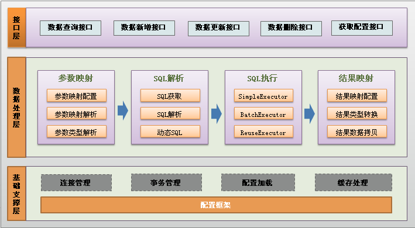

说明：

- **加载配置**：配置来源于两个地方，一处是配置文件，一处是 Java 代码的注解，将 SQL 的配置信息加载成为一个个 MappedStatement 对象（包括了传入参数映射配置、执行的 sql 语句、结果映射配置），存储在内存中；
- **SQL 解析**：当 API 接口层接收到调用请求时，会接收到传入 SQL 的 ID 和传入对象（可以是 Map、JavaBean 或者基本数据类型），Mybatis 会根据 SQL 的 ID 找到对应的 MappedStatement，然后根据传入参数对象对 MappedStatement 进行解析，解析后可以得到最终要执行的 SQL 语句和参数；
- **SQL 执行**：将最终得到的 SQL 和参数拿到数据库进行执行，得到操作数据库的结果；
- **结果映射**：将操作数据库的结果按照映射配置进行转换，可以转换成 Map、JavaBean 或者基本数据类型，并将最终结果返回。

### 1.2、Mybatis 的优点

- **简单易学**：本身就很小且简单。没有任何第三方依赖，最简单的使用只需要一个 Jar 包 + 几个 sql 映射文件，通过文档和源代码，可以比较容易的掌握它的设计思路和实现；
- **灵活**：Mybatis 不会对应用程序或者数据库的现有设计强加任何影响。sql 写在 xml 中，便于统一管理和优化。通过 sql 语句可以满足对数据库的所有操作；
- **解除 sql 与程序代码的耦合**：通过提供 dao 层，将业务逻辑和数据访问逻辑分离，使系统的设计更清晰，更易维护，更易单元测试。sql 和代码的分离，提高了可维护性；
- 提供映射标签，支持对象与数据库的 orm 字段关系映射；
- 提供对象关系映射标签，支持对象关系组建维护；
- 提供 xml 标签，支持编写动态 sql。

## 2、第一个 Mybatis 程序📌

思路：数据库建表 --> 导入 Mybatis 等依赖 --> 配置数据库驱动 --> 编写代码 --> 测试

### 2.1、创建数据库表与测试数据

```sql
create database `mybatis`;
use `mybatis`;

create table `user`(
  `id` int(20) primary key,
  `name` varchar(30) not null default '',
  `pwd` varchar(30) not null default ''
)engine=innodb default charset=utf8;

insert into `user` values(1, 'xiaoming', '123456'),
(2, 'xiaorang', '123456'),
(3, 'xiaowang', '123456'),
(4, 'xiaohong', '123456');
```

### 2.2、导入依赖：

```xml
<properties>
    <project.version>1.0-SNAPSHOT</project.version>
    <mysql.version>5.1.49</mysql.version>
    <mybatis.version>3.5.7</mybatis.version>
    <junit.version>4.13.2</junit.version>
    <lombok.version>1.18.22</lombok.version>
    <slf4j.version>1.7.32</slf4j.version>
    <slf4j-log4j12.version>1.7.25</slf4j-log4j12.version>
    <log4j.version>1.2.17</log4j.version>
</properties>
```

```xml
<dependencies>
    <dependency>
        <groupId>mysql</groupId>
        <artifactId>mysql-connector-java</artifactId>
        <version>${mysql.version}</version>
    </dependency>
    <dependency>
        <groupId>org.mybatis</groupId>
        <artifactId>mybatis</artifactId>
        <version>${mybatis.version}</version>
    </dependency>
    <dependency>
        <groupId>junit</groupId>
        <artifactId>junit</artifactId>
        <version>${junit.version}</version>
    </dependency>
    <dependency>
        <groupId>org.projectlombok</groupId>
        <artifactId>lombok</artifactId>
        <version>${lombok.version}</version>
    </dependency>
    <dependency>
        <groupId>log4j</groupId>
        <artifactId>log4j</artifactId>
        <version>${log4j.version}</version>
    </dependency>
</dependencies>
```

### 2.3、mybatis 核心配置文件

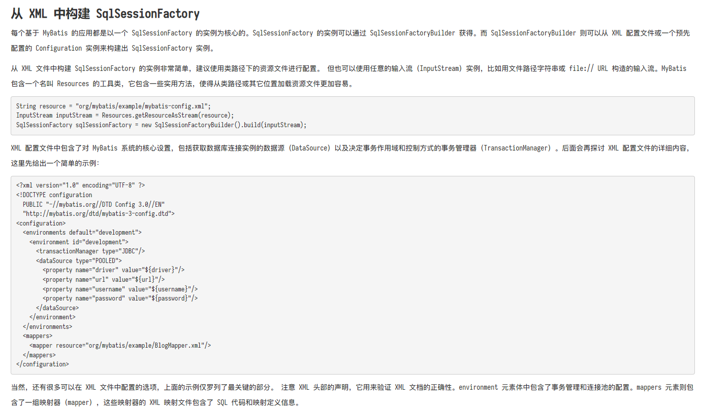

Mybatis 的核心配置文件 `mybatis-config.xml`，包括获取数据库连接实例的数据源（DataSource）以及决定事务作用域和控制方式的事务管理器（TransactionManager）。当然还有很多可以在 xml 文件中配置的 [选项](https://mybatis.net.cn/configuration.html)，上面的示例仅仅罗列了最关键的部分。注意 xml 头部的声明，它用来验证 xml 文档的正确性。envrioment 元素体中包含了事务管理器和连接池的配置。mappers 元素则包含了一组映射器（mapper）,这些映射器的 xml 映射文件包含了 SQL 代码和映射定义信息。

```xml
<?xml version="1.0" encoding="UTF-8" ?>
<!DOCTYPE configuration
        PUBLIC "-//mybatis.org//DTD Config 3.0//EN"
        "http://mybatis.org/dtd/mybatis-3-config.dtd">
<configuration>
    <environments default="development">
        <environment id="development">
            <transactionManager type="JDBC"/>
            <dataSource type="POOLED">
                <property name="driver" value="com.mysql.jdbc.Driver"/>
                <property name="url" value="jdbc:mysql://120.78.177.161:3306/mybatis?useSSL=false&amp;useUnicode=true&amp;characterEncoding=utf-8&amp;"/>
                <property name="username" value="root"/>
                <property name="password" value="123456"/>
            </dataSource>
        </environment>
    </environments>
    
    <mappers>
        <!--        <mapper resource="top/xiaorang/mybatis/dao/UserMapper.xml"/>-->
        <!--        <mapper class="top.xiaorang.mybatis.dao.UserMapper" />-->
        <package name="top.xiaorang.mybatis.dao"/>
    </mappers>
</configuration>
```

### 2.4、编写代码

Mybatis 中打交道最多的是一个个 mapper，每一个 mapper 都是一个 dao 层接口的实现类，crud 操作都是通过 mapper 实例去调用的。mapper 是由 SqlSession 实例获得的，SqlSession 实例是由 SqlSessionFactory 实例获得的，而 SqlSessionFactory 实例是由 SqlSessionFactoryBuilder 实例和 Mybatis 核心配置文件获得的，关系如下图：

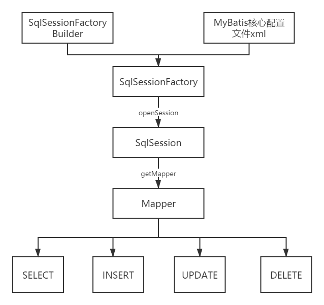

#### 2.4.1、mybatis 工具类

```java
public class MybatisUtil {
    private static SqlSessionFactory sqlSessionFactory;

    static {
        try {
            InputStream inputStream = Resources.getResourceAsStream("mybatis-config.xml");
            sqlSessionFactory = new SqlSessionFactoryBuilder().build(inputStream);
        } catch (IOException e) {
            e.printStackTrace();
        }
    }

    public static SqlSession getSqlSession() {
        return sqlSessionFactory.openSession();
    }
}
```

#### 2.4.2、实体类

```java
@Data
@NoArgsConstructor
@AllArgsConstructor
public class User {
    private Integer id;
    private String name;
    private String password;
}
```

#### 2.4.3、接口与 mapper

```java
public interface UserMapper {
    /**
     * 查询所有的用户
     *
     * @return 用户集合
     */
    List<User> selectUserList();
}
```

```xml
<?xml version="1.0" encoding="UTF-8" ?>
<!DOCTYPE mapper
        PUBLIC "-//mybatis.org//DTD Mapper 3.0//EN"
        "http://mybatis.org/dtd/mybatis-3-mapper.dtd">
<mapper namespace="top.xiaorang.mybatis.dao.UserMapper">
    <resultMap id="UserMap" type="User">
        <result column="pwd" property="password"/>
    </resultMap>
    <select id="selectUserList" resultMap="UserMap">
        select *
        from mybatis.user;
    </select>
</mapper>
```

### 2.5、测试代码

```java
public class UserMapperTest {
    private SqlSession sqlSession;
    private UserMapper userMapper;

    @Before
    public void before() {
        sqlSession = MybatisUtil.getSqlSession();
        userMapper = sqlSession.getMapper(UserMapper.class);
    }

    @Test
    public void selectUserList() {
        List<User> users = userMapper.selectUserList();
        users.forEach(System.out::println);
    }

    @After
    public void after() {
        sqlSession.commit();
        sqlSession.close();
    }
}
```

### 2.6、Mybatis 新增 Mapper 进行 CRUD 的步骤

- 创建 Pojo 实体类；
- 创建对应实体类的 dao 层接口，里面声明了针对该实体类需要执行的数据库方法，注意接口名称为 **xxxMapper**；
- 创建接口实现类，即 **xxxMapper.xml**，接口中的方法在 xml 文件中都有对应的 sql 语句，并且 **xml 文件最好与接口同包同名**！
- **在 Mybatis 核心配置文件注册该 xxxMapper.xml 文件**，即在核心配置文件中的 mappers 标签里添加对应的 mapper 子标签。

## 3、Map 传参优化和模糊查询

**使用场景**：当实体类里由很多属性，或者表里涉及很多字段时，如果还是按对象传递参数，会写很多没有用的字段，此时用 Map 参数更方便，map 中只需要放入 sql 语句中的参数所对应的 key 即可，不需要初始化完整的实例对象。

UserMapper 中的 `selectUsers` 接口：

```java
/**
  * 根据id和用户名称查询用户
  * @param params 查询条件
  * @return 用户集合
  */
List<User> selectUsers(Map<String, Object> params);
```

Mapper.xml：关键就是 `like` 后面的 `concat()` 函数

```xml
<select id="selectUsers" parameterType="map" resultType="top.xiaorang.mybatis.entity.User">
    select * from user where id = #{id} and name like concat('%', #{name}, '%')
</select>
```

`selectUsers` 接口的单元测试：

```java
@Test
public void testSelectUsers() {
    Map<String,Object> params = new HashMap<>();
    params.put("id", 1);
    params.put("name", "xiao");
    List<User> users = userMapper.selectUsers(params);
    users.forEach(System.out::println);
}
```

💡注意：

- dao 层接口里的 `selectUsers` 方法的参数类型为 map 类型，且 mapper.xml 中 `select` 标签里的 `parameterType` 的值必须也是 map 类型；
- mapper.xml 中，#{} 传参名称可以和 User 实体类的属性不一致，但是必须与单元测试里 map 中的 key 的名称一致。

## 4、Mybatis 配置解析📌

这里的配置指的是 Mybatis 核心配置文件中的配置项，Mybatis 的核心配置文件 `mybatis-config.xml` 包含了会深深影响 Mybatis 行为的设置和属性信息。配置文档的顶层结构如下：

- configuration（配置） 
   - [properties（属性）](https://mybatis.net.cn/configuration.html#properties) 
   - [settings（设置）](https://mybatis.net.cn/configuration.html#settings) 
   - [typeAliases（类型别名）](https://mybatis.net.cn/configuration.html#typeAliases) 
   - [typeHandlers（类型处理器）](https://mybatis.net.cn/configuration.html#typeHandlers) 
   - [objectFactory（对象工厂）](https://mybatis.net.cn/configuration.html#objectFactory) 
   - [plugins（插件）](https://mybatis.net.cn/configuration.html#plugins) 
   - [environments（环境配置）](https://mybatis.net.cn/configuration.html#environments) 
	  - environment（环境变量） 
		 - transactionManager（事务管理器）
		 - dataSource（数据源）
   - [databaseIdProvider（数据库厂商标识）](https://mybatis.net.cn/configuration.html#databaseIdProvider) 
   - [mappers（映射器）](https://mybatis.net.cn/configuration.html#mappers) 

目前需要掌握 `properties`、`settings`、`typeAliases`、`envrionments`、`mappers` 这几个配置。

### 4.1、envrionments(环境配置)

Mybatis 可以配置成适应多种环境，这种机制有助于将 sql 映射应用于多种数据库之中，现实情况下有多种理由需要这么做。例如，开发、测试和生产环境需要不同的配置。

如何定义多个环境？如下：

```xml
<environments default="development">
    <environment id="development">
        <transactionManager type="JDBC"/>
        <dataSource type="POOLED">
            <property name="driver" value="com.mysql.jdbc.Driver"/>
            <property name="url" value="jdbc:mysql://120.78.xxx.xxx:3306/mybatis?useSSL=false&useUnicode=true&characterEncoding=utf-8"/>
            <property name="username" value="root"/>
            <property name="password" value="123456"/>
        </dataSource>
    </environment>
    <environment id="test">
        ...
    </environment>
</environments>
```

💡注意：

- 在 `envrioments` 标签下建立多个 `envrioment` 子标签，每个子标签对应一套环境，其中 `id` 代表这套环境的名称，如果想使用某套环境，只需要在 `envrioments` 标签中的 `default` 属性后指明即可； 
- 环境可以随意命名，但是 **务必保证默认的环境 ID 要匹配其中一套环境的 ID**； 
- **尽管可以配置多个环境，但每个 SqlSessionFactory 实例只能选择一种环境**。为了指定创建哪种环境，只要将它作为可选参数传递给 SqlSessionFactoryBuilder 即可。可以接受环境配置的两个方法签名为： <br />如果忽略了环境参数，那么将会加载默认环境，如下所示：  

```java
SqlSessionFactory factory = new SqlSessionFactoryBuilder().build(reader, environment);
SqlSessionFactory factory = new SqlSessionFactoryBuilder().build(reader, environment, properties);
```

```java
SqlSessionFactory factory = new SqlSessionFactoryBuilder().build(reader);
SqlSessionFactory factory = new SqlSessionFactoryBuilder().build(reader, properties);
```

- Mybatis 默认的事务管理器是 JDBC，数据库连接池是 POOLED。 

### 4.2、properties(属性)

Mybatis 核心配置文件中 `envrioments` 标签里的环境配置，既可以想上面那样直接在核心配置文件里定义，也可以在 `properties` 元素的子元素中设置，或者从外部配置文件中读取。

```properties
driver=com.mysql.jdbc.Driver
url=jdbc:mysql://120.78.xxx.xxx:3306/mybatis?useSSL=false&useUnicode=true&characterEncoding=utf-8
username=root
password=123456
```

```xml
<properties resource="db.properties"/>
<!--    <properties>-->
<!--        <property name="driver" value="com.mysql.jdbc.Driver"/>-->
<!--        <property name="url" value="jdbc:mysql://120.78.xxx.xxx:3306/mybatis?useSSL=false&useUnicode=true&characterEncoding=utf-8"/>-->
<!--        <property name="username" value="root"/>-->
<!--        <property name="password" value="123456"/>-->
<!--    </properties>-->
```

配置好的属性可以在整个核心配置文件中用来替换需要动态配置的属性值。比如：

```xml
<environments default="development">
    <environment id="development">
        <transactionManager type="JDBC"/>
        <dataSource type="POOLED">
            <property name="driver" value="${driver}"/>
            <property name="url" value="${url}"/>
            <property name="username" value="${username}"/>
            <property name="password" value="${password}"/>
        </dataSource>
    </environment>
    <environment id="test">
        ...
    </environment>
</environments>
```

💡注意：

**如果一个属性在不止一个地方进行了配置，那么，Mybatis 将按照下面的顺序来加载**：

- 首先读取在 `properties` 元素体内指定的属性；
- 然后根据 `properties` 元素中的 `resource` 属性读取类路径下属性文件，或根据 `url` 属性指定的路径读取属性文件，并覆盖之前读取过的同名属性；
- 最后读取作为方法参数传递的属性，并覆盖之前读取过的同名属性。

因此，通过方法参数传递的属性具有最高优先级，`resource/url` 属性中指定的配置文件次之，最低优先级的则是  `properties` 元素中指定的属性。

### 4.3、typeAliases(类型别名)

类型别名可为 Java 类型设置一个缩写名字。它仅用于 XML 配置，意在降低冗余的全限定类名书写。例如：

```xml
<typeAliases>
  <typeAlias alias="Author" type="domain.blog.Author"/>
  <typeAlias alias="Blog" type="domain.blog.Blog"/>
  <typeAlias alias="Comment" type="domain.blog.Comment"/>
  <typeAlias alias="Post" type="domain.blog.Post"/>
  <typeAlias alias="Section" type="domain.blog.Section"/>
  <typeAlias alias="Tag" type="domain.blog.Tag"/>
</typeAliases>
```

当这样配置时，`Blog` 可以用在任何使用 `domain.blog.Blog` 的地方。

当 pojo 包下的实体类较多时，推荐使用包扫描的方式。比如：

```xml
<typeAliases>
  <package name="domain.blog"/>
</typeAliases>
```

每一个在包 `domain.blog` 中的 Java Bean，在没有注解的情况下，会使用 Bean 的首字母小写的非限定类名来作为它的别名。比如 `domain.blog.Author` 的别名为 `author` ；若有注解，则别名优先为注解值。如：

```java
@Alias("author")
public class Author {
    ...
}
```

下面是一些常见的 Java 类型内建的类型别名。它们都是不区分大小写的，注意，为了应对原始类型的命名重复，采取了特殊的命名风格。

| 别名 | 映射的类型 |
| --- | --- |
| _byte | byte |
| _long | long |
| _short | short |
| _int | int |
| _integer | int |
| _double | double |
| _float | float |
| _boolean | boolean |
| string | String |
| byte | Byte |
| long | Long |
| short | Short |
| int | Integer |
| integer | Integer |
| double | Double |
| float | Float |
| boolean | Boolean |
| date | Date |
| decimal | BigDecimal |
| bigdecimal | BigDecimal |
| object | Object |
| map | Map |
| hashmap | HashMap |
| list | List |
| arraylist | ArrayList |
| collection | Collection |
| iterator | Iterator |

### 4.4、mappers(映射器)

需要在 Mybatis 的核心配置文件里，告诉 Myabtis 到哪里去找映射文件。你可以使用相对于类路径的资源引用，或完全限定资源定位符（包括 file:///形式的 URL），或类名和包名等。例如：

```xml
<!-- 使用相对于类路径的资源引用 -->
<mappers>
  <mapper resource="org/mybatis/builder/AuthorMapper.xml"/>
  <mapper resource="org/mybatis/builder/BlogMapper.xml"/>
  <mapper resource="org/mybatis/builder/PostMapper.xml"/>
</mappers>
```

```xml
<!-- 使用完全限定资源定位符（URL） -->
<mappers>
  <mapper url="file:///var/mappers/AuthorMapper.xml"/>
  <mapper url="file:///var/mappers/BlogMapper.xml"/>
  <mapper url="file:///var/mappers/PostMapper.xml"/>
</mappers>
```

```xml
<!-- 使用映射器接口实现类的完全限定类名 -->
<mappers>
  <mapper class="org.mybatis.builder.AuthorMapper"/>
  <mapper class="org.mybatis.builder.BlogMapper"/>
  <mapper class="org.mybatis.builder.PostMapper"/>
</mappers>
```

```xml
<!-- 将包内的映射器接口实现全部注册为映射器 -->
<mappers>
  <package name="org.mybatis.builder"/>
</mappers>
```

💡注意：

- 第二种方式不推荐使用
- 第三种与第四种方式使用的前提是：xxxMapper 接口与 xxxMapper.xml 文件必须在一个包下。

### 4.5、settings(设置)

Mybatis 中极为重要的调整设置，它们会改变 Mybatis 的运行时行为。下面描述了设置中各项设置的含义、默认值等。

| 设置名 | 描述 | 有效值 | 默认值 |
| --- | --- | --- | --- |
| cacheEnabled | 全局性地开启或关闭所有映射器配置文件中已配置的任何缓存。 | true &#124; false | true |
| lazyLoadingEnabled | 延迟加载的全局开关。当开启时，所有关联对象都会延迟加载。 特定关联关系中可通过设置 `fetchType`<br /> 属性来覆盖该项的开关状态。 | true &#124; false | false |
| mapUnderscoreToCamelCase | 是否开启驼峰命名自动映射，即从经典数据库列名 A_COLUMN 映射到经典 Java 属性名 aColumn。 | true &#124; false | False |
| logImpl | 指定 MyBatis 所用日志的具体实现，未指定时将自动查找。 | SLF4J &#124; LOG4J &#124; LOG4J2 &#124; JDK_LOGGING &#124; COMMONS_LOGGING &#124; STDOUT_LOGGING &#124; NO_LOGGING | 未设置 |

## 5、作用域与生命周期📌

作用域和生命周期类别是至关重要的，因为错误的使用会导致非常严重的并发问题。

### 5.1、SqlSessionFactoryBuilder

这个 **类可以被实例化、使用和丢弃，一旦创建了 SqlSeesionFactory，就不再需要它了**。因此 SqlSessionFactoryBuilder 实例的 **最佳作用域是方法作用域（也就是局部方法变量）**。你可以重用 SqlSessionFactoryBuilder 来创建多个 SqlSeesionFactory 实例，但最好还是不要一直保留它，以保证所有的 XML 解析资源可以被释放给更重要的事情。

### 5.2、SqlSessionFactory

SqlSessionFactory **一旦被创建就应该在应用的运行期间一直存在，没有任何理由丢弃它或重新创建另一个实例**。使用 SqlSessionFactory 的最佳事件是在应用运行期间不要重复创建多次，多次创建 SqlSessionFactory 被视为一种代码 " 坏习惯 "。因此 SqlSessionFactory 的 **最佳作用域是应用作用域**。有很多办法可以做到，最简单的就是使用 **单例模式或者静态单例模式**。

### 5.3、SqlSession

每个线程都应该有它自己的 SqlSession 实例。**SqlSession 的实例不是线程安全的，因此是不能被共享的，所以它的最佳作用域是请求或方法作用域**。绝对不能将 SqlSession 实例的引用放在一个类的静态域，甚至一个类的实例变量也不行。也绝不能将 SqlSession 实例的引用放在任何类型的托管作用域中，比如 Servlet 框架中的 HttpSession。如果你

现在正在使用一种 Web 框架，考虑将 SqlSession 放在一个和 Http 请求相似的作用域中。**换句话说，每次收到 Http 请求，就可以打开一个 SqlSession，返回一个响应后，就关闭它**。这个 **关闭操作很重要，为了确保每次都能执行关闭操作，你应该把这个关闭操作放到 finally 块中**。

下面的示例就是一个 **确保 SqlSession 关闭的标准模式**：

```java
try (SqlSession session = sqlSessionFactory.openSession()) {
  // 你的应用逻辑代码
}
```

在所有的代码中都遵循这种使用模式，可以保证所有数据库资源都能被正确的关闭。

## 6、ResultMap(结果集映射)📌

`resultMap` 元素是 Mybatis 中最重要最强大的元素**。它可以让你从 90% 的 JDBC **`**ResultSets**`** 数据提取代码中解放出来**，并在一些情形下允许你进行一些 JDBC 不支持的操作。实际上，在为一些比如连接的复杂语句编写映射代码的时候，一份 `resultMap` 能够替代实现同等功能的数千行代码。ResultMap 的设计思想是，对简单的语句做到零配置，对于复杂一点的语句，只需要描述语句之间的关系就行了。

### 6.1、概念与基本使用

之前你已经见过简单映射语句的示例，它们没有显式指定 `resultMap`。比如：

```java
<select id="selectUsers" resultType="map">
  select id, username, hashedPassword
  from some_table
  where id = #{id}
</select>
```

上述语句只是简单地将所有的列映射到 `HashMap` 的键上，这由 `resultType` 属性指定。虽然大部分情况下都够用，但是 HashMap 并不是一个很好的领域模型。你的程序更可能会使用 JavaBean 或 POJO 作为领域模型。Mybatis 对两者都提供了支持。看看下面这个 JavaBean：

```java
@Data
public class User {
  private int id;
  private String username;
  private String hashedPassword;
}
```

基于 JavaBean 的规范，上面这个类的 3 个属性：id，username 和 hashedPassword。这些属性会对应到 select 语句中的列名。

这样的一个 JavaBean 可以被映射到 `ResultSet`，就像映射到 `HashMap` 一样简单。

```xml
<select id="selectUsers" resultType="User">
  select id, username, hashedPassword
  from some_table
  where id = #{id}
</select>
```

在这些情况下，Mybatis 会在幕后自动创建一个 `ResultMap`，再根据属性名来映射列到 JavaBean 的属性上。如果列名和属性名不能匹配上，可以在 select 语句中设置列别名来完成匹配。比如：

```xml
<select id="selectUsers" resultType="User">
  select
    user_id             as "id",
    user_name           as "userName",
    hashed_password     as "hashedPassword"
  from some_table
  where id = #{id}
</select>
```

在学习了上面的知识后，你会发现上面的例子没有一个需要显示配置 `ResultMap`，这就是 `ResultMap` 的优秀之处 -- 你完全不用显示地配置它们。显示使用外部的 `resultMap` 会怎样，这也是解决列名不匹配的另外一种方式。

```xml
<resultMap id="userResultMap" type="User">
  <id property="id" column="user_id" />
  <result property="username" column="user_name"/>
  <result property="password" column="hashed_password"/>
</resultMap>
```

然后再引用它的语句中设置 `resultMap` 属性就行了（注意我们去掉了 `resultType` 属性）。比如：

```xml
<select id="selectUsers" resultMap="userResultMap">
  select user_id, user_name, hashed_password
  from some_table
  where id = #{id}
</select>
```

- `id`：一个 ID 结果；标记出作为 ID 的结果可以帮助提高整体性能；
- `result`：返回 POJO 类的属性和表中字段的对应关系。 
   - property：POJO 类的属性名
   - column：POJO 类的属性名在表中对应的字段
- `assciation`：一个复杂类型的关联，比如 POJO 里的一个属性也是 POJO，嵌套。 
   - property：POJO 类的属性名
   - javaType：属性的类型
   - select：在子查询里，内部查询语句的 id；（不推荐）
- `collection`：一个复杂类型的集合，比如一个 List，里面的元素是 POJO 类型 
   - property：集合的属性名
   - ofType：集合里的 POJO 类名
   - 在 collection 里还可以有 result 标签，用于描述集合中元素类属性与字段名的对应关系

### 6.2、一对多

场景：一个班级里多个学生仅有一个班主任，站在老师的角度而言，老师跟学生的关系就是 " 一对多 "。

**由于联表查询简单易理解，今后这种一对多、多对一的问题都建议使用联表查询的方式（即结果集嵌套的方式）。**

#### 6.2.1、环境搭建

```java
@Data
public class Teacher {
    private Integer id;
    private String name;
    /**
     * 一对多和多对一只选一种方式维护即可，这里是测试，所以才在teacher中维护students集合的同时，又在student中维护teacher
     */
    private List<Student> students;
}
```

```java
@Data
public class Student {
    private Integer id;
    private String name;
    private Teacher teacher;
}
```

#### 6.2.2、sql 语句查询

```java
public interface TeacherMapper {
    /**
     * 查询所有的老师
     *
     * @return 老师集合
     */
    List<Teacher> selectTeacherList();
}
```

```xml
<!-- 结果集嵌套的方式（推荐使用，查询嵌套的方式不易理解，就不列举了） -->
<resultMap id="TeacherStudentMap" type="teacher">
    <result property="id" column="tid" />
    <result property="name" column="tname" />
    <collection property="students" ofType="student">
        <result property="id" column="sid" />
        <result property="name" column="sname" />
    </collection>
</resultMap>
<select id="selectTeacherList" resultMap="TeacherStudentMap">
    select t.id tid, t.name tname, s.id sid, s.name sname
    from mybatis.teacher t, student s where t.id = s.tid;
</select>
```

#### 6.2.3、测试代码

```java
@Test
public void testSelectTeacherList() {
    List<Teacher> teachers = teacherMapper.selectTeacherList();
    teachers.forEach(System.out::println);
}
```

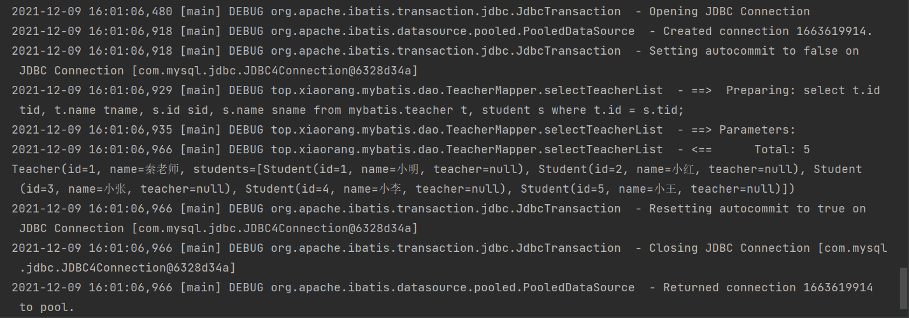

### 6.3、多对一

场景：一个班级里多个学生仅有一个班主任，站在学生的角度而言，学生跟老师的关系就是 " 多对一 "。

其中实体类还是上面一样的实体类。

#### 6.3.1、sql 语句查询

```java
/**
     * 查询所有的学生
     * @return 学生集合
     */
    List<Student> selectStudents();
```

```xml
<!-- 结果集嵌套的方式 -->
<resultMap id="StudentTeacherMap" type="Student">
    <result property="id" column="sid" />
    <result property="name" column="sname" />
    <association property="teacher" javaType="Teacher">
        <result property="id" column="tid" />
        <result property="name" column="tname" />
    </association>
</resultMap>

<select id="selectStudents" resultMap="StudentTeacherMap">
    select s.id as sid, s.name as sname, t.id as tid, t.name as tname from student s, teacher t where s.tid = t.id
</select>
```

#### 6.3.2、测试代码

```java
@Test
    public void testSelectStudents() {
        List<Student> students = studentMapper.selectStudents();
        students.forEach(System.out::println);
    }
```

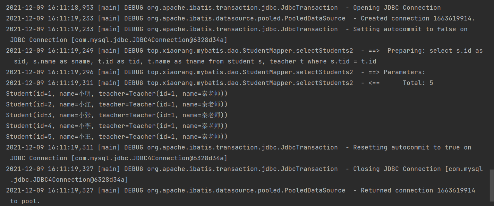

## 7、日志

Mybatis 通过使用内置的日志工厂提供日志功能。内置日志工厂将会把日志工作委托给下面的实现之一：

日志框架有很多，常见的有：

- [Slf4j](https://link.zhihu.com/?target=http%3A//www.slf4j.org/) 
- [Apache Commons Logging](https://link.zhihu.com/?target=http%3A//commons.apache.org/proper/commons-logging/) 
- Log4j2 
- Log4j 
- JDK logging 

Mybatis 内置日志工厂会基于运行时检测信息选择日志委托实现。它会（按上面罗列的顺序）使用第一个查找到的实现。当没有找到这些实现时，将会禁用日志功能。

不少应用服务器（如 Tomcat 和 WebShpere）的类路径中已经包含 Commons Logging。注意，在这种配置环境下，Mybatis 会把 Commons Logging 作为日志工具。如果你的应用部署在一个类路径已经包含 Commons Logging 的环境中，而你又想使用其他日志实现，这时你可以通过在 Mybatis 配置文件 mybatis-config.xml 里面添加一项 setting 来选择其他日志实现。

```xml
<configuration>
  <settings>
    ...
    <setting name="logImpl" value="LOG4J"/>
    ...
  </settings>
</configuration>
```

Mybatis 中支持的日志框架如下：

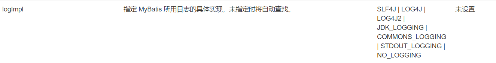

### 7.1、日志门面

前两种日志门面，后三种是日志框架，每一种日志框架都有自己单独的 API，要使用对应的框架就要使用其对应的 API，这就大大的增加应用程序代码与日志框架的耦合性。

日志门面框架（比如 SLF4J）它不是一个真正的日志实现，而是一个 **抽象层**，它 **允许你在后台对应任意一个日志实现**，日志门面框架提供了统一的 API，兼容了后台对接的日志框架的 API，因此，对于应用程序来说，无论底层的日志框架怎么变，应用程序不需要修改任意一行代码，就可以直接上线。


### 7.2、日志级别

Java 的日志框架一般会提供以下日志级别，日志级别由高到低的顺序如下：

- fatal：严重的，造成服务中断的错误
- error：其他错误运行期错误
- warn：警告信息，如程序员调用了一个即将作废的接口，接口的不当使用，运行状态不是期望的但可以继续处理等
- info：有意义的事件信息，如程序启动，关闭事件，收到请求事件等
- debug：调试信息，可记录详细的业务处理到哪一步了，以及当前的变量状态
- trace：更详细的跟踪信息

**日志只能打印大于等于日志级别的日志信息，比如日志级别设置成 info，则 error、warn、info 级别的日志都可以被打印出来，而 debug 级别的日志则打印不出来。**

日志级别缺省时默认设置的 info 级别；debug、trace 级别的日志在生产环境一般不会输出，在开发和测试环境可以通过不同的日志配置文件打开 debug 级别。

### 7.3、Log4j

- Log4j 是 [Apache](https://baike.baidu.com/item/Apache/8512995) 的一个开源项目，通过使用 Log4j，我们可以控制日志信息输送的目的地是 [控制台](https://baike.baidu.com/item/%E6%8E%A7%E5%88%B6%E5%8F%B0/2438626)、文件、[GUI](https://baike.baidu.com/item/GUI) 组件，甚至是套接口服务器、[NT](https://baike.baidu.com/item/NT/3443842) 的事件记录器、[UNIX](https://baike.baidu.com/item/UNIX) [Syslog](https://baike.baidu.com/item/Syslog)[守护进程](https://baike.baidu.com/item/%E5%AE%88%E6%8A%A4%E8%BF%9B%E7%A8%8B/966835) 等； 
- 我们也可以控制每一条日志的输出格式； 
- 通过定义每一条日志信息的级别，我们能够更加细致地控制日志的生成过程。 
- 最令人感兴趣的就是，这些可以通过一个 [配置文件](https://baike.baidu.com/item/%E9%85%8D%E7%BD%AE%E6%96%87%E4%BB%B6/286550) 来灵活地进行配置，而不需要修改应用的代码。 

Log4j 已经在 2012 年就已经停止维护了，取而代之的是 [Log4j2](https://logging.apache.org/log4j/2.x/manual/index.html)。

### 7.4、日志配置

具体配置步骤取决于日志实现。接下来以 Log4j 为例。配置日志功能步骤如下

1. 添加依赖  

```xml
<dependency>
    <groupId>log4j</groupId>
    <artifactId>log4j</artifactId>
    <version>1.2.17</version>
</dependency>
```

2. 在应用的类路径中创建一个名为 `log4j.properties` 的文件，文件内容如下：  

```properties
#Log4J配置文件实现了输出到控制台、文件
log4j.rootLogger=DEBUG,CONSOLE,FILE
log4j.addivity.org.apache=true

#应用于控制台
log4j.appender.CONSOLE=org.apache.log4j.ConsoleAppender
log4j.appender.CONSOLE.Threshold=DEBUG
log4j.appender.CONSOLE.Target=System.out
log4j.appender.CONSOLE.layout=org.apache.log4j.PatternLayout
log4j.appender.CONSOLE.layout.ConversionPattern=%d{yyyyMMdd-HH:mm:ss} %t %c %m%n

#应用于文件
log4j.appender.FILE=org.apache.log4j.FileAppender
log4j.appender.FILE.File=./log/log4j_test.log
log4j.appender.FILE.Append=false
log4j.appender.FILE.Threshold=DEBUG
log4j.appender.FILE.layout=org.apache.log4j.PatternLayout
log4j.appender.FILE.layout.ConversionPattern=%d{yyyyMMdd-HH:mm:ss} %t %c %m%n

# 日志输出级别
log4j.logger.org.mybatis=DEBUG
log4j.logger.sql=DEBUG
log4j.logger.java.sql.Statement=DEBUG
log4j.logger.java.sql=ResultSet=DEBUG
log4j.logger.java.sql.PreparedStatement=DEBUG
```

3. mybatis 配置以 log4j 作为日志框架  

```xml
<settings>
  <setting name="logImpl" value="LOG4J"/>
</settings>
```

4. 在代码中打印日志 <br />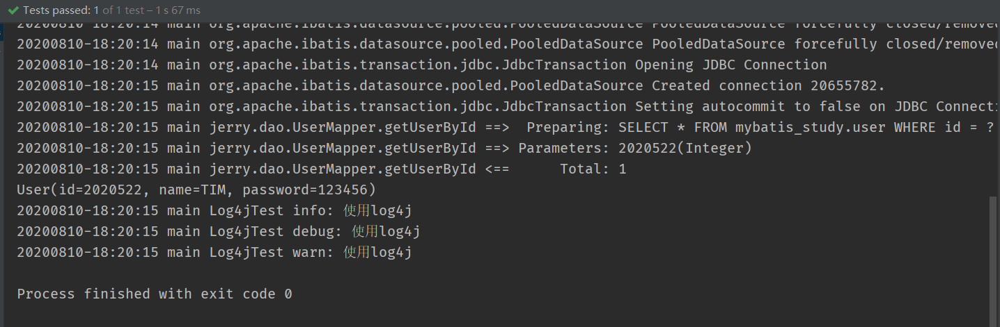 

```java
public class Log4jTest {
    @Test
    public void testLog4j()
    {
        Logger logger = Logger.getLogger(Log4jTest.class);

        SqlSession sqlSession = MyBatisUtils.getSqlSession();
        UserMapper userMapper = sqlSession.getMapper(UserMapper.class);

        int id = 2020522;
        User user = userMapper.getUserById(id);

        System.out.println(user);
        logger.info("info: 使用log4j");
        logger.debug("debug: 使用log4j");
        logger.warn("warn: 使用log4j");
        
        sqlSession.close();
    }
}
```

## 8、动态 SQL📌

动态 SQL 是 Mybatis 的强大特性之一。如果你使用过 JDBC 或 其他类似的框架，你应该能理解 **根据不同条件拼接 SQL 语句** 有多痛苦，例如拼接时要确保不能忘记添加必要的空格。还要注意去掉列表最后一个列名的逗号。利用动态 SQL，可以彻底摆脱这种痛苦。

Mybatis 中支持的动态 SQL 元素：

- if
- choose(when，otherwise)
- trim(where，set)
- foreach

### 8.1、环境搭建

#### 8.1.1、创建数据库表与测试数据

```sql
CREATE TABLE `blog`
(
    `id`          VARCHAR(50)  NOT NULL COMMENT '博客id',
    `title`       VARCHAR(100) NOT NULL COMMENT '博客标题',
    `author`      VARCHAR(30)  NOT NULL COMMENT '博客作者',
    `create_time` DATETIME     NOT NULL COMMENT '创建时间',
    `views`       INT(30)      NOT NULL COMMENT '浏览量'
) ENGINE = INNODB
  DEFAULT CHARSET = utf8;

insert into blog
values ('95231459-b135-9ca3-386a-24992d5e2c72', 'java如此简单', 'xiaorang', now(), 25),
       ('69824e2e-8048-0bf4-3477-0e04299be4a9', 'js如此简单', 'xiaoming', now(), 1000),
       ('0fd1ef61-03f0-6459-561d-a3bb70edca48', 'vue如此简单', 'xiaohong', now(), 9999),
       ('c8eac9e8-dd38-8d02-367c-701077bef4a5', 'spring源码解读', 'xiaoxing', now(), 9999);
```

#### 8.1.2、实体类以及 Mapper 接口

```java
@Data
public class Blog implements Serializable {
    private String id;
    private String title;
    private String author;
    private Date createTime;
    private int views;
}
```

```java
public interface BlogMapper {
    
}
```

```xml
<?xml version="1.0" encoding="UTF-8" ?>
<!DOCTYPE mapper
        PUBLIC "-//mybatis.org//DTD Mapper 3.0//EN"
        "http://mybatis.org/dtd/mybatis-3-mapper.dtd">
<mapper namespace="top.xiaorang.mybatis.dao.BlogMapper">
   
</mapper>
```

### 8.2、IF 标签

查询 blog 表中记录时，有这样一个场景：

- 当不传入 title 和 author 查询参数时，将 blog 表中所有记录返回；
- 当传入 title 或者 author 查询参数时，按照查询参数 title 或者 author 进行匹配查找。

如果直接写 sql 语句，会发现以上场景不能直接使用 sql 语句去写，此时动态 sql 中的 IF 标签就排上用场了。

```java
public interface BlogMapper {
    /**
     * 根据条件查询所有的博客列表
     *
     * @param params 查询条件
     * @return 博客列表
     */
    List<Blog> findBlogs(Map<String, Object> params);
}
```

```xml
<?xml version="1.0" encoding="UTF-8" ?>
<!DOCTYPE mapper
        PUBLIC "-//mybatis.org//DTD Mapper 3.0//EN"
        "http://mybatis.org/dtd/mybatis-3-mapper.dtd">
<mapper namespace="top.xiaorang.mybatis.dao.BlogMapper">
    <select id="findBlogs" parameterType="map" resultType="Blog">
        select *
        from blog ture 
            <if test="title != null">
                and title = #{title}
            </if>
            <if test="author != null">
                and author = #{author}
            </if>
            <if test="id != null">
                and id = #{id}
            </if>
    </select>
</mapper>
```

```java
public class BlogMapperTest {
    private SqlSession sqlSession;
    private BlogMapper blogMapper;

    @Before
    public void before() {
        sqlSession = MybatisUtil.getSqlSession();
        blogMapper = sqlSession.getMapper(BlogMapper.class);
    }

    @Test
    public void testFindBlogs() {
        Map<String, Object> params = new HashMap<>();
        params.put("title", "java如此简单");
        params.put("author", "xiaorang");
        params.put("id", "95231459-b135-9ca3-386a-24992d5e2c72");
        List<Blog> blogs = blogMapper.findBlogs(params);
        blogs.forEach(System.out::println);
    }
    
    @After
    public void after() {
        sqlSession.commit();
        sqlSession.close();
    }
}
```

当查询参数中既有 title，又有 author、id 的时候，能查到一条满足所有条件的记录。

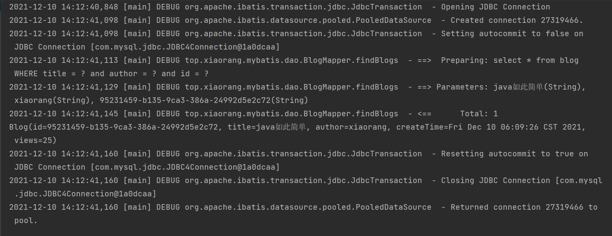

说明：多个 IF 标签之间的关系是 and，即如果多个 IF 标签都生效，查询结果要同时满足所有条件。

### 8.3、where 标签

**_where_ 元素只会在子元素返回任何内容的情况下才插入 “WHERE” 子句。而且，若子句的开头为 “AND” 或 “OR”，_where_ 元素也会将它们去除**。

等价于：

```xml
<trim prefix="WHERE" prefixOverrides="AND |OR ">
  ...
</trim>
```

```xml
<select id="findBlogs" parameterType="map" resultType="Blog">
    select *
    from blog
    <where>
        <if test="title != null">
            title = #{title}
        </if>
        <if test="author != null">
            and author = #{author}
        </if>
        <if test="id != null">
            and id = #{id}
        </if>
    </where>
</select>
```

### 8.4、set 标签

**_set_ 元素会动态地在行首插入 SET 关键字，并会删掉额外的逗号（这些逗号是在使用条件语句给列赋值时引入的）**。

等价于：

```xml
<trim prefix="SET" suffixOverrides=",">
  ...
</trim>
```

```xml
<update id="updateBlog" parameterType="map">
    update blog
    <set>
        <if test="title != null">
            title = #{title},
        </if>
        <if test="author != null">
            author = #{author}
        </if>
    </set>
    where id = #{id}
</update>
```

### 8.5、choose(when，otherwise)

有时候，我们不想使用所有的条件，而只是想从多个条件中选择一个使用。针对这种情况，Mybatis 提供了 choose 元素，它有点像 Java 中的 switch 语句。

还是上面的例子，但是策略变为：传入了 "title" 就按 "title" 查找，传入了 "author" 就按 "author" 查找的情形，若两者都没有传入，则返回全部记录。

```xml
<select id="queryBlogChoose" resultType="Blog">
    select *
    from blog
    <where>
        <choose>
            <when test="title != null">
                title = #{title}
            </when>
            <when test="author != null">
                and author = #{author}
            </when>
            <otherwise>
                and views = #{views}
            </otherwise>
        </choose>
    </where>
</select>
```

### 8.6、Foreach 标签

动态 SQL 的另一个常见使用场景就是对集合进行遍历（尤其是在构建 IN 条件语句的时候）。比如：

```xml
<select id="selectPostIn" resultType="domain.blog.Post">
  SELECT *
  FROM POST P
  WHERE ID in
  <foreach item="item" index="index" collection="list"
      open="(" separator="," close=")">
        #{item}
  </foreach>
</select>
```

foreach 元素的功能非常强大，它允许你指定一个集合，声明可以在元素体内使用的集合项（item）和索引（index）变量。它也允许你指定开头与结尾的字符串以及集合项迭代之间的分隔符。这个元素也不会错误地添加多余的分隔符，看它多智能！

✨tips：你可以将任何迭代对象（如 List、Set 等）、Map 对象或者数组对象作为集合参数传递给 foreach。当使用可迭代对象或数组时，index 是当前迭代的序号，item 的值是本次迭代获取到的元素。当使用 Map 对象（或者 Map.Entry 对象的集合）时，index 是键，item 是值。

```xml
<select id="findBlogsById" parameterType="list" resultType="blog">
    select * from blog
    <where>
        <foreach collection="ids" item="id" open="(" close=")" separator="or">
            id = #{id}
        </foreach>
    </where>
</select>
```

```java
@Test
public void testFindBlogsById() {
    List<String> ids = Arrays.asList("95231459-b135-9ca3-386a-24992d5e2c72", "69824e2e-8048-0bf4-3477-0e04299be4a9");
    List<Blog> blogs = blogMapper.findBlogsById(ids);
    blogs.forEach(System.out::println);
}
```

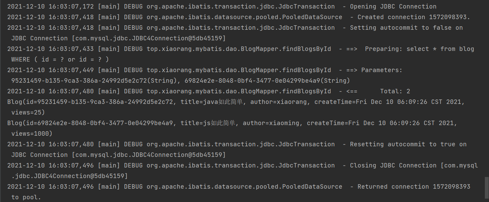

### 8.7、SQL 标签

SQL 标签用于将一些公共的 SQL 片段抽取出来封装以下，方便复用。

```xml
<sql id="title-author">
  <if test="title != null">
    AND title = #{title}
  </if>
  <if test="author != null">
    AND author = #{author}
  </if>
</sql>

<select id="queryBlogIf" parameterType="map" resultType="Blog">
  SELECT * FROM mybatis_study.blog WHERE TRUE
  <include refid="title-author"></include>
</select>
```

## 9、缓存

### 9.1、缓存简介

1. 什么是缓存？<br />**存在内存中的临时数据**；<br />将用户经常查询的数据放到缓存中，用户查询数据就不从磁盘中读取，而是直接从缓存中拿，提高查询效率，解决高并发系统的性能问题。 
2. 为什么使用缓存？<br />**减少和数据库的交互次数，减小系统开销，提高查询效率** 
3. 什么样的数据使用缓存？<br />**经常查询且不经常改变的数据** 

### 9.2、一级缓存

一级缓存已经 **默认开启**。一级缓存 **是 SqlSession 级别的缓存**，它仅仅对一个会话中的数据进行缓存；即在同一个会话中查询相同的数据时，直接从一级缓存中获取，不必再去访问数据库。

其实在企业项目中，**一级缓存并没有多大用**，因为查询出来数据之后，我们都会用变量来接收查询出来的数据，在后续的使用过程直接使用变量即可，而不会再去调用 sql 查询数据库，所以说感觉一级缓存并没有什么大用。

**测试**：在一个 SqlSession 会话期间进行两次通过 id 查询用户的操作，通过日志查看数据库语句执行情况。

```java
@Test
public void selectUserById() {
    User user = userMapper.selectUserById(1);
    System.out.println(user);
    System.out.println("======================");
    User user2 = userMapper.selectUserById(1);
    System.out.println(user);
    System.out.println(user == user2);
}
```

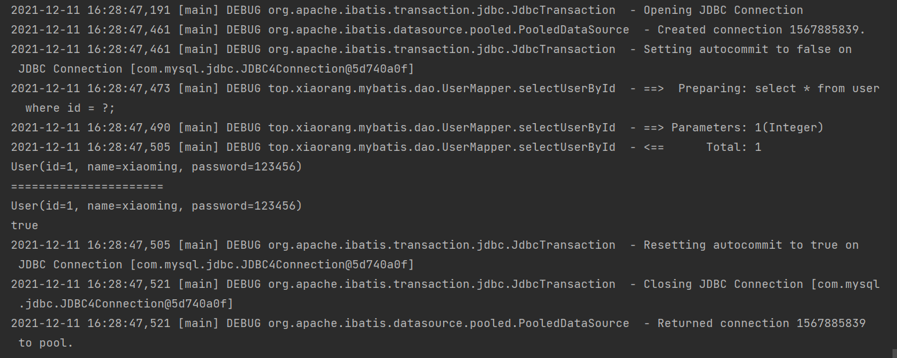

上图结果中，在一个 SqlSession 会话中查询两次相同 id 的用户，实际上只执行了一次查询语句，因为第二次查询并没有执行 SQL 查询语句，而是直接从本次 SqlSession 会话的一级缓存中获取结果。

**一级缓存失效的情况**：

- 查询不同的东西；
- 增删改操作，可能会改变数据库里的数据，所以必定刷新缓存；
- 查询不同的 Mapper.xml（一级缓存的声明周期是在整个 SqlSession 会话里，不同的 Mapper 已经超出了这个范围）；
- 显示地清理缓存：`sqlSession.clearCache();`

### 9.3、二级缓存

默认情况下，二级全局缓存已开启，但是二级缓存生效还需要在 SQL 映射文件中手动开启才行，`<cache />`;

由于一级缓存作用域太小了，实际开发中基本上没什么作用，所以引进了二级缓存。二级缓存时 namespace 级别的，每个 Mapper 都对应一个属于自己的二级缓存。

使用二级缓存的步骤：

1. 在 Mybatis 核心配置文件中显示开启全局缓存（默认已开启，不设置也没问题）  

```xml
<settings>
  <!--显式地开启二级缓存-->
  <setting name="cacheEnabled" value="true"/>
</settings>
```

2. 在 Mapper.xml 文件中使用全局缓存 <br />在每个单独的 sql 语句中通过 `useCache="false"` 来显式地开启和关闭该条 sql 语句的二级缓存  

```xml
<cache />
```

```xml
<select id="queryUserById" resultType="User" useCache="false">
  SELECT * FROM mybatis_study.user WHERE id = #{id};
</select>
```

3. 测试：打开两个 SqlSession，每个 SqlSession 里都按照相同 id 查询一个 user，看是否仅执行了一次 SQL 语句，前提是上面两个步骤（打开二级缓存和使用二级缓存）已经执行 <br />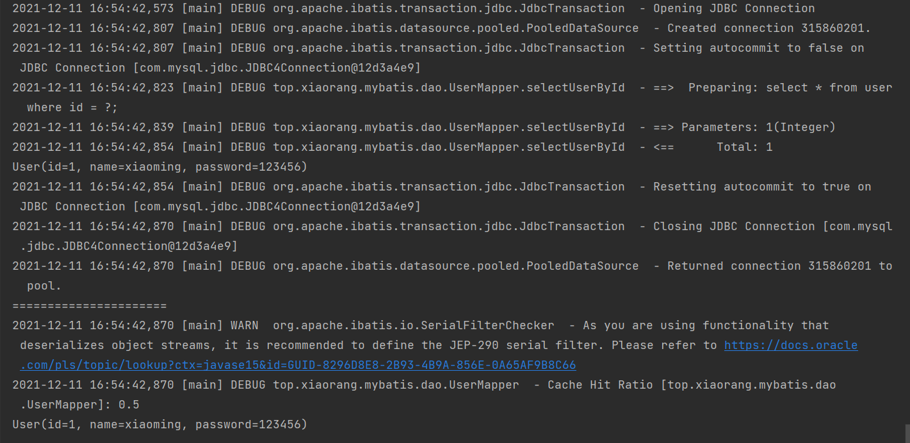<br />在上图结果中，开启了两次 SqlSession，在第一个 SqlSession 关闭后，打开第二个 SqlSession，在第二个 SqlSession 里查询相同 id 的用户，并没有向数据库执行 SQL 查询语句，而是直接从 UserMapper 对应的二级缓存里查询用户。 

```java
@Test
public void selectUserById() {
    SqlSession sqlSession1 = MybatisUtil.getSqlSession();
    UserMapper userMapper1 = sqlSession1.getMapper(UserMapper.class);
    SqlSession sqlSession2 = MybatisUtil.getSqlSession();
    UserMapper userMapper2 = sqlSession2.getMapper(UserMapper.class);
    User user = userMapper1.selectUserById(1);
    System.out.println(user);
    sqlSession1.close();
    System.out.println("======================");
    User user2 = userMapper2.selectUserById(1);
    System.out.println(user2);
    sqlSession2.close();
}
```

### 9.4、缓存原理

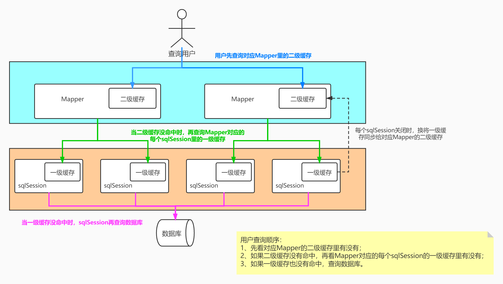

## 10、相关资料🎁

[mybatis中文文档手册](https://mybatis.net.cn/index.html) [MyBatis 3.5.7 参考文档.pdf](https://www.yuque.com/attachments/yuque/0/2021/pdf/1554080/1639214281485-4a3d6585-6cd6-4bc9-850c-5dc767d2b485.pdf?_lake_card=%7B%22src%22%3A%22https%3A%2F%2Fwww.yuque.com%2Fattachments%2Fyuque%2F0%2F2021%2Fpdf%2F1554080%2F1639214281485-4a3d6585-6cd6-4bc9-850c-5dc767d2b485.pdf%22%2C%22name%22%3A%22MyBatis+3.5.7+%E5%8F%82%E8%80%83%E6%96%87%E6%A1%A3.pdf%22%2C%22size%22%3A3778929%2C%22type%22%3A%22application%2Fpdf%22%2C%22ext%22%3A%22pdf%22%2C%22status%22%3A%22done%22%2C%22taskId%22%3A%22uea035f8a-3176-4353-8350-2570b384cbc%22%2C%22taskType%22%3A%22upload%22%2C%22id%22%3A%22hvgKa%22%2C%22card%22%3A%22file%22%7D)[free-idea-mybatis-2020.12.18.zip](https://www.yuque.com/attachments/yuque/0/2021/zip/1554080/1639214300788-21399d8d-ae2f-4fb8-9473-cdcf76e12663.zip?_lake_card=%7B%22src%22%3A%22https%3A%2F%2Fwww.yuque.com%2Fattachments%2Fyuque%2F0%2F2021%2Fzip%2F1554080%2F1639214300788-21399d8d-ae2f-4fb8-9473-cdcf76e12663.zip%22%2C%22name%22%3A%22free-idea-mybatis-2020.12.18.zip%22%2C%22size%22%3A1035927%2C%22type%22%3A%22application%2Fx-zip-compressed%22%2C%22ext%22%3A%22zip%22%2C%22status%22%3A%22done%22%2C%22taskId%22%3A%22u16c1e25d-4011-4737-bd89-abd82b0ac03%22%2C%22taskType%22%3A%22upload%22%2C%22id%22%3A%22u043de394%22%2C%22card%22%3A%22file%22%7D)

## 11、遇到的问题💣

1、找不到 mapper 接口：

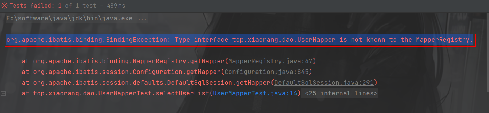

🎉解决方法：在 mybatis 核心配置中注册该 mapper 接口。

2、以 resource 的方式注册 mapper 接口的时候，xml 文件没有放在 resources 目录下，编译之后没有 xml 文件不会导出，导致找不到该配置文件：

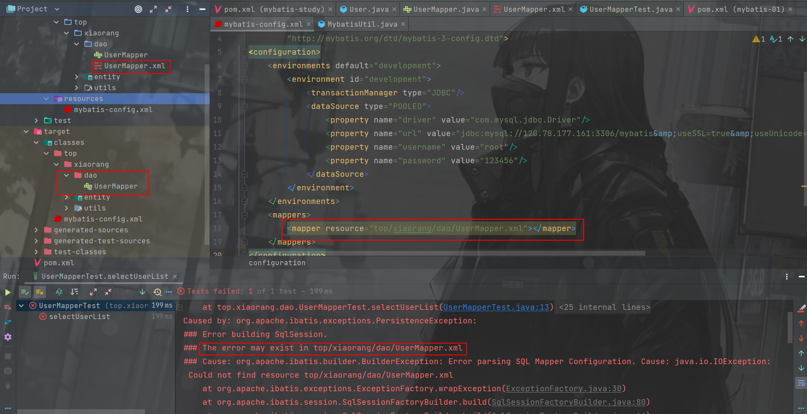

🎉解决方法：在父工程的 pom.xml 文件中添加配置，在 build 中配置 resources，防止我们资源导出失败的问题。

```xml
<build>
  <resources>
    <resource>
      <directory>src/main/resources</directory>
      <includes>
        <include>**/*.properties</include>
        <include>**/*.xml</include>
      </includes>
    </resource>
    <resource>
      <directory>src/main/java</directory>
      <includes>
        <include>**/*.properties</include>
        <include>**/*.xml</include>
      </includes>
    </resource>
  </resources>
</build>
```

3、mysql 连接不上：

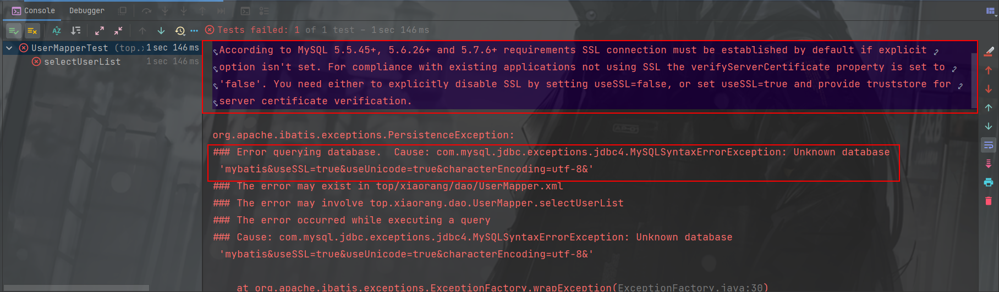

🎉解决方法：不建议在没有服务器身份验证的情况下建立 SSL 连接，需要通过设置 useSSL=false 显式禁用 SSL。修改 mybatis 核心配置文件中 url 的值为 `jdbc:mysql://120.78.177.161:3306/mybatis?useSSL=false&amp;useUnicode=true&amp;characterEncoding=utf-8&amp;`。

4、测试二级缓存时保存：

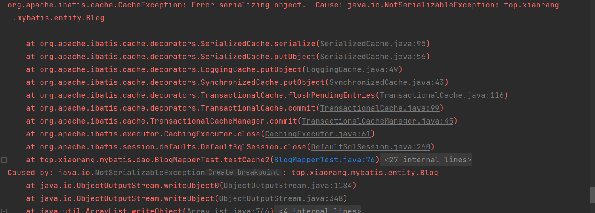

🎉解决方法：让实体类实现序列化。

## 12、Tips✨

1、对某个类快速生成测试类：选中需要生成测试代码的类 ->右键 -> Go To -> Test -> Create New Test。

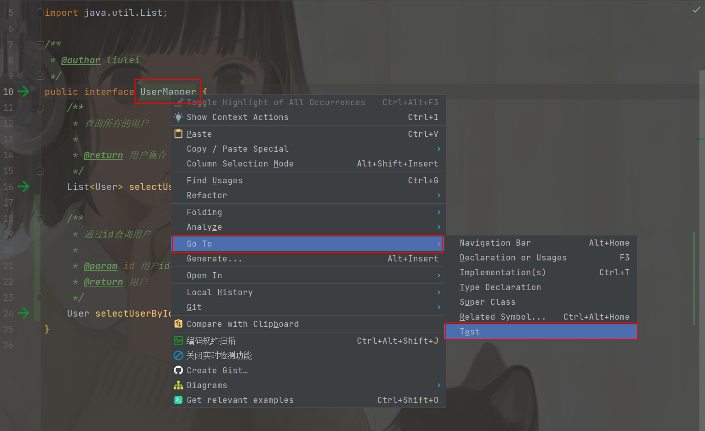
