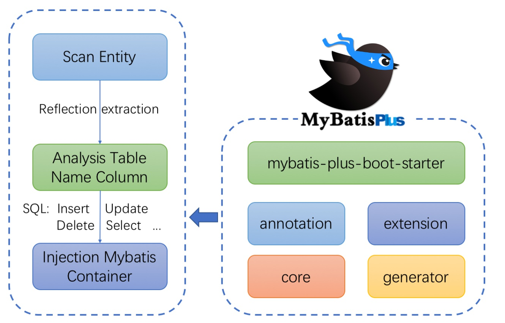
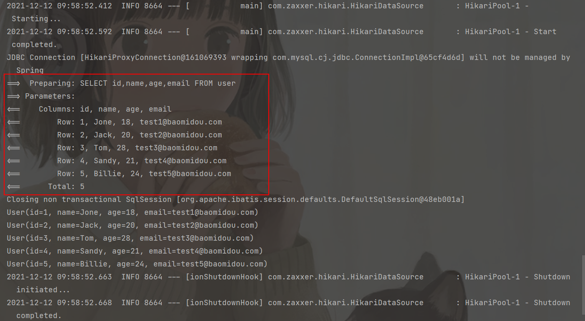

# 1、简介

<br />[Mybatis-Plus](https://baomidou.com/)（简称 MP）是一个 [Mybatis](https://mybatis.net.cn/) 的增强工具，在 Mybatis 的基础上只做增强不做改变，为简化开发、提升效率而生。

# 2、特性

>  
> - **无侵入**：只做增强不做改变，引入它不会对现有工程产生影响，如丝般顺滑
> - **损耗小**：启动即会自动注入基本 CURD，性能基本无损耗，直接面向对象操作
> - **强大的 CRUD 操作**：内置通用 Mapper、通用 Service，仅仅通过少量配置即可实现单表大部分 CRUD 操作，更有强大的条件构造器，满足各类使用需求
> - **支持 Lambda 形式调用**：通过 Lambda 表达式，方便的编写各类查询条件，无需再担心字段写错
> - **支持主键自动生成**：支持多达 4 种主键策略（内含分布式唯一 ID 生成器 - Sequence），可自由配置，完美解决主键问题
> - **支持 ActiveRecord 模式**：支持 ActiveRecord 形式调用，实体类只需继承 Model 类即可进行强大的 CRUD 操作
> - **支持自定义全局通用操作**：支持全局通用方法注入（ Write once, use anywhere ）
> - **内置代码生成器**：采用代码或者 Maven 插件可快速生成 Mapper 、 Model 、 Service 、 Controller 层代码，支持模板引擎，更有超多自定义配置等您来使用
> - **内置分页插件**：基于 MyBatis 物理分页，开发者无需关心具体操作，配置好插件之后，写分页等同于普通 List 查询
> - **分页插件支持多种数据库**：支持 MySQL、MariaDB、Oracle、DB2、H2、HSQL、SQLite、Postgre、SQLServer 等多种数据库
> - **内置性能分析插件**：可输出 SQL 语句以及其执行时间，建议开发测试时启用该功能，能快速揪出慢查询
> - **内置全局拦截插件**：提供全表 delete 、 update 操作智能分析阻断，也可自定义拦截规则，预防误操作。

# 3、框架结构



# 4、快速开始📌

## 4.1、创建数据库与测试数据

现有一张 `User` 表，其表结构如下：

| id | name | age | email |
| --- | --- | --- | --- |
| 1 | Jone | 18 | [test1@baomidou.com](mailto:test1@baomidou.com) |
| 2 | Jack | 20 | [test2@baomidou.com](mailto:test2@baomidou.com) |
| 3 | Tom | 28 | [test3@baomidou.com](mailto:test3@baomidou.com) |
| 4 | Sandy | 21 | [test4@baomidou.com](mailto:test4@baomidou.com) |
| 5 | Billie | 24 | [test5@baomidou.com](mailto:test5@baomidou.com) |

其对应的数据库 Schema 脚本如下：

```sql
DROP TABLE IF EXISTS user;

CREATE TABLE user
(
	id BIGINT(20) NOT NULL COMMENT '主键ID',
	name VARCHAR(30) NULL DEFAULT NULL COMMENT '姓名',
	age INT(11) NULL DEFAULT NULL COMMENT '年龄',
	email VARCHAR(50) NULL DEFAULT NULL COMMENT '邮箱',
	PRIMARY KEY (id)
);
```

其对应的数据库 Data 脚本如下：

```sql
DELETE FROM user;

INSERT INTO user (id, name, age, email) VALUES
(1, 'Jone', 18, 'test1@baomidou.com'),
(2, 'Jack', 20, 'test2@baomidou.com'),
(3, 'Tom', 28, 'test3@baomidou.com'),
(4, 'Sandy', 21, 'test4@baomidou.com'),
(5, 'Billie', 24, 'test5@baomidou.com');
```

## 4.2、初始化工程

可以使用 [Spring Initializer](https://start.spring.io/) 快速创建一个空的 Spring Boot 工程

## 4.3、添加依赖

```xml
<dependencies>
    <dependency>
        <groupId>org.springframework.boot</groupId>
        <artifactId>spring-boot-starter-web</artifactId>
    </dependency>
    <dependency>
        <groupId>com.baomidou</groupId>
        <artifactId>mybatis-plus-boot-starter</artifactId>
        <version>3.4.3.4</version>
    </dependency>
    <dependency>
        <groupId>mysql</groupId>
        <artifactId>mysql-connector-java</artifactId>
        <scope>runtime</scope>
    </dependency>
    <dependency>
        <groupId>org.springframework.boot</groupId>
        <artifactId>spring-boot-configuration-processor</artifactId>
        <optional>true</optional>
    </dependency>
    <dependency>
        <groupId>org.projectlombok</groupId>
        <artifactId>lombok</artifactId>
        <optional>true</optional>
    </dependency>
    <dependency>
        <groupId>org.springframework.boot</groupId>
        <artifactId>spring-boot-starter-test</artifactId>
        <scope>test</scope>
    </dependency>
</dependencies>
```

## 4.4、配置

在 `application.yml` 配置文件添加 数据库的相关配置

```yaml
server:
  port: 8500
# DataSource Config
spring:
  datasource:
    url: jdbc:mysql://120.78.xxx.xxx:3306/mybatis-plus?useSSL=false&useUnicode=true&characterEncoding=utf-8&serverTimezone=Asia/Shanghai
    username: root
    password: 123456
    driver-class-name: com.mysql.cj.jdbc.Driver
```

在 Springboot 启动类中添加 `@MapperScan` 注解，扫描 Mapper 文件

```java
@SpringBootApplication
@MapperScan("top.xiaorang.mybatisplusstudy.mapper")
public class MybatisPlusStudyApplication {
    public static void main(String[] args) {
        SpringApplication.run(MybatisPlusStudyApplication.class, args);
    }
}
```

## 4.5、编码

编写实体类 `User.java` （此处使用了 [Lombok](https://www.projectlombok.org/) 简化代码）

```java
@Data
public class User {
    private Long id;
    private String name;
    private Integer age;
    private String email;
}
```

编写 Mapper 类 `UserMapper.java`

```java
public interface UserMapper extends BaseMapper<User> {}
```

## 4.6、开始使用

添加测试类，进行功能测试：

```java
@SpringBootTest
public class SampleTest {
    @Autowired
    private UserMapper userMapper;

    @Test
    public void testSelect() {
        System.out.println(("----- selectAll method test ------"));
        List<User> userList = userMapper.selectList(null);
        userList.forEach(System.out::println);
    }
}
```

控制台输出：

```
User(id=1, name=Jone, age=18, email=test1@baomidou.com)
User(id=2, name=Jack, age=20, email=test2@baomidou.com)
User(id=3, name=Tom, age=28, email=test3@baomidou.com)
User(id=4, name=Sandy, age=21, email=test4@baomidou.com)
User(id=5, name=Billie, age=24, email=test5@baomidou.com)
```

## 4.7、小结

通过以上几个简单的步骤，我们就实现了 `User` 表的 CRUD 功能，甚至连 XML 文件都不用编写！<br />从以上步骤中，可以看到集成 `Mybatis-Plus` 非常的简单，只需要引入 starter 工程，并配置 mapper 扫描路径即可。

# 5、[日志输出](https://baomidou.com/guide/faq.html#%E5%90%AF%E5%8A%A8-mybatis-%E6%9C%AC%E8%BA%AB%E7%9A%84-log-%E6%97%A5%E5%BF%97)

现在所有的 sql 语句都是不可见的，我们希望知道它是怎么执行的，所以我们必须要看日志！

```yaml
mybatis-plus:
  configuration:
    log-impl: org.apache.ibatis.logging.stdout.StdOutImpl
```



# 6、Mapper CRUD📌

## 6.1、[插入操作](https://baomidou.com/pages/49cc81/#insert) 

```java
// 插入一条记录 
int insert(T entity);
```

```java
@Test
public void testInsert() {
    User user = User.builder().name("小让的糖果屋").age(2).email("2329862718@qq.com").build();
    userMapper.insert(user);
    System.out.println(user);
}
```

<br />💡注意：主键 id 已经反填。

## 6.2、主键生成策略

> 提示：自 mybatis-plus 3.3.0 版本开始，默认使用雪花算法 +UUID(不含中划线)

> 雪花算法：snowflake 是 Twitter 开源的分布式 ID 生成算法，结果是一个 long 型的 ID。其核心思想是：使用 41bit 作为 毫秒数，10bit 作为机器的 ID（5 个 bit 是数据中心，5 个 bit 的机器 ID），12bit 作为毫秒内的流水号（意味 着每个节点在每毫秒可以产生 4096 个 ID），最后还有一个符号位，永远是 0。可以保证几乎全球唯 一！

如果我们将主键生成策略改成 **自增**：

1. 在实体类字段上增加 `@TableId_(_type = IdType._AUTO)_`
1. 数据库字段一定要是自增！


3. 再次测试插入

<br /><br />通过注解注解 [@TableId](https://baomidou.com/pages/223848/#tableid) + [@IdType](https://baomidou.com/pages/223848/#idtype) 来配置主键的生成策略：

| 值 | 描述 |
| --- | --- |
| AUTO | 数据库 ID 自增 |
| NONE | 无状态，该类型为未设置主键类型（注解里等于跟随全局，全局里约等于 INPUT） |
| INPUT | insert 前自行 set 主键值 |
| ASSIGN_ID | 分配 ID(主键类型为 Number(Long 和 Integer) 或 String)(since 3.3.0),使用接口 IdentifierGenerator 的方法 nextId(默认实现类为 DefaultIdentifierGenerator 雪花算法) |
| ASSIGN_UUID | 分配 UUID,主键类型为 String(since 3.3.0),使用接口 IdentifierGenerator 的方法 nextUUID(默认 default 方法) |
| ~~ID_WORKER~~ | 分布式全局唯一 ID 长整型类型 (please use ASSIGN_ID) |
| ~~UUID~~ | 32 位 UUID 字符串 (please use ASSIGN_UUID) |
| ~~ID_WORKER_STR~~ | 分布式全局唯一 ID 字符串类型 (please use ASSIGN_ID) |

其中 nextId() 与 nextUUID()：

| 方法 | 主键生成策略 | 主键类型 | 说明 |
| --- | --- | --- | --- |
| nextId | ASSIGN_ID，~~ID_WORKER~~，~~ID_WORKER_STR~~ | Long,Integer,String | 支持自动转换为 String 类型，但数值类型不支持自动转换，需精准匹配，例如返回 Long，实体主键就不支持定义为 Integer |
| nextUUID | ASSIGN_UUID，~~UUID~~ | String | 默认不含中划线的 UUID 生成 |

## 6.3、[更新操作](https://baomidou.com/pages/49cc81/#update-3) 

```java
// 根据 whereWrapper 条件，更新记录 
int update(@Param(Constants.ENTITY) T updateEntity, @Param(Constants.WRAPPER) Wrapper<T> whereWrapper); 
// 根据 ID 修改 
int updateById(@Param(Constants.ENTITY) T entity);
```

```java
@Test
public void testUpdate() {
    User user = User.builder().id(1471083433073393667L).name("小让的糖果屋1").age(3).email("15019474951@163.com").build();
    userMapper.updateById(user);
}
```

<br />可以看出 sql 语句中赋值了哪些字段就更新哪些字段！

## 6.4、自动填充功能

需求：创建时间和修改时间这些个的赋值操作应该是自动化完成的，不应该手动来填写。<br />阿里巴巴开发手册：所有的数据库表都应该有 `gmt_create` 和 `gmt_modified` 字段，而且需要自动化！

### 6.4.1、数据库级别

1. 在表中新增 `create_time`，`update_time` 字段

```sql
alter table user add column update_time DATETIME NULL default CURRENT_TIMESTAMP ON UPDATE current_timestamp comment '更新时间';
alter table user add column create_time DATETIME NULL default CURRENT_TIMESTAMP comment '创建时间';
```


2. 实体类增加 `createTime` 和 `updateTime` 字段

```java
@Data
@Builder
public class User {
    @TableId(type = IdType.AUTO)
    private Long id;
    private String name;
    private Integer age;
    private String email;
    private Date createTime;
    private Date updateTime;
}
```

3. 插入测试

```java
@Test
public void testInsert() {
    User user = User.builder().name("小让的糖果屋2").age(18).email("2329862718@qq.com").build();
    userMapper.insert(user);
    System.out.println(user);
}
```

<br />💡注意：主键 id 反填，但是创建时间与更新时间并没有反填！<br />  

```ad-important
💣数据库填写的时间与当前系统的时间相差 8 个小时：<br /><br />不用慌，使用 `select now();` 来查看 mysql 时间，如果时间与当前系统时间一致，则说明 mysql 的时间没有问题，问题出在 java 时间上，将 jdbc url 参数修改成 `serverTimezone=Asia/Shanghai`；如果 mysql 时间与当前系统不一致，则使用以下 sql 设置 mysql 时区：<br />show variables like '%time_zone%'; -- 查询当前时区<br />set global time_zone='+8:00';  -- 在标准时区上加 +8 小时,即东 8 区时间<br />set time_zone = '+08:00';<br />flush privileges; -- 立即生效<br />再次执行插入操作，发现此时插入的时间与当前系统的时间终于一致！🎉🎉🎉<br />  
```

4. 更新测试

```java
@Test
public void testUpdate() {
    User user = User.builder().id(1471083433073393669L).age(26).email("15019474951@163.com").build();
    userMapper.updateById(user);
}
```

<br />

### 6.4.2、代码级别

原理：

- 实现元对象处理器接口：`com.baomidou.mybatisplus.core.handlers.MetaObjectHandler`
- 注解填充字段：

```java
@TableField(fill = FieldFill.INSERT)
private Date createTime;
@TableField(fill = FieldFill.INSERT_UPDATE)
private Date updateTime;
```

- 自定义实现类 `MyMetaObjectHandler`

```java
@Slf4j
@Component
public class MyMetaObjectHandler implements MetaObjectHandler {
    @Override
    public void insertFill(MetaObject metaObject) {
        log.info("start insert fill ....");
        this.strictInsertFill(metaObject, "createTime", LocalDateTime::now, LocalDateTime.class); // 起始版本 3.3.3(推荐)
        this.strictInsertFill(metaObject, "updateTime", LocalDateTime::now, LocalDateTime.class); // 起始版本 3.3.3(推荐)
    }

    @Override
    public void updateFill(MetaObject metaObject) {
        log.info("start update fill ....");
        this.strictUpdateFill(metaObject, "updateTime", LocalDateTime::now, LocalDateTime.class); // 起始版本 3.3.3(推荐)
    }
}
```

> 💡注意事项：
> - 填充原理是直接给 `entity` 的属性设置值！！！
> - 注解则是指定该属性在对应情况下必有值，如果无值则入库会是 `null`
> - `MetaObjectHandler` 提供的默认方法的策略为：如果属性有值则不覆盖，如果填充值为 `null` 则不填充
> - 字段必须声明 `TableField` 注解，属性 `fill` 选择对应策略，该声明告知 `Mybatis-Plus` 需要预留注入 `SQL` 字段
> - 填充处理器 `MyMetaObjectHandler` 在 SpringBoot 中需要声明 `@Component` 或 `@Bean` 注入
> - 要想根据注解 `FiledFill.xxx` 和 `字段名` 以及 `字段类型` 来区分必须使用父类的 `strictInsertFill` 或者 `strictUpdateFill` 方法
> - 不需要根据任何来区分可以使用父类的 `fillStrategy` 方法

```java
public enum FieldFill {
    /**
     * 默认不处理
     */
    DEFAULT,
    /**
     * 插入填充字段
     */
    INSERT,
    /**
     * 更新填充字段
     */
    UPDATE,
    /**
     * 插入和更新填充字段
     */
    INSERT_UPDATE
}
```

删除数据库中字段的默认值与更新操作！<br /><br />1、插入测试：<br /><br />发现使用官网的方法，创建时间与更新时间都为 null，这是为什么呢？？找到源码，发现 自动填充的字段必须要注解了 fill，并且字段名和字段属性都要匹配才会进行填充！所以当我们的字段类型是 `java.util.Date` ，而填充的类型是 `LocalDateTime` 类型时，就会填充不进去。<br /><br />那么如何修改呢？

```java
@Slf4j
@Component
public class MyMetaObjectHandler implements MetaObjectHandler {
    @Override
    public void insertFill(MetaObject metaObject) {
        log.info("start insert fill ....");
        this.strictInsertFill(metaObject, "createTime", Date::new, Date.class); // 起始版本 3.3.3(推荐)
        this.strictInsertFill(metaObject, "updateTime", Date::new, Date.class); // 起始版本 3.3.3(推荐)
    }

    @Override
    public void updateFill(MetaObject metaObject) {
        log.info("start update fill ....");
        this.strictUpdateFill(metaObject, "updateTime", Date::new, Date.class); // 起始版本 3.3.3(推荐)
    }
}
```

<br />可以看到，改完之后，创建时间和更新时间都已经有值并且也反填回来了！🎉🎉🎉<br />2、更新测试：

```java
@Test
public void testUpdate() {
    User user = User.builder().id(1471083433073393675L).age(26).email("15019474951@163.com").build();
    userMapper.updateById(user);
}
```

<br />可以看到，我的更新操作当中并没有主动给更新时间赋值，但是生成的 sql 语句中 有 `update_time` 这个字段，而且给它赋值当前时间！

## 6.5、乐观锁

> 当要更新一条记录的时候，希望这条记录没有被别人更新  
> 乐观锁实现方式：
> - 取出记录，获取当前 version
> - 更新时，带上这个 version
> - 执行更新时，set version = new Version where version = oldVersion
> - 如果 version 不对，就更新失败

乐观锁配置需要两步：

### 6.5.1、配置插件

```java
@Bean
public MybatisPlusInterceptor mybatisPlusInterceptor() {
    MybatisPlusInterceptor interceptor = new MybatisPlusInterceptor();
    interceptor.addInnerInterceptor(new OptimisticLockerInnerInterceptor());
    return interceptor;
}
```

### 6.5.2、增加 version 字段以及 @version 注解

```sql
alter table user add version int default 1 not null;
```

```java
@Version
private Integer version;
```

> 说明：
> - 支持的数据类型只有：int，Integer，long，Long，Date，TimeStamp，LocalDateTime
> - 整数类型下 `newVersion = oldVersion + 1`
> - `newVersion` 会回写到 `entity` 中
> - 仅支持 `updateById(id)` 与 `update(entity, wrapper)` 方法
> - 在 `update(entity, wrapper)` 方法下，`wrapper` 不能复用！！！

### 6.5.3、测试

```java
@Test
public void testUpdate() {
    User user = User.builder().id(1471083433073393675L).age(30).email("15019474951@163.com").build();
    userMapper.updateById(user);
}
```

<br />从上面打印出来的 sql 语句发现更新的时候并没有更新 version 版本号，为什么会这样呢？🤔

```java
@Test
public void testUpdate2() {
    User user = userMapper.selectById(1471083433073393675L);
    user.setAge(30);
    userMapper.updateById(user);
}
```

<br />查看源码发现：<br /><br />📢结论：使用乐观锁之前一定要先查询拿到版本号，如果不拿到版本号就直接更新是更新不了的；并且 **如果版本号为 null，再通过版本号去更新数据，无论怎样更新该条数据都不会使版本号 +1，而是一直为 null**。<br />接下来测试一下模仿多线程下更新用户，看看乐观锁是否起到作用？

```java
@Test
public void testUpdate3() {
    User user = userMapper.selectById(1471083433073393675L);

    User user2 = userMapper.selectById(1471083433073393675L);
    user2.setAge(32);
    userMapper.updateById(user2);

    user.setAge(30);
    userMapper.updateById(user);
}
```

<br />🤔从上面可以看出查询了两遍数据库，感觉一级缓存没有生效，为什么要创建一个新的 SqlSession ？？？<br /><br />从上图可以看出乐观锁已经生效，后面更新的数据是不会被更新的！

## 6.6、[查询操作](https://baomidou.com/pages/49cc81/#select) 

```java
// 根据 ID 查询
T selectById(Serializable id);
// 根据 entity 条件，查询一条记录
T selectOne(@Param(Constants.WRAPPER) Wrapper<T> queryWrapper);

// 查询（根据ID 批量查询）
List<T> selectBatchIds(@Param(Constants.COLLECTION) Collection<? extends Serializable> idList);
// 根据 entity 条件，查询全部记录
List<T> selectList(@Param(Constants.WRAPPER) Wrapper<T> queryWrapper);
// 查询（根据 columnMap 条件）
List<T> selectByMap(@Param(Constants.COLUMN_MAP) Map<String, Object> columnMap);
// 根据 Wrapper 条件，查询全部记录
List<Map<String, Object>> selectMaps(@Param(Constants.WRAPPER) Wrapper<T> queryWrapper);
// 根据 Wrapper 条件，查询全部记录。注意： 只返回第一个字段的值
List<Object> selectObjs(@Param(Constants.WRAPPER) Wrapper<T> queryWrapper);

// 根据 entity 条件，查询全部记录（并翻页）
IPage<T> selectPage(IPage<T> page, @Param(Constants.WRAPPER) Wrapper<T> queryWrapper);
// 根据 Wrapper 条件，查询全部记录（并翻页）
IPage<Map<String, Object>> selectMapsPage(IPage<T> page, @Param(Constants.WRAPPER) Wrapper<T> queryWrapper);
// 根据 Wrapper 条件，查询总记录数
Integer selectCount(@Param(Constants.WRAPPER) Wrapper<T> queryWrapper);
```

1. 按照 id 批量查询

```java
@Test
public void testSelectByBatchId(){
    List<User> users = userMapper.selectBatchIds(Arrays.asList(1, 2, 3));
    users.forEach(System.out::println);
}
```


2. 根据 map 中的条件进行查询

```java
@Test
public void testSelectByMap() {
    HashMap<String, Object> map = new HashMap<>();
    map.put("name", "Jone");
    map.put("age", 18);
    List<User> users = userMapper.selectByMap(map);
    users.forEach(System.out::println);
}
```


## 6.8、分页查询

首先需要配置分页插件，不然使用分页接口进行查询的时候，查出来的是全部的数据！

```java
@Configuration
@MapperScan("top.xiaorang.mybatisplusstudy.mapper")
public class MybatisPlusConfig {
    @Bean
    public MybatisPlusInterceptor mybatisPlusInterceptor() {
        MybatisPlusInterceptor interceptor = new MybatisPlusInterceptor();
        interceptor.addInnerInterceptor(new OptimisticLockerInnerInterceptor()); # 乐观锁插件
        interceptor.addInnerInterceptor(new PaginationInnerInterceptor()); # 分页插件
        return interceptor;
    }
}
```

```java
@Test
public void testPage() {
    // 参数一：当前页
    // 参数二：页面大小
    // 使用了分页插件之后，所有的分页操作也变得简单的！
    Page<User> page = new Page<>(2, 5);
    userMapper.selectPage(page, null);
    page.getRecords().forEach(System.out::println);
    System.out.println(page.getTotal());
}
```


## 6.9、[删除操作](https://baomidou.com/pages/49cc81/#delete) 

```java
// 根据 entity 条件，删除记录
int delete(@Param(Constants.WRAPPER) Wrapper<T> wrapper);
// 删除（根据ID 批量删除）
int deleteBatchIds(@Param(Constants.COLLECTION) Collection<? extends Serializable> idList);
// 根据 ID 删除
int deleteById(Serializable id);
// 根据 columnMap 条件，删除记录
int deleteByMap(@Param(Constants.COLUMN_MAP) Map<String, Object> columnMap);
```

```java
@Test
public void testDeleteById() {
    userMapper.deleteById(1471083433073393675L);
}
```


```java
@Test
public void testDeleteByBatchId() {
    userMapper.deleteBatchIds(Arrays.asList(1, 2, 3));
}
```


```java
@Test
public void testDeleteMap(){
    HashMap<String, Object> map = new HashMap<>();
    map.put("name","Sandy");
    userMapper.deleteByMap(map);
}
```


## 6.10、逻辑删除

```ad-important
📢说明：<br />只对自动注入的 Sql 起效，也就是调用 mybatis-plus 方法时生成的 sql 语句：

- 插入：不作限制
- 查找：追加 where 条件过滤掉已删除数据，且使用 wrapper.entity 生成的 where 条件会忽略该字段
- 更新：追加 where 条件防止更新到已删除数据，且使用 wrapper.entity 生成的 where 条件会忽略给字段
- 删除：转变为 更新

例如：

- 删除：`update user set deleted = 1 where id = 1 and delete = 0`
- 查找：`select id,name,deleted from user where deleted = 0`

字段类型支持说明：

- 支持所有数据类型（推荐使用 `Integer`，`Boolean`，`LocalDateTime`）
- 如果数据库字段使用 `datetime`，逻辑未删除值和已删除值支持配置为字符串 `null`，另一个值支持配置为函数来获取值如 `now()`

附录：

- 逻辑删除是为了方便数据恢复和保护数据本身价值等等的一种方案，但实际就是删除
- 如果你需要频繁查出来看就不应使用逻辑删除，而是以一个状态去表示  
``` 

### 6.10.1、增加字段以及注解

```sql
alter table user add deleted int default 0 not null;
```

```java
@TableLogic
private Integer deleted;
```

### 6.10.2、配置逻辑删除

```yaml
mybatis-plus:
  global-config:
    db-config:
      logic-delete-value: 1 # 逻辑已删除值(默认为 1)
      logic-not-delete-value: 0 # 逻辑未删除值(默认为 0)
```

### 6.10.3、测试

```java
@Test
public void testDeleteById() {
    userMapper.deleteById(1471083433073393675L);
}
```

<br />从上图可以发现，走的不再是 delete 语句，而是更新语句！

```java
@Test
public void testSelectById() {
    User user = userMapper.selectById(1471083433073393675L);
    System.out.println(user);
}
```

<br />从上图可以发现查询的时候 条件上自动带上了 deleted = 0，表示逻辑删除的记录是查不到的！

## 6.11、性能分析插件

作用：性能分析插件，用于输出每条 SQL 语句以及执行时间，找出开发中的慢 SQL 进行分析和优化！

> 该功能依赖 `p6spy` 组件，完美的输出打印 SQL 及 执行时长

```ad-warning
💡注意！

- driver-class-name 为 p6spy 提供的驱动类
- url 前缀为 jdbc:p6spy 跟着冒号为对应数据库连接地址
- 打印出 sql 为 null，在 excludecategories 增加 commit
- 批量操作不打印 sql，去除 excludecategories 中的 batch
- 批量操作打印重复的问题请使用 MybatisPluLogFactory（3.2.1 新增）
- 该插件有性能损耗，不建议生产环境使用  
```  

### 6.11.1、引入依赖

```xml
<dependency>
   <groupId>p6spy</groupId>
   <artifactId>p6spy</artifactId>
   <version>3.9.1</version>
</dependency>
```

### 6.11.2、application.yml 配置

```yaml
spring:
  datasource:
    url: jdbc:p6spy:mysql://120.78.xxx.xxx:3306/mybatis-plus?useSSL=false&useUnicode=true&characterEncoding=utf-8&serverTimezone=Asia/Shanghai
    username: root
    password: 123456
    driver-class-name: com.p6spy.engine.spy.P6SpyDriver
```

### 6.11.3、spy.properties 配置

```
modulelist=com.baomidou.mybatisplus.extension.p6spy.MybatisPlusLogFactory,com.p6spy.engine.outage.P6OutageFactory
# 自定义日志打印
logMessageFormat=com.baomidou.mybatisplus.extension.p6spy.P6SpyLogger
#日志输出到控制台
appender=com.baomidou.mybatisplus.extension.p6spy.StdoutLogger
# 使用日志系统记录 sql
#appender=com.p6spy.engine.spy.appender.Slf4JLogger
# 设置 p6spy driver 代理
deregisterdrivers=true
# 取消JDBC URL前缀
useprefix=true
# 配置记录 Log 例外,可去掉的结果集有error,info,batch,debug,statement,commit,rollback,result,resultset.
excludecategories=info,debug,result,commit,resultset
# 日期格式
dateformat=yyyy-MM-dd HH:mm:ss
# 实际驱动可多个
#driverlist=org.h2.Driver
# 是否开启慢SQL记录
outagedetection=true
# 慢SQL记录标准 2 秒
outagedetectioninterval=2
```

### 6.11.4、测试

```java
@Test
public void testSelectById() {
    User user = userMapper.selectById(1471083433073393675L);
    System.out.println(user);
}
```

<br />从上图发现具体的 SQL 语句以及执行时长！

## 6.12、[条件构造器](https://baomidou.com/pages/10c804/#abstractwrapper)📌

1.查询名字是 `J` 开头的用户

```java
@Test
public void testWrapper() {
    QueryWrapper<User> queryWrapper = new QueryWrapper<>();
    queryWrapper.likeRight("name", "J");
    List<User> users = userMapper.selectList(queryWrapper);
    users.forEach(System.out::println);
}
```

<br />2.查询名字是 `J` 开头并且年龄大于 18 的用户

```java
@Test
public void testWrapper1() {
    QueryWrapper<User> queryWrapper = new QueryWrapper<>();
    queryWrapper.likeRight("name", "J").gt("age", 18);
    List<User> users = userMapper.selectList(queryWrapper);
    users.forEach(System.out::println);
}
```

<br />3.查询所有的用户并且按照年龄升序排列

```java
@Test
public void testWrapper2() {
    QueryWrapper<User> queryWrapper = new QueryWrapper<>();
    queryWrapper.orderByAsc("age");
    List<User> users = userMapper.selectList(queryWrapper);
    users.forEach(System.out::println);
}
```

<br />4.查询名字是 `J` 开头或者年龄大于 24 岁的用户，并且按照年龄升序排列

```java
@Test
public void testWrapper3() {
    QueryWrapper<User> queryWrapper = new QueryWrapper<>();
    queryWrapper.likeRight("name", "J").or().gt("age", 24).orderByAsc("age");
    List<User> users = userMapper.selectList(queryWrapper);
    users.forEach(System.out::println);
}
```

<br />上面使用 `QueryWrapper` 查询时，参数中 column 那一列全是写死的，即硬编码或者魔法代码，如果这个时候数据库表中字段被修改了，这个时候在编译时是不会报错的，只有等到运行到这里的时候才会报错，所以有没有更加好一点的办法呢？使用 `LamdaQueryWrapper` 就可以解决这个问题！<br />5.查询名字是 `J` 开头或者年龄大于 24 岁的用户，并且按照年龄升序排列

```java
@Test
public void testWrapper4() {
    LambdaQueryWrapper<User> queryWrapper = new LambdaQueryWrapper<>();
    queryWrapper.likeRight(User::getName, "J").or().gt(User::getAge, 24).orderByAsc(User::getAge);
    List<User> users = userMapper.selectList(queryWrapper);
    users.forEach(System.out::println);
}
```

<br />从上图可以看出来，`LamdaQueryWrapper` 产生的 SQL 语句和 `QueryWrapper` 产生的 SQL 语句一样，但是 `LamadQueryWrapper` 编码的时候却比 `QueryWrapper` 优秀而且便于维护，所以以后尽量使用 `LamadQueryWrapper`。<br />6.更新名字为 `Jone` 的用户的名字为 'xiaorang' 和 年龄 = 26

```java
@Test
public void testWrapper5() {
    LambdaUpdateWrapper<User> updateWrapper = new LambdaUpdateWrapper<>();
    updateWrapper.eq(User::getName, "Jone").set(User::getName, "xiaorang").set(User::getAge, 26);
    int update = userMapper.update(null, updateWrapper);
    System.out.println(update);
}
```

<br />7.更新名字为 `Jone` 的用户的名字为 'xiaorang' 和 年龄 = 26（将上面的条件与赋值分开）

```java
@Test
public void testWrapper6() {
    LambdaUpdateWrapper<User> updateWrapper = new LambdaUpdateWrapper<>();
    updateWrapper.eq(User::getName, "xiaorang");
    User user = User.builder().name("Jone").age(18).build();
    int update = userMapper.update(user, updateWrapper);
    System.out.println(update);
}
```

<br />从上图可以发现，查询与赋值分开后，会比上面那种更新生成的 SQL 语句多更新一个更新时间字段。<br />以上就列举这么多，看上去还挺简单的，像这种哪里不懂就可以查询官方文档。

# 7、代码生成器📌

## 7.1、引入依赖

添加 mybatis-plus-generator 代码自动生成器依赖、freemarker 模板引擎依赖和 knife4j 接口文档依赖（依赖 swagger）。

```xml
<dependency>
  <groupId>com.baomidou</groupId>
  <artifactId>mybatis-plus-generator</artifactId>
  <version>3.5.1</version>
</dependency>
<dependency>
  <groupId>org.freemarker</groupId>
  <artifactId>freemarker</artifactId>
  <version>2.3.31</version>
</dependency>
<dependency>
  <groupId>com.github.xiaoymin</groupId>
  <artifactId>knife4j-spring-boot-starter</artifactId>
  <version>3.0.3</version>
</dependency>
```

## 7.2、添加配置

knife4j 配置，用于自动生成文档接口！

```java
@Configuration
@EnableSwagger2WebMvc
public class Knife4jConfig {
  @Bean(value = "defaultApi2")
  public Docket defaultApi2() {
    return new Docket(DocumentationType.SWAGGER_2)
        .apiInfo(
            new ApiInfoBuilder()
                // .title("swagger-bootstrap-ui-demo RESTful APIs")
                .description("mybatis-plus 学习文档")
                .termsOfServiceUrl("http://www.xiaorang.top/")
                .contact(new Contact("xiaorang", "", "15019474951@163.com"))
                .version("1.0")
                .build())
        // 分组名称
        .groupName("2.X版本")
        .select()
        // 这里指定Controller扫描包路径
        .apis(RequestHandlerSelectors.basePackage("top.xiaorang.mybatisplusstudy.controller"))
        .paths(PathSelectors.any())
        .build();
  }
}
```

启动程序，发现直接报错？这是什么鬼？？？<br /><br />在网上找了以下解决方案，引入 knife4j 会出现这个错误，需要在配置文件中加入以下配置才行：

```yaml
spring:
  mvc:
    pathmatch:
      matching-strategy: ant_path_matcher
```

再次启动，终于没有再报错！开心~<br />回到正文，那么怎么自动生成代码呢？根据 [官网文档](https://baomidou.com/pages/981406/#%E6%95%B0%E6%8D%AE%E5%BA%93%E9%85%8D%E7%BD%AE-datasourceconfig)，改成符合自己项目的配置即可：

```java
public static void main(String[] args) {
    String projectPath = System.getProperty("user.dir");
    FastAutoGenerator.create(new DataSourceConfig.Builder(URL, USERNAME, PASSWORD))
        .globalConfig(
            builder ->
                builder
                    .author("xiaorang")
                    .enableSwagger()
                    .commentDate("yyyy-MM-dd")
                    .fileOverride()
                    .disableOpenDir()
                    .dateType(DateType.ONLY_DATE)
                    .outputDir(projectPath + "/src/main/java"))
        .packageConfig(
            builder ->
                builder
                    .parent("top.xiaorang.mybatisplusstudy")
                    .pathInfo(
                        Collections.singletonMap(
                            OutputFile.mapperXml, projectPath + "/src/main/resources/mapper")))
        .strategyConfig(
            (scanner, builder) ->
                builder
                    .addInclude(getTables(scanner.apply("请输入表名，多个英文逗号分隔？所有输入 all")))
                    .controllerBuilder()
                    .enableRestStyle()
                    .enableHyphenStyle()
                    .serviceBuilder()
                    .formatServiceFileName("%sService")
                    .mapperBuilder()
                    .enableMapperAnnotation()
                    .entityBuilder()
                    .enableLombok()
                    .versionColumnName("version")
                    .logicDeleteColumnName("deleted")
                    .idType(IdType.ASSIGN_ID)
                    .addTableFills(
                        new Column("create_time", FieldFill.INSERT),
                        new Column("update_time", FieldFill.INSERT_UPDATE))
                    .build())
        .templateEngine(new FreemarkerTemplateEngine())
        .execute();
  }

  // 处理 all 情况
  protected static List<String> getTables(String tables) {
    return "all".equals(tables) ? Collections.emptyList() : Arrays.asList(tables.split(","));
  }
```

执行 main 方法，输入想要自动生成代码的表名，回车之后就会自动生成了！（注意：使用 @Test 方法测试时，控制台输入无效，查阅资料好像是 idea 的 bug，所以改成 main 方法）。<br /><br />用红框框中的全是自动生成的代码，感觉极大的提高了开发效率！

# 8、批量插入📌

先来简单说一下 3 种批量插入数据的方式：

1. 循环单次插入数据
1. MP 批量插入数据
1. 原生批量插入数据

分别测试 3 种方法批量插入 1W 和 10W 条数据所需要的时间！

## 8.1、循环单次插入数据

```java
@SpringBootTest
public class BatchSaveTest {
  private static final int MAX_COUNT = 10000;
  @Autowired private UserMapper userMapper;

  @Test
  void testBatchSave() {
    long start = System.currentTimeMillis(); // 统计开始时间
    for (int i = 0; i < MAX_COUNT; i++) {
      userMapper.insert(User.builder().name("test:" + i).build());
    }
    long end = System.currentTimeMillis(); // 统计结束时间
    System.out.println("执行时间：" + (end - start));
  }
}
```

<br />从上图可以看出循环单次插入 1W 条数据需要 3 分多钟，有点难接受！就别提 10W 条数据了，反正我是测试到一半就停下了，挺难等的！

## 8.2、MP 批量插入

```java
@SpringBootTest
public class BatchSaveTest {
  private static final int MAX_COUNT = 10000;
  @Autowired private UserMapper userMapper;

  @Test
  void batchSave2() {
    long start = System.currentTimeMillis(); // 统计开始时间
    List<User> users = new ArrayList<>();
    for (int i = 0; i < MAX_COUNT; i++) {
      users.add(User.builder().name("test:" + i).build());
    }
    userService.saveBatch(users);
    long end = System.currentTimeMillis(); // 统计结束时间
    System.out.println("执行时间：" + (end - start));
  }
}
```

<br />测试一下，发现居然大概要 1 分多钟，有点不能忍，按理说批量保存应该挺快的才对啊！查看一下源码：<br /><br /><br />从上图可以发现 mybatis-plus 内部源码实际上是 **不支持批量插入** 的，IService 接口下的 **saveBatch 方法实际上是循环插入**。那该怎么办呢？😱  

```ad-important
🎨通过 [查询资料](https://blog.csdn.net/weixin_33694136/article/details/113430434) 发现 MySQL JDBC 驱动默认情况下会无视 executeBatch() 语句，会把批量语句拆散一条一条的发给数据库执行，批量插入实际上是单条插入，直接造成较低的性能。<br />只有把 `rewriteBatchedStatements` 参数置为 true, 驱动才会帮你批量执行 SQL，另外这个选项对 insert/update/delete 都是生效的。
```  

所以当前数据源配置：

```yaml
spring:
  datasource:
    url: jdbc:mysql://120.78.xxx.xxx:3306/mybatis-plus?useSSL=false&useUnicode=true&characterEncoding=utf-8&&rewriteBatchedStatements=true&serverTimezone=Asia/Shanghai
    username: root
    password: 123456
    driver-class-name: com.mysql.cj.jdbc.Driver
```

再测试一下，发现插入 1W 条数据居然只要 2~3 秒，10W 条数据只要 12 秒钟，牛皮！！！<br /><br /><br />上面的解决方案是服务器 ->数据库层级的，速度慢还是需要在服务器层级上解决。

## 8.3、原生批量插入

原生批量插入方法是依靠 Mybatis 中的 foreach 标签，将数据拼接成一条原生的 insert 语句一次性执行。<br />核心代码实现如下：

1. UserMapper 接口中增加 `saveBatchByNative` 方法

```java
@Mapper
public interface UserMapper extends BaseMapper<User> {
    boolean saveBatchByNative(List<User> list);
}
```

2. UserMapper.xml 添加 `saveBatchByNative` 方法的 SQL 语句

```xml
<mapper namespace="top.xiaorang.mybatisplusstudy.mapper.UserMapper">
    <insert id="saveBatchByNative" parameterType="list">
        insert into user(id, name, email) values
        <foreach collection="list" item="item" separator=",">
            (#{item.id}, #{item.name}, #{item.email})
        </foreach>
    </insert>
</mapper>
```

3. 测试代码

```java
@Test
void batchSave3() {
    long start = System.currentTimeMillis(); // 统计开始时间
    List<User> users = new ArrayList<>();
    for (int i = 0; i < MAX_COUNT; i++) {
        users.add(User.builder().id(i + 10L).name("test:" + i).build());
    }
    userMapper.saveBatchByNative(users);
    long end = System.currentTimeMillis(); // 统计结束时间
    System.out.println("执行时间：" + (end - start));
}
```

<br />从上图可以发现居然只要 1 秒多钟就完成了插入全部数据，但是别高兴太早，当插入 10W 条数据的时候，居然报错了！<br /><br />那么这是为什么呢？查阅了一下资料，原来是我们使用原生方法将 10W 条数据拼接成一条 SQL 语句执行时，由于拼接的 SQL 过大，超出了设置的 4M 大小，所以程序就报错了！<br />查看 `max_allowed_packet ` 大小的命令： `show VARIABLES like'%max_allowed_packet%';`<br /><br />我们可以临时更改 MySQL 最大执行 SQL 大小为 10M ：`set global max_allowed_packet = 10*1024*1024;`<br />设置完成之后，程序执行成功并且插入全部的数据只要 6 秒钟，是真的恐怖！<br /><br />但是上面的解决方案任是治标不治本，因为我们无法预测程序钟最大的执行 SQL 到底有多大。所以不推荐使用！

## 8.4、参考文档

完结，撒花！！！🌸🌸🌸
