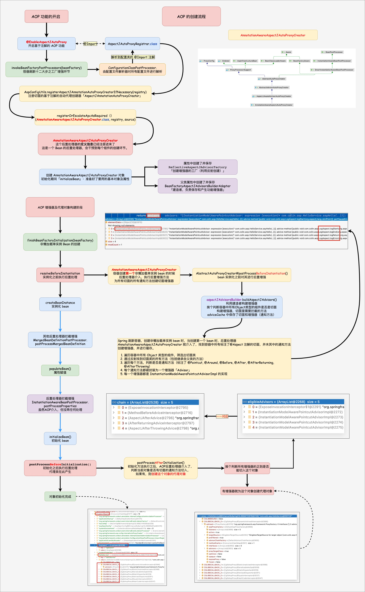
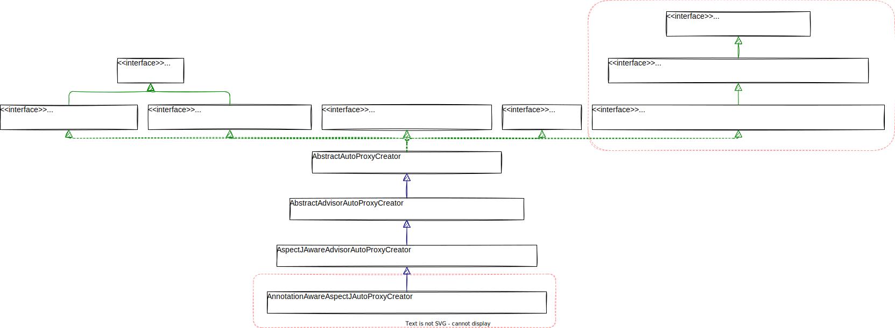
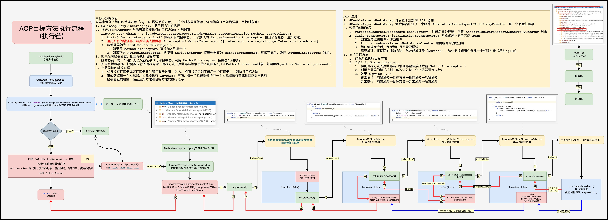

# 1. AOP 环境搭建

利用这篇文章 [Spring 源码环境搭建](../Spring源码环境搭建/README.md) 搭建好的 Spring 源码环境，首先编写一个 AOP 的测试案例，然后再根据案例去逐步分析 AOP 的整个源码。

## 1.1. 引入相关依赖

```gradle
dependencies {  
    testImplementation 'org.junit.jupiter:junit-jupiter-api:5.8.1'  
    testRuntimeOnly 'org.junit.jupiter:junit-jupiter-engine:5.8.1'  
    implementation(project(':spring-context'))  
    implementation(project(':spring-aspects'))  
    implementation 'log4j:log4j:1.2.17'  
    implementation 'org.slf4j:slf4j-log4j12:2.0.0'  
    implementation 'org.slf4j:slf4j-api:2.0.0'  
}
```

## 1.2. 增加 Log4j 配置文件

```properties
# resources文件夹根目录下  
### 配置根  
log4j.rootLogger=debug,console  
### 日志输出到控制台显示  
log4j.appender.console=org.apache.log4j.ConsoleAppender  
log4j.appender.console.Target=System.out  
log4j.appender.console.layout=org.apache.log4j.PatternLayout  
log4j.appender.console.layout.ConversionPattern=%d{yyyy-MM-dd HH:mm:ss} %-5p %c{1}:%L - %m%n
```

## 1.3. 测试案例

### 1.3.1. 目标对象

```java
@Service  
public class HelloService {  
   private static final Logger LOGGER = LoggerFactory.getLogger(HelloService.class);  
  
   public HelloService() {  
      LOGGER.info("...HelloService创建了...");  
   }  
  
   /**  
    * 切面目标方法  
    */  
   public String sayHello(String name) {  
      LOGGER.info("目标方法执行：你好，{}", name);  
  
      // 模拟异常  
      // Object o1 = new ArrayList<>(10).get(11);  
  
      return "你好，返回通知";  
   }  
}
```

### 1.3.2. 切面类

```java
@Component  
@Aspect  
public class LogAspect {  
   private static final Logger LOGGER = LoggerFactory.getLogger(LogAspect.class);  
  
   public LogAspect() {  
      LOGGER.info("...LogAspect创建了...");  
   }  
  
   @Pointcut("execution(* top.xiaorang.aop.service.HelloService.sayHello(..))")  
   public void pointcut() {  
   }  
   /**  
    * 前置通知，增强方法/增强器  
    *  
    * @param joinPoint 封装了 AOP 中切面方法的信息  
    */  
   @Before("pointcut()")  
   public void logStart(JoinPoint joinPoint) {  
      String name = joinPoint.getSignature().getName();  
      LOGGER.info("前置通知logStart==>{}===【args:{}}】", name, Arrays.asList(joinPoint.getArgs()));  
   }  
  
   /**  
    * 返回通知  
    *  
    * @param joinPoint 封装了 AOP 中切面方法的信息  
    * @param result    目标方法的返回值  
    */  
   @AfterReturning(value = "pointcut()", returning = "result")  
   public void logReturn(JoinPoint joinPoint, Object result) {  
      String name = joinPoint.getSignature().getName();  
      LOGGER.info("返回通知logReturn==>{}===【args:{}}】【result：{}】", name, Arrays.asList(joinPoint.getArgs()), result);  
   }  
  
   /**  
    * 后置通知  
    *  
    * @param joinPoint 封装了 AOP 中切面方法的信息  
    */  
   @After("pointcut()")  
   public void logEnd(JoinPoint joinPoint) {  
      String name = joinPoint.getSignature().getName();  
      LOGGER.info("后置通知logEnd==>{}===【args:{}】", name, Arrays.asList(joinPoint.getArgs()));  
   }  
  
   /**  
    * 异常通知  
    *  
    * @param joinPoint 封装了 AOP 中切面方法的信息  
    * @param e         异常  
    */  
   @AfterThrowing(value = "pointcut()", throwing = "e")  
   public void logError(JoinPoint joinPoint, Exception e) {  
      String name = joinPoint.getSignature().getName();  
      LOGGER.info("异常通知logError==>{}===【args:{}】【exception: {}】", name, Arrays.asList(joinPoint.getArgs()), e.getMessage());  
   }  
}
```

### 1.3.3. 配置类

```java
@Configuration  
@EnableAspectJAutoProxy  
@ComponentScan({"top.xiaorang.aop"})  
public class MainConfig {  
}
```

### 1.3.4. 测试类

```java
public class SpringAopSourceTests {  
   private static final Logger LOGGER = LoggerFactory.getLogger(SpringAopSourceTests.class);  
  
   @Test  
   public void test() {  
      LOGGER.info("======================华丽的分割线=========================");  
      ApplicationContext applicationContext = new AnnotationConfigApplicationContext(MainConfig.class);  
      HelloService helloService = applicationContext.getBean(HelloService.class);  
      helloService.sayHello("小让");  
      LOGGER.info("======================华丽的分割线=========================");  
  
   }  
}
```

正常通知测试测试结果如下所示：  
  
异常通知测试测试结果如下所示：  
  
测试成功，达到预期效果！🎉 接下来，就根据该测试案例来逐步分析 AOP 的整个源码。加油！🎯

# 2. AOP 创建流程



## 2.1. 开启 AOP

在 [Spring-AOP 基础](../../基础/AOP/README.md) 一文中提到：使用注解配置 Spring AOP 总体分为两步：第一步是编写一个配置类，使用 `@ComponentScan` 注解激活自动扫描组件功能，同时使用 `@EnableAspectJAutoProxy` 激活自动代理功能；第二步是为切面类标注 `@Aspect` 注解。  
其中，最为关键的一个注解为 **`@EnableAspectJAutoProxy` 注解**，==为什么使用该注解就开启了 Spring AOP 的功能？==咱们就从这个问题着手开始分析。先让咱们来看下 `@EnableAspectJAutoProxy` 注解的源码。

```java
@Target(ElementType.TYPE)
@Retention(RetentionPolicy.RUNTIME)
@Documented
@Import(AspectJAutoProxyRegistrar.class)
public @interface EnableAspectJAutoProxy {
   boolean proxyTargetClass() default false;
   
   boolean exposeProxy() default false;
}
```

该注解上标注了另外一个注解 **`@Import`**，`@Import` 注解中 `value` 属性的值为 **`AspectJAutoProxyRegistrar`**。**`@Import` 注解主要用于 快速向 Spring 容器中导入一个组件**，其中的 `value` 属性可以使用标注 `@Configuration` 注解的类、实现 `ImportSelector` 接口的类、**实现 `ImportBeanDefinitionRegistrar` 接口的类** 或者一个简单的类（对于 `@Import` 注解不清楚的小伙伴可以参考下这篇文章 [Spring 注解驱动开发](../../基础/Spring注解驱动开发/README.md) ）。再来看下 `AspectJAutoProxyRegistrar` 类的源码。

```java
class AspectJAutoProxyRegistrar implements ImportBeanDefinitionRegistrar {
    @Override
    public void registerBeanDefinitions(
            AnnotationMetadata importingClassMetadata, BeanDefinitionRegistry registry) {
		// 注册切面的基于注解的自动代理创建器「AnnotationAwareAspectJAutoProxyCreator」的 BeanDefinition
        AopConfigUtils.registerAspectJAnnotationAutoProxyCreatorIfNecessary(registry);

        AnnotationAttributes enableAspectJAutoProxy =
                AnnotationConfigUtils.attributesFor(importingClassMetadata, EnableAspectJAutoProxy.class);
        if (enableAspectJAutoProxy != null) {
            if (enableAspectJAutoProxy.getBoolean("proxyTargetClass")) {
                AopConfigUtils.forceAutoProxyCreatorToUseClassProxying(registry);
            }
            if (enableAspectJAutoProxy.getBoolean("exposeProxy")) {
                AopConfigUtils.forceAutoProxyCreatorToExposeProxy(registry);
            }
        }
    }

}
```

发现其实现了 `ImportBeanDefinitionRegistrar` 接口，并且重写了接口中的 `registerBeanDefinitions()` 方法，该方法主要用于向 Spring 容器中注册 bean 的定义信息。在 `AspectJAutoProxyRegistrar` 类的 `registerBeanDefinitions()` 方法中，就调用 `AopConfigUtils` 类中的 `registerAspectJAnnotationAutoProxyCreatorIfNecessary()` 方法 **向容器中注册一个基于注解的自动代理创建器的 bean 定义信息**，其中 beanName = `internalAutoProxyCreator`，class = `AnnotationAwareAspectJAutoProxyCreator`。先来看下 `AnnotationAwareAspectJAutoProxyCreator` 类结构关系图：  
  
从上面 `AnnotationAwareAspectJAutoProxyCreator` 的类结构关系图可以看出：`AnnotationAwareAspectJAutoProxyCreator` 的父类 `AbstractAutoProxyCreator`，实现了 `SmartInstantiationAwareBeanPostProcessor` 接口，而 `SmartInstantiationAwareBeanPostProcessor` 接口继承自 `InstantiationAwareBeanPostProcessor` 接口，而 `InstantiationAwareBeanPostProcessor` 接口又继承自 `BeanPostProcessor` 接口。  也就是说 **`AnnotationAwareAspectJAutoProxyCreator` 是一个 bean 后置处理器**。

### 2.1.1. BeanPostProcessor 接口

```java
public interface BeanPostProcessor {
    @Nullable
    default Object postProcessBeforeInitialization(Object bean, String beanName) throws BeansException {
        return bean;
    }

    @Nullable
    default Object postProcessAfterInitialization(Object bean, String beanName) throws BeansException {
        return bean;
    }
}
```

**`BeanPostProcessor` 后置处理器的调用发生在容器完成 bean 实例对象的创建和属性的依赖注入之后**。其中的 `Before` 方法在 bean 执行初始化方法（如 `InitializingBean` 的 `afterPropertiesSet()` 或自定义 init 方法）之前调用，而 `After` 方法在 bean 执行初始化方法之后调用，两个方法的默认实现都是按原样返回给定的 bean。  
💡需要注意的是：如果方法的返回值为 null ，则不会再调用后续的 BeanPostProcessors。

### 2.1.2. SmartInstantiationAwareBeanPostProcessor 接口

`SmartInstantiationAwareBeanPostProcessor` 接口对 `BeanPostProcessor` 接口进行了扩展，增加了一个重要的方法：

```java
public interface InstantiationAwareBeanPostProcessor extends BeanPostProcessor {
    @Nullable
    default Object postProcessBeforeInstantiation(Class<?> beanClass, String beanName) throws BeansException {
        return null;
    }
}
```

看方法名字就知道，该 **`postProcessBeforeInstantiation()` 方法是在 bean 被实例化之前调用**。返回的 bean 对象可能是要使用的代理对象而不是目标 bean，从而有效地抑制了目标 bean 的默认实例化。如果这个方法返回了一个非空的对象，那么 bean 的创建过程就会短路，也就是不再执行后面的流程。  

## 2.2. 注册后置处理器

在测试代码中，`new AnnotationConfigApplicationContext(MainConfig.class);` 用于注册配置类的定义信息和刷新容器，刷新容器，即 `refresh()` 方法是整个 Spring 源码最为核心的一个点，算是整个 Spring 的一个入口。

```java
public AnnotationConfigApplicationContext(Class<?>... componentClasses) {  
   this();
   // 注册配置类的定义信息  
   register(componentClasses);
   // 刷新容器（核心）  
   refresh();  
}
```

咱们来看看 `AbstractApplicationContext` 类中的 `refresh()` 方法在底层到底都干了什么？源码如下所示：

```java
@Override  
public void refresh() throws BeansException, IllegalStateException {  
   synchronized (this.startupShutdownMonitor) {  
      StartupStep contextRefresh = this.applicationStartup.start("spring.context.refresh");  
  
      // Prepare this context for refreshing.  
      prepareRefresh();  
  
      // Tell the subclass to refresh the internal bean factory.  
      ConfigurableListableBeanFactory beanFactory = obtainFreshBeanFactory();  
  
      // Prepare the bean factory for use in this context.  
      prepareBeanFactory(beanFactory);  
  
      try {  
         // Allows post-processing of the bean factory in context subclasses.  
         postProcessBeanFactory(beanFactory);  
  
         StartupStep beanPostProcess = this.applicationStartup.start("spring.context.beans.post-process");  
         // Invoke factory processors registered as beans in the context.  
         invokeBeanFactoryPostProcessors(beanFactory);  
  
         // 注册拦截 bean 创建的 bean 后置处理器 
         registerBeanPostProcessors(beanFactory);  
         beanPostProcess.end();  
  
         // Initialize message source for this context.  
         initMessageSource();  
  
         // Initialize event multicaster for this context.  
         initApplicationEventMulticaster();  
  
         // Initialize other special beans in specific context subclasses.  
         onRefresh();  
  
         // Check for listener beans and register them.  
         registerListeners();  
  
         // Instantiate all remaining (non-lazy-init) singletons.  
         finishBeanFactoryInitialization(beanFactory);  
  
         // Last step: publish corresponding event.  
         finishRefresh();  
      }  
  
      catch (BeansException ex) {  
         if (logger.isWarnEnabled()) {  
            logger.warn("Exception encountered during context initialization - " +  
                  "cancelling refresh attempt: " + ex);  
         }  
  
         // Destroy already created singletons to avoid dangling resources.  
         destroyBeans();  
  
         // Reset 'active' flag.  
         cancelRefresh(ex);  
  
         // Propagate exception to caller.  
         throw ex;  
      }  
  
      finally {  
         // Reset common introspection caches in Spring's core, since we  
         // might not ever need metadata for singleton beans anymore...         resetCommonCaches();  
         contextRefresh.end();  
      }  
   }  
}
```

当容器刷新执行到 `registerBeanPostProcessors()` 方法时，该方法用于注册后置处理器，在此处打一个断点，调试一下。发现容器中已经存在 8 个 bean 的定义信息：  
  
其中绿色的为 Spring 内部自己注册的 bean 定义信息，紫色的为配置类，橘黄色的为切面类，蓝色的为目标对象，红色的为今天的主角，也就是第 2.1 节最后分析出来的后置处理器 `AnnotationAwareAspectJAutoProxyCreator`。  F5 进入方法内部，发现调用另外一个方法。

```java
protected void registerBeanPostProcessors(ConfigurableListableBeanFactory beanFactory) {  
   PostProcessorRegistrationDelegate.registerBeanPostProcessors(beanFactory, this);  
}
```

再 F5 进入方法内部，该方法看名字就知道是用来注册 bean 后置处理器的地方，从 Spring 容器中获取所有后置处理器的名称，再将所有的后置处理器按照是否实现 `PriorityOrdered` 接口和 `Ordered` 接口分成三块，每一块代码就是一个循环，代码逻辑一样，所以只要分析其中一块就好。从 `AnnotationAwareAspectJAutoProxyCreator` 后置处理器的类结构图可以看出，该类实现了 `Ordered` 接口，那么就拿第二个循环分析。遍历 `orderedPostProcessorNames` 集合，集合中存放的就是实现了 `Ordered` 接口的后置处理器，在循环体内部根据后置处理器的名称与类型去容器中获取，第一次肯定是获取不到的，获取不到则会创建一个 bean 保存在容器中然后返回创建的 bean。循环结束之后，则对获取出来的后置处理器进行排序，然后再将后置处理器注册到容器中，其实就是添加到一个 `beanPostProcessors` 的集合中。

```java
public static void registerBeanPostProcessors(
            ConfigurableListableBeanFactory beanFactory, AbstractApplicationContext applicationContext) {

    String[] postProcessorNames = beanFactory.getBeanNamesForType(BeanPostProcessor.class, true, false);
    
    int beanProcessorTargetCount = beanFactory.getBeanPostProcessorCount() + 1 + postProcessorNames.length;
    beanFactory.addBeanPostProcessor(new BeanPostProcessorChecker(beanFactory, beanProcessorTargetCount));

    // 将实现 PriorityOrdered、Ordered 和其余部分的 BeanPostProcessor 分开。
    List<BeanPostProcessor> priorityOrderedPostProcessors = new ArrayList<>();
    List<BeanPostProcessor> internalPostProcessors = new ArrayList<>();
    List<String> orderedPostProcessorNames = new ArrayList<>();
    List<String> nonOrderedPostProcessorNames = new ArrayList<>();
    for (String ppName : postProcessorNames) {
        if (beanFactory.isTypeMatch(ppName, PriorityOrdered.class)) {
            BeanPostProcessor pp = beanFactory.getBean(ppName, BeanPostProcessor.class);
            priorityOrderedPostProcessors.add(pp);
            if (pp instanceof MergedBeanDefinitionPostProcessor) {
                internalPostProcessors.add(pp);
            }
        }
        else if (beanFactory.isTypeMatch(ppName, Ordered.class)) {
            orderedPostProcessorNames.add(ppName);
        }
        else {
            nonOrderedPostProcessorNames.add(ppName);
        }
    }

    // First, register the BeanPostProcessors that implement PriorityOrdered.
    sortPostProcessors(priorityOrderedPostProcessors, beanFactory);
    registerBeanPostProcessors(beanFactory, priorityOrderedPostProcessors);

    // Next, register the BeanPostProcessors that implement Ordered.
    List<BeanPostProcessor> orderedPostProcessors = new ArrayList<>(orderedPostProcessorNames.size());
    for (String ppName : orderedPostProcessorNames) {
        // 根据名字和类型去容器中获取bean，获取不到的话，则会创建出一个bean保存到容器中再返回回来
        BeanPostProcessor pp = beanFactory.getBean(ppName, BeanPostProcessor.class);
        orderedPostProcessors.add(pp);
        if (pp instanceof MergedBeanDefinitionPostProcessor) {
            internalPostProcessors.add(pp);
        }
    }
    sortPostProcessors(orderedPostProcessors, beanFactory);
    registerBeanPostProcessors(beanFactory, orderedPostProcessors);

    // Now, register all regular BeanPostProcessors.
    List<BeanPostProcessor> nonOrderedPostProcessors = new ArrayList<>(nonOrderedPostProcessorNames.size());
    for (String ppName : nonOrderedPostProcessorNames) {
        BeanPostProcessor pp = beanFactory.getBean(ppName, BeanPostProcessor.class);
        nonOrderedPostProcessors.add(pp);
        if (pp instanceof MergedBeanDefinitionPostProcessor) {
            internalPostProcessors.add(pp);
        }
    }
    registerBeanPostProcessors(beanFactory, nonOrderedPostProcessors);

    // Finally, re-register all internal BeanPostProcessors.
    sortPostProcessors(internalPostProcessors, beanFactory);
    registerBeanPostProcessors(beanFactory, internalPostProcessors);

    // Re-register post-processor for detecting inner beans as ApplicationListeners,
    // moving it to the end of the processor chain (for picking up proxies etc).
    beanFactory.addBeanPostProcessor(new ApplicationListenerDetector(applicationContext));
}
```

在该方法的第二个循环体内部打一个断点，使用 `getBean()` 方法从容器中获取 `AnnotationAwareAspectJAutoProxyCreator` 后置处理器，其实就是去创建一个 `AnnotationAwareAspectJAutoProxyCreator` 实例对象保存到容器中后再返回。由于还实现了 `BeanFactoryAware` 接口，在其初始化期间，为其属性 `aspectJAdvisorFactory` 创建并保存了用于利用反射创建增强器的工厂 `ReflectiveAspectJAdvisorFactory`，同时还为其属性 `aspectJAdvisorsBuilder` 创建并保存了用于负责保存和产生功能增强器的 `BeanFactoryAspectJAdvisorsBuilderAdapter`。由于 `AnnotationAwareAspectJAutoProxyCreator` 是一个 bean 的后置处理器，那么就会介入到每个 bean 的创建过程中。  
  
至此，`AnnotationAwareAspectJAutoProxyCreator` 后置处理器就已经被注册到容器当中，后面如果要用到该后置处理器，则直接从容器中拿即可。

## 2.3. 创建增强器

在 `AnnotationAwareAspectJAutoProxyCreator` 后置处理器的父类 `AbstractAutoProxyCreator` 中只重写了其中的两个方法 `postProcessBeforeInstantiation()` 和 `postProcessAfterInitialization()`。  
  
那就先来看下 `postProcessBeforeInstantiation()` 方法。

### 2.3.1. postProcessBeforeInstantiation() 方法

在 `AbstractAutoProxyCreator` 中的 `postProcessBeforeInstantiation()` 方法打一个断点，看下整个方法的调用栈：  
  
从整个方法的调用栈可以看出：

1. 当调用 `getBean` 方法从容器中获取指定 bean 时（此时 beanName = ”mainConfig“，即获取配置类的组件），从容器中获取不到时，则会调用 `AbstractAutowireCapableBeanFactory` 类的 `createBean()` 方法创建 bean 实例对象。

```java
protected Object createBean(String beanName, RootBeanDefinition mbd, @Nullable Object[] args)
			throws BeanCreationException {
    // 省略部分代码

    try {
        // 让 BeanPostProcessors 有机会返回一个代理而不是目标 bean 实例
        Object bean = resolveBeforeInstantiation(beanName, mbdToUse);
        if (bean != null) {
            return bean;
        }
    } catch (Throwable ex) {
        throw new BeanCreationException(mbdToUse.getResourceDescription(), beanName,
                                        "BeanPostProcessor before instantiation of bean failed", ex);
    }

    try {
	    // 真正创建bean实例的地方
        Object beanInstance = doCreateBean(beanName, mbdToUse, args);
        if (logger.isTraceEnabled()) {
            logger.trace("Finished creating instance of bean '" + beanName + "'");
        }
        return beanInstance;
    } catch (BeanCreationException | ImplicitlyAppearedSingletonException ex) {
        // A previously detected exception with proper bean creation context already,
        // or illegal singleton state to be communicated up to DefaultSingletonBeanRegistry.
        throw ex;
    } catch (Throwable ex) {
        throw new BeanCreationException(
            mbdToUse.getResourceDescription(), beanName, "Unexpected exception during bean creation", ex);
    }
}
```

2. 在执行真正的创建 bean 实例的方法之前，会先调用 **`resolveBeforeInstantiation()` 方法，该方法的作用是让 BeanPostProcessors 有机会返回一个代理而不是目标 bean 实例**。当容器中存在 `InstantiationAwareBeanPostProcessor` 类型的后置处理器时，则执行 `applyBeanPostProcessorsBeforeInstantiation()` 方法，如果方法返回值不为 null，紧接着执行 `applyBeanPostProcessorsAfterInitialization()` 方法。

```java
protected Object resolveBeforeInstantiation(String beanName, RootBeanDefinition mbd) {
    Object bean = null;
    if (!Boolean.FALSE.equals(mbd.beforeInstantiationResolved)) {
        // Make sure bean class is actually resolved at this point.
        if (!mbd.isSynthetic() && hasInstantiationAwareBeanPostProcessors()) {
            Class<?> targetType = determineTargetType(beanName, mbd);
            if (targetType != null) {
	            // 
                bean = applyBeanPostProcessorsBeforeInstantiation(targetType, beanName);
                if (bean != null) {
                    bean = applyBeanPostProcessorsAfterInitialization(bean, beanName);
                }
            }
        }
        mbd.beforeInstantiationResolved = (bean != null);
    }
    return bean;
}
```

3. `applyBeanPostProcessorsBeforeInstantiation()` 方法，在该方法中循环遍历所有类型为 `InstantiationAwareBeanPostProcessor` 的后置处理器，依次执行每个后置处理器中的 `postProcessBeforeInstantiation()` 方法。

```java
protected Object applyBeanPostProcessorsBeforeInstantiation(Class<?> beanClass, String beanName) {  
   for (InstantiationAwareBeanPostProcessor bp : getBeanPostProcessorCache().instantiationAware) {  
      Object result = bp.postProcessBeforeInstantiation(beanClass, beanName);  
      if (result != null) {  
         return result;  
      }  
   }  
   return null;  
}
```

4. 通过 `AnnotationAwareAspectJAutoProxyCreator` 类的结构关系图可以知道其父类 `AbstractAutoProxyCreator` 实现了 `InstantiationAwareBeanPostProcessor` 接口，那么此时在循环体中就会去执行后置处理器 `AbstractAutoProxyCreator` 中的 `postProcessBeforeInstantiation()` 方法。  
至于怎么来到 `AbstractAutoProxyCreator` 中的 `postProcessBeforeInstantiation()` 方法的已经分析的很清楚，总的来说就是，Spring 容器刷新执行到 `finishBeanFactoryInitialization()` 方法时，实例化所有剩余的非懒加载的单实例 bean，在实例化 bean 之前，后置处理器就会介入，即 `AnnotationAwareAspectJAutoProxyCreator` 后置处理器会在 bean 实例化之前执行 `postProcessBeforeInstantiation()` 方法。

现在来看下 `postProcessBeforeInstantiation()` 方法在底层到底干了什么？  

```ad-important
🎨结论先行：**`AnnotationAwareAspectJAutoProxyCreator`** 会利用 **`postProcessBeforeInstantiation()`** 方法会**为容器中所有的切面中的所有的通知方法创建增强器**，即筛选所有组件中标注了 `@Aspect` 注解的切面，为其中的所有通知方法生成增强器 `Advisor`，排序后存入缓存中，**一个增强器 `Advisor` 即是一个 `InstantiationModelAwarePointcutAdvisorImpl` 类型的实例对象**，其封装了**增强方法** (通知方法) 和**切入点**等关键信息。  
```

`AbstractAutoProxyCreator` 中的 `postProcessBeforeInstantiation()` 方法源码如下所示：

```java
public Object postProcessBeforeInstantiation(Class<?> beanClass, String beanName) {
   // 构建缓存 key
   Object cacheKey = getCacheKey(beanClass, beanName);

   if (!StringUtils.hasLength(beanName) || !this.targetSourcedBeans.contains(beanName)) {
      // 判断缓存中是都存在已经分析过的组件
      if (this.advisedBeans.containsKey(cacheKey)) {
         // 被分析过，则直接返回
         return null;
      }

      // 是不是aop基础类？是否跳过
      if (isInfrastructureClass(beanClass) || shouldSkip(beanClass, beanName)) {
         /**
          * isInfrastructureClass(beanClass):
          * 判断是否为基础 bean 组件，即 bean 的 class 是 Advice、Pointcut、Advisor、AopInfrastructureBean 类型，
          * 则将其缓存进 advisedBeans 中
          *
          * shouldSkip():
          * 判断当前 bean 是否需要跳过，其中切面类会返 true，即切面类会缓存进 advisedBeans 中
          * shouldSkip() 方法会将切面类中的通知方法创建成增强器 Advisor，并保存进缓存中，以后使用增强器时，直接从缓存中获取
          */
         this.advisedBeans.put(cacheKey, Boolean.FALSE);
         return null;
      }
   }
   return null;
}
```

#### 2.3.1.1. 判断是不是 AOP 基础类

调用的是子类 `AnnotationAwareAspectJAutoProxyCreator` 中的 `isInfrastructureClass()` 方法：该方法用来寻找哪些是切面类。

```java
protected boolean isInfrastructureClass(Class<?> beanClass) {
    /**
	 * 判断是不是切面。
	 * 判断是否实现了这几个接口：Advice、Pointcut、Advisor、AopInfrastructureBean
	 * 或者当前类是否存在 @Aspect 注解
	 */
    return (super.isInfrastructureClass(beanClass) ||
            (this.aspectJAdvisorFactory != null && this.aspectJAdvisorFactory.isAspect(beanClass)));
}
```

父类中的 `isInfrastructureClass()` 方法：

```java
protected boolean isInfrastructureClass(Class<?> beanClass) {
    /**
	 * 假如当前正在创建的 bean 的 class 是 Advice、Pointcut、Advisor、AopInfrastructureBean 类型，则直接跳过，不需要解析
	 */
    boolean retVal = Advice.class.isAssignableFrom(beanClass) ||
        Pointcut.class.isAssignableFrom(beanClass) ||
            Advisor.class.isAssignableFrom(beanClass) ||
                AopInfrastructureBean.class.isAssignableFrom(beanClass);
    if (retVal && logger.isTraceEnabled()) {
        logger.trace("Did not attempt to auto-proxy infrastructure class [" + beanClass.getName() + "]");
    }
    return retVal;
}
```

#### 2.3.1.2. 是否应该跳过

调用的是子类 `AnnotationAwareAspectJAutoProxyCreator` 中的 `shouldSkip()` 方法：

```java
protected boolean shouldSkip(Class<?> beanClass, String beanName) {  
   /**  
	 * 找到候选的增强器，即为所有标注了注解 @Aspect 的切面类构建增强器。  
	 * 遍历容器中所有组件来筛选切面，继而为其构建增强器  
	 * 构建好的增强器保存在缓存 advisorsCache 中，使用时直接到缓存中获取  
	 */ 
   List<Advisor> candidateAdvisors = findCandidateAdvisors();  
   for (Advisor advisor : candidateAdvisors) {  
      if (advisor instanceof AspectJPointcutAdvisor &&  
            ((AspectJPointcutAdvisor) advisor).getAspectName().equals(beanName)) {  
         return true;  
      }  
   }  
   return super.shouldSkip(beanClass, beanName);  
}
```

#### 2.3.1.3. 获取候选的增强器

调用的是子类 `AnnotationAwareAspectJAutoProxyCreator` 中的 `findCandidateAdvisors()` 方法：

```java
protected List<Advisor> findCandidateAdvisors() {
    /**
	 * 调用父类方法，加载 xml 中配置的增强器。（即兼容 xml 方式配置的 AOP）
	 * 找出 xml 配置的 Advisor 和原生接口的 AOP 的 Advisor，找出事务相关的 Advisor
	 */
    List<Advisor> advisors = super.findCandidateAdvisors();

    // 利用建造者构建切面增强器。
    if (this.aspectJAdvisorsBuilder != null) {
        /**
		 * 为标注注解 @Aspect 的切面类中的通知方法构建增强器
		 * 增强器缓存进 advisorsCache 中，使用时直接到缓存中获取
		 * aspectJAdvisorsBuilder.buildAspectJAdvisors()：构建增强器
		 */
        advisors.addAll(this.aspectJAdvisorsBuilder.buildAspectJAdvisors());
    }
    return advisors;
}
```

在方法的最后打一个断点，看下获取到了哪些候选的增强器？  


本案例使用的基于 `@Aspect` 注解的方式来配置切面类，所以调用 `buildAspectJAdvisors()` 方法来构建所有的增强器。

#### 2.3.1.4. 构建所有的增强器

`buildAspectJAdvisors()` 方法：从容器中获取标注 `@Aspect` 注解的 bean，然后为切面类中的每个通知方法生成一个增强器。

```java
public List<Advisor> buildAspectJAdvisors() {
    // 获取所有标注了注解 @Aspect 的切面的名字
    List<String> aspectNames = this.aspectBeanNames;
    // DCL：双检查锁的写法(双端检锁)
    if (aspectNames == null) {
        synchronized (this) {
            aspectNames = this.aspectBeanNames;
            if (aspectNames == null) {

                // 用于保存创建的增强器的集合
                List<Advisor> advisors = new ArrayList<>();
                aspectNames = new ArrayList<>();

                // 获取容器中所有组件的名字
                String[] beanNames = BeanFactoryUtils.beanNamesForTypeIncludingAncestors(
                    this.beanFactory, Object.class, true, false);
                // 拿到容器中所有的组件，挨个遍历判断
                for (String beanName : beanNames) {
                    if (!isEligibleBean(beanName)) {
                        continue;
                    }
                    // 获取 bean 对应的 class 对象
                    Class<?> beanType = this.beanFactory.getType(beanName, false);
                    if (beanType == null) {
                        continue;
                    }

                    // 根据 class 对象判断是否为切面
                    if (this.advisorFactory.isAspect(beanType)) {
                        // 每一个组件先判断是否是切面，如果是切面，则放入集合 aspectNames 中
                        aspectNames.add(beanName);
                        // 将 beanName 和 class 对象构建成为一个切面元数据对象 AspectMetadata
                        AspectMetadata amd = new AspectMetadata(beanType, beanName);
                        if (amd.getAjType().getPerClause().getKind() == PerClauseKind.SINGLETON) {
                            MetadataAwareAspectInstanceFactory factory =
                                new BeanFactoryAspectInstanceFactory(this.beanFactory, beanName);

                            // 利用增强器工厂，获取切面中定义的所有的增强器(通知方法)
                            List<Advisor> classAdvisors = this.advisorFactory.getAdvisors(factory);
                            if (this.beanFactory.isSingleton(beanName)) {
                                // 缓存单实例的切面及其增强器（通知方法）
                                this.advisorsCache.put(beanName, classAdvisors);
                            }
                            else {
                                // 如果不是单例，则缓存工厂，以方便下一次快速创建增强器
                                this.aspectFactoryCache.put(beanName, factory);
                            }

                            // 添加构建好的增强器
                            advisors.addAll(classAdvisors);
                        }
                        else {
                            // Per target or per this.
                            if (this.beanFactory.isSingleton(beanName)) {
                                throw new IllegalArgumentException("Bean with name '" + beanName +
                                                                   "' is a singleton, but aspect instantiation model is not singleton");
                            }
                            MetadataAwareAspectInstanceFactory factory =
                                new PrototypeAspectInstanceFactory(this.beanFactory, beanName);
                            this.aspectFactoryCache.put(beanName, factory);
                            advisors.addAll(this.advisorFactory.getAdvisors(factory));
                        }
                    }
                }

                // 设置处理过切面类的 beanName 数组，以便下一次直接从缓存中获取
                this.aspectBeanNames = aspectNames;
                // 返回创建好的增强器集合
                return advisors;
            }
        }
    }

    if (aspectNames.isEmpty()) {
        return Collections.emptyList();
    }
    List<Advisor> advisors = new ArrayList<>();

    // 遍历所有的切面找增强器
    for (String aspectName : aspectNames) {
        // 尝试直接从缓存中获取增强器集合
        List<Advisor> cachedAdvisors = this.advisorsCache.get(aspectName);
        if (cachedAdvisors != null) {
            advisors.addAll(cachedAdvisors);
        }
        else {
            // 若缓存中没有增强器集合，则使用工厂快速构建新的增强器 advisors
            MetadataAwareAspectInstanceFactory factory = this.aspectFactoryCache.get(aspectName);
            advisors.addAll(this.advisorFactory.getAdvisors(factory));
        }
    }
    return advisors;
}
```

##### 2.3.1.4.1. 获取某个切面类中所有的增强器

```java
public List<Advisor> getAdvisors(MetadataAwareAspectInstanceFactory aspectInstanceFactory) {
    // 获取标记的 @Aspect 注解的类
    Class<?> aspectClass = aspectInstanceFactory.getAspectMetadata().getAspectClass();
    // 获取切面类的名称
    String aspectName = aspectInstanceFactory.getAspectMetadata().getAspectName();
    // 校验切面类
    validate(aspectClass);

    // 包装一下
    MetadataAwareAspectInstanceFactory lazySingletonAspectInstanceFactory =
        new LazySingletonAspectInstanceFactoryDecorator(aspectInstanceFactory);

    // 准备要搜集所有增强器的集合；getAdvisorMethods(aspectClass) 找到当前类中的所有方法，包括继承自父类的方法
    List<Advisor> advisors = new ArrayList<>();

    /**
	 * getAdvisorMethods()：获取切面类中声明的所有方法，
	 * 就会返回标注了 @Before、@AfterReturning、@After、@AfterThrowing 注解的方法，也包含 hashCode()、equals()、toString() 等方法
	 * 但不会解析标注了注解 @PointCut 的方法
	 */
    for (Method method : getAdvisorMethods(aspectClass)) {
        /**
		 * 遍历所有方法，如果当前方法是通知方法，就被封装为增强器 Advisor，
		 * Advisor 就是 InstantiationModelAwarePointcutAdvisorImpl 的实例
		 */
        Advisor advisor = getAdvisor(method, lazySingletonAspectInstanceFactory, 0, aspectName);
        if (advisor != null) {
            advisors.add(advisor);
        }
    }
    return advisors;
}
```

##### 2.3.1.4.2. 通知方法转换成增强器

```java
public Advisor getAdvisor(Method candidateAdviceMethod, MetadataAwareAspectInstanceFactory aspectInstanceFactory,
			int declarationOrderInAspect, String aspectName) {

    validate(aspectInstanceFactory.getAspectMetadata().getAspectClass());
    // 获取当前通知的切入点表达式
    AspectJExpressionPointcut expressionPointcut = getPointcut(
        candidateAdviceMethod, aspectInstanceFactory.getAspectMetadata().getAspectClass());
    if (expressionPointcut == null) {
        return null;
    }

    /**
	 * 构建一个增强器 Advisor，即一个 InstantiationModelAwarePointcutAdvisorImpl 类型的实例
	 * 通过构造方法的方式，将增强方法 candidateAdviceMethod 和切点 expressionPointcut 等关键信息封装到增强器 Advisor 中
	 */
    return new InstantiationModelAwarePointcutAdvisorImpl(expressionPointcut, candidateAdviceMethod,
                this, aspectInstanceFactory, declarationOrderInAspect, aspectName);
}
```

##### 2.3.1.4.3. 获取切入点表达式

```java
private AspectJExpressionPointcut getPointcut(Method candidateAdviceMethod, Class<?> candidateAspectClass) {
    // 从方法上找到 AspectJ 的注解，@Pointcut, @Around, @Before, @After, @AfterReturning, @AfterThrowing
    AspectJAnnotation<?> aspectJAnnotation =
        AbstractAspectJAdvisorFactory.findAspectJAnnotationOnMethod(candidateAdviceMethod);
    if (aspectJAnnotation == null) {
        // 忽略掉没有的注解
        return null;
    }

    // 构建出来一个切点对象，即构建一个 AspectJExpressionPointcut 的实例，并将其作为方法结果进行返回
    AspectJExpressionPointcut ajexp =
        new AspectJExpressionPointcut(candidateAspectClass, new String[0], new Class<?>[0]);
    // 设置切入点表达式
    ajexp.setExpression(aspectJAnnotation.getPointcutExpression());
    if (this.beanFactory != null) {
        ajexp.setBeanFactory(this.beanFactory);
    }
    // 返回刚构建好的切点对象
    return ajexp;
}
```

## 2.4. 创建代理对象

在 `AbstractAutoProxyCreator` 中的 `postProcessAfterInitialization()` 方法打一个断点，看下整个方法的调用栈：  
  
从整个方法的调用栈可以看出：在 bean 实例化以及属性赋值之后的初始化阶段，执行完自定义的初始化方法之后，`AnnotationAwareAspectJAutoProxyCreator` 后置处理器会再次介入，执行 `postProcessAfterInitialization()` 方法。  
现在来看下 `postProcessAfterInitialization()` 方法在底层到底干了什么？  

```ad-important
🎨结论先行：在 bean 的初始化之后，`AnnotationAwareAspectJAutoProxyCreator` 会再次介入，执行 `postProcessAfterInitialization()` 方法，判断是否有切面的通知方法切入当前 bean 对象，即当前 bean 对象是切面的目标类，则会为当前 bean 创建动态代理，会根据 bean 是否实现了接口，来区分是使用 JDK 动态代理还是 Cglib 动态代理，代理对象创建完成保存进 ioc 容器。
```

`AbstractAutoProxyCreator` 中的 `postProcessAfterInitialization()` 方法源码如下所示：

```java
public Object postProcessAfterInitialization(@Nullable Object bean, String beanName) {  
   if (bean != null) {  
      Object cacheKey = getCacheKey(bean.getClass(), beanName);  
      // 判断缓存中当前 bean 是否被执行过 AOP 代理，若缓存中不存在，则为其创建代理对象  
      if (this.earlyProxyReferences.remove(cacheKey) != bean) {  
         // 若当前 bean 不存在早期代理缓存中，则说明当前 bean 还没有被执行 AOP 代理，则为其创建代理对象  
         return wrapIfNecessary(bean, beanName, cacheKey);  
      }  
   }  
  
   // 至此，说明当前 bean 已经被执行过 AOP 代理，直接返回  
   return bean;  
}
```

其中的 `wrapIfNecessary()` 方法用于判断是否需要创建代理对象，如果当前 bean 能够获取到符合条件的增强器集合，则给当前 bean 创建代理对象并返回。

```java
protected Object wrapIfNecessary(Object bean, String beanName, Object cacheKey) {

    // 若当前 bean 已经被处理过了，则直接返回
    if (StringUtils.hasLength(beanName) && this.targetSourcedBeans.contains(beanName)) {
        return bean;
    }

    // 若当前 bean 不需要被增强，则直接返回
    if (Boolean.FALSE.equals(this.advisedBeans.get(cacheKey))) {
        return bean;
    }

    // 若当前 bean 是基础类或不需要被代理，则直接返回
    if (isInfrastructureClass(bean.getClass()) || shouldSkip(bean.getClass(), beanName)) {
        this.advisedBeans.put(cacheKey, Boolean.FALSE);
        return bean;
    }

    // (获取符合条件的增强器集合)。如果有切面的通知方法切入这个对象，就给对象创建代理对象。
    Object[] specificInterceptors = getAdvicesAndAdvisorsForBean(bean.getClass(), beanName, null);

    // 存在增强逻辑时，才会进行代理
    if (specificInterceptors != DO_NOT_PROXY) {
        this.advisedBeans.put(cacheKey, Boolean.TRUE);

        // 利用增强器为 AOP 目标对象创建代理对象
        Object proxy = createProxy(
            bean.getClass(), beanName, specificInterceptors, new SingletonTargetSource(bean));

        this.proxyTypes.put(cacheKey, proxy.getClass());
        return proxy;
    }

    this.advisedBeans.put(cacheKey, Boolean.FALSE);
    return bean;
}
```

### 2.4.1. 获取所有符合条件的增强器

```java
protected Object[] getAdvicesAndAdvisorsForBean(  
      Class<?> beanClass, String beanName, @Nullable TargetSource targetSource) {  
  
   // 找到符合这个类的所有的增强器 Advisor，例如切面类中的各个通知方法  
   List<Advisor> advisors = findEligibleAdvisors(beanClass, beanName);  
   if (advisors.isEmpty()) {  
      // 如果没找到增强器 Advisor，则不创建代理  
      return DO_NOT_PROXY;  
   }  
   return advisors.toArray();  
}
```

其中的 `findEligibleAdvisors()` 方法用于从前面就已经准备好的所有候选增强器中找到与当前 bean 匹配的增强器，由于可能存在多个切面类同时作用于该 bean，所以需要排序之后再返回。

```java
protected List<Advisor> findEligibleAdvisors(Class<?> beanClass, String beanName) {  
  
   // 找到候选的增强器「各种增强方法，前置方法，后置方法等」。缓存中存在，直接获取  
   List<Advisor> candidateAdvisors = findCandidateAdvisors();  
  
   // 判断增强器能否应用到当前 bean，找到与之匹配的增强器  
   List<Advisor> eligibleAdvisors = findAdvisorsThatCanApply(candidateAdvisors, beanClass, beanName);  
   // 为增强器链中添加了 ExposeInvocationInterceptor「拦截器」  
   extendAdvisors(eligibleAdvisors);  
  
   if (!eligibleAdvisors.isEmpty()) {  
      /**  
       * 给增强器排序  
       * 若多个切面类同时作用，增强器需按顺序执行，切面类可通过实现 Order 接口来实现优先级设定，数值越小，优先级越高  
       */  
      eligibleAdvisors = sortAdvisors(eligibleAdvisors);  
   }  
   return eligibleAdvisors;  
}
```

在方法的最后打一个断点，查看一下当 bean 为 `HelloService` 时获取到符合条件的增强器有哪些？  


### 2.4.2. 创建代理对象

当存在增强器能切入当前 bean 时，则为当前 bean 创建一个代理对象，在创建代理对象时，会根据当前 bean 是否实现了接口，来区分是使用 JDK 动态代理还是 Cglib 动态代理，代理对象创建完成后保存到容器中。

```java
protected Object createProxy(Class<?> beanClass, @Nullable String beanName,
			@Nullable Object[] specificInterceptors, TargetSource targetSource) {

    if (this.beanFactory instanceof ConfigurableListableBeanFactory) {
        AutoProxyUtils.exposeTargetClass((ConfigurableListableBeanFactory) this.beanFactory, beanName, beanClass);
    }

    // 创建一个代理工厂 proxyFactory 对象，即专门用来创建动态代理的工厂，可以通过其 getProxy() 方法创代理对象
    ProxyFactory proxyFactory = new ProxyFactory();
    // 将 AnnotationAwareAspectJAutoProxyCreator 的相关属性拷贝一份到 ProxyConfig 中
    proxyFactory.copyFrom(this);

    /**
	 * 判断应该基于类代理还是基于接口代理，即该使用 cglib 代理还是该使用 jdk 代理
	 * 当 proxyTargetClass 属性值为 false，则表明当前是基于接口代理的
	 */
    if (!proxyFactory.isProxyTargetClass()) {
        // 表明基于接口代理

        /**
		 * 判断有没有配置 preserveTargetClass 属性，
		 * preserveTargetClass 是 BeanDefinition 中定义的属性，可以控制是否需要基于类代理
		 * 若 preserveTargetClass 属性值为 true，则表明需要基于类代理，否则基于接口代理
		 */
        if (shouldProxyTargetClass(beanClass, beanName)) {
            // 设置基于类代理
            proxyFactory.setProxyTargetClass(true);
        }
        else {
            /**
			 * 设置基于接口代理
			 * 如果目标类有符合要求的接口，那么就将接口添加到 proxyFactory 的 interface 属性中
			 * 如果目标类没有符合要求的接口，那么就只能基于类代理，此时需要将 preserveTargetClass 属性设置为 true
			 */
            evaluateProxyInterfaces(beanClass, proxyFactory);
        }
    }

    // 构建增强器（将匹配到的增强拦截器和普通的拦截器进行合并）
    Advisor[] advisors = buildAdvisors(beanName, specificInterceptors);
    // 将合并之后的所有增强器设置到 proxyFactory 中
    proxyFactory.addAdvisors(advisors);
    // 设置代理的目标类
    proxyFactory.setTargetSource(targetSource);
    // 可以预留给子类实现定制 proxyFactory，默认为空实现
    customizeProxyFactory(proxyFactory);

    proxyFactory.setFrozen(this.freezeProxy);
    /**
	 * 代表之前是否筛选 advise
	 * 因为继承了 AbstractAdvisorAutoProxyCreator，并且之前调用了 findEligibleAdvisors() 方法进行筛选，因此为 true
	 */
    if (advisorsPreFiltered()) {
        proxyFactory.setPreFiltered(true);
    }

    // Use original ClassLoader if bean class not locally loaded in overriding class loader
    ClassLoader classLoader = getProxyClassLoader();
    if (classLoader instanceof SmartClassLoader && classLoader != beanClass.getClassLoader()) {
        classLoader = ((SmartClassLoader) classLoader).getOriginalClassLoader();
    }

    // 真正的创建动态代理对象
    return proxyFactory.getProxy(classLoader);
}
```

💡需要注意的是：如何判断是使用 jdk 动态代理还是使用 Cglib 动态代理 ？默认情况下当前 bean 如果实现接口，则使用 JDK 动态代理，如果没有实现接口，则使用 Cglib 动态代理；当然可以通过设置 `@EnableAspectJAutoProxy` 注解中的 `proxyTargetClass` 属性为 true，开启强制使用 Cglib 动态代理。  

> 对于 **JDK 动态代理** 和 **Cglib 动态代理** 不清楚的小伙伴可以查看 [代理模式](../../../设计模式/代理模式.md) 这一篇文章，文章中详细地介绍了 JDK 动态代理和 Cglib 动态代理是如何使用的，以及两者之间的区别。  

最后，在 `wrapIfNecessary()` 方法的 `createProxy()` 后打一个断点，查看一下当前 bean 的代理对象：  
  

# 3. AOP 目标方法执行流程

目标方法的执行，容器中保存了组件的代理对象「cglib 增强后的对象」，这个对象里面保存了详细信息（比如增强器、目标对象等）

1. `CglibAopProxy.intercept()`，拦截目标方法的执行
2. 根据 ProxyFactory 对象获取将要执行的目标方法的拦截器链， `List<Object> chain = this.advised.getInterceptorsAndDynamicInterceptionAdvice(method, targetClass)`
	1. `List<Object> interceptorList`：保存所有的拦截器，一个默认的 ExposeInvocationInterceptor 和四个增强器，即通知方法
	2. 遍历所有的增强器，将其转换成 Interceptor：`MethodInterceptor[] interceptors = registry.getInterceptors(advisor)`
	3. 将增强器转为 `List<MethodInterceptor>`
		1. 如果是 MethodInterceptor ，直接加入到集合中
		2. 如果不是 MethodInterceptor，则使用 AdvisorAdapter 将增强器转为 MethodInterceptor，转换完成后，返回 MethodInterceptor 数组
3. 如果没有拦截器链，则直接执行目标方法。「拦截器链：每一个通知方法又被包装成方法拦截器，利用 MethodInterceptor 拦截器机制执行」
4. 如果有拦截器链，把需要执行的目标对象、目标方法、拦截器链等信息传入创建的 `CglibMethodInvokation` 对象，并调用 `Object retVal = mi.procceed()`
5. 拦截器链的触发过程
	1. 如果没有拦截器或者拦截器索引和拦截器数组 - 1 的大小相同 (指定到了最后一个拦截器)，则执行目标方法
	2. 链式获取每一个拦截器，拦截器执行 `invoke()` 方法，每一个拦截器等待下一个拦截器执行完成返回以后再执行。为拦截器链的机制，保证通知方法和目标方法的执行顺序

  
Cglib 代理对象执行目标方法时，会被 `CglibAopProxy$DynamicAdvisedInterceptor` 类中的 `intercept()` 方法所拦截。

```java
public Object intercept(Object proxy, Method method, Object[] args, MethodProxy methodProxy) throws Throwable {
    Object oldProxy = null;
    boolean setProxyContext = false;
    Object target = null;

    // 拿到目标对象
    TargetSource targetSource = this.advised.getTargetSource();
    try {
        // exposeProxy 暴露代理对象，使用了代理对象，就有了增强功能
        if (this.advised.exposeProxy) {
            // 可以使用 ThreadLoacl 线程共享这个代理对象。Make invocation available if necessary.
            oldProxy = AopContext.setCurrentProxy(proxy);
            setProxyContext = true;
        }
        target = targetSource.getTarget();
        // 获取目标
        Class<?> targetClass = (target != null ? target.getClass() : null);

        // 获取拦截器链 chain，chain 是由 AOP 后置处理器在容器启动的时候就生成好的 5 个增强器，然后封装成的 MethodInterceptor 组成。
        List<Object> chain = this.advised.getInterceptorsAndDynamicInterceptionAdvice(method, targetClass);

        Object retVal;
        // 如果拦截器链为空，则直接调用目标方法
        if (chain.isEmpty() && Modifier.isPublic(method.getModifiers())) {
            Object[] argsToUse = AopProxyUtils.adaptArgumentsIfNecessary(method, args);
            // 直接调用目标方法
            retVal = methodProxy.invoke(target, argsToUse);
        }
        else {
            /**
			 * 先将拦截器链包装到 CglibMethodInvocation 中，然后调用 proceed() 方法执行拦截器链
			 */
            retVal = new CglibMethodInvocation(proxy, target, method, args, targetClass, chain, methodProxy).proceed();
        }
        retVal = processReturnType(proxy, target, method, retVal);
        // 返回方法结果
        return retVal;
    }
    finally {
        if (target != null && !targetSource.isStatic()) {
            targetSource.releaseTarget(target);
        }
        if (setProxyContext) {
            // Restore old proxy.
            AopContext.setCurrentProxy(oldProxy);
        }
    }
}
```

## 3.1. 获取拦截器链

```java
public List<Object> getInterceptorsAndDynamicInterceptionAdvice(Method method, @Nullable Class<?> targetClass) {  
  
   // 构建缓存 key   MethodCacheKey cacheKey = new MethodCacheKey(method);  
   // 先从缓存中获取拦截器链  
   List<Object> cached = this.methodCache.get(cacheKey);  
   // 当缓存中不存在拦截器链时，就构建拦截器链  
   if (cached == null) {  
      /**  
       * 把增强器(只保存了信息)变成拦截器(能真正执行目标方法)  
       * 根据 ProxyFactory 对象获取将要执行的目标方法的拦截器链  
       */  
      cached = this.advisorChainFactory.getInterceptorsAndDynamicInterceptionAdvice(  
            this, method, targetClass);  
      // 缓存拦截器链  
      this.methodCache.put(cacheKey, cached);  
   }  
   return cached;  
}
```

```java
public List<Object> getInterceptorsAndDynamicInterceptionAdvice(
			Advised config, Method method, @Nullable Class<?> targetClass) {

    AdvisorAdapterRegistry registry = GlobalAdvisorAdapterRegistry.getInstance();
    /**
	 * 获取当前在 ProxyFactory 中添加的增强器，一般这个 config 就是 ProxyFactory
	 * 给 ProxyFactory 设置属性的时候，其中有一行代码就是 proxyFactory.addAdvisors(advisors)，
	 * 说白了就是通过这行代码将增强器 advisors 设置给了 ProxyFactory。
	 */
    Advisor[] advisors = config.getAdvisors();
    // 用于存储拦截器的集合，即目标方法需要执行的拦截器集合。（筛选出符合条件的增强器，并转换成拦截器，添加进此集合中）
    List<Object> interceptorList = new ArrayList<>(advisors.length);
    // actualClass 就是目标类
    Class<?> actualClass = (targetClass != null ? targetClass : method.getDeclaringClass());
    Boolean hasIntroductions = null;

    // 遍历所有的增强器，匹配出目标方法可以使用的增强器，对普通增强、引介增强以及其他类型的增强分别进行了处理
    for (Advisor advisor : advisors) {
        // 普通增强器的处理
        if (advisor instanceof PointcutAdvisor) {
            // Add it conditionally.
            PointcutAdvisor pointcutAdvisor = (PointcutAdvisor) advisor;
            // 在类级别判断目标类是否匹配当前增强器 advisor，与之前 AopUtils.canApply() 匹配切面的逻辑一样
            if (config.isPreFiltered() || pointcutAdvisor.getPointcut().getClassFilter().matches(actualClass)) {
                MethodMatcher mm = pointcutAdvisor.getPointcut().getMethodMatcher();
                boolean match;
                // 在方法级别判断目标方法是否匹配当前增强器
                if (mm instanceof IntroductionAwareMethodMatcher) {
                    if (hasIntroductions == null) {
                        hasIntroductions = hasMatchingIntroductions(advisors, actualClass);
                    }
                    match = ((IntroductionAwareMethodMatcher) mm).matches(method, actualClass, hasIntroductions);
                }
                else {
                    match = mm.matches(method, actualClass);
                }

                // 匹配成功的处理
                if (match) {
                    // (如果是通知方法)把增强器转拦截器
                    MethodInterceptor[] interceptors = registry.getInterceptors(advisor);
                    if (mm.isRuntime()) {
                        // 添加动态拦截器
                        for (MethodInterceptor interceptor : interceptors) {
                            interceptorList.add(new InterceptorAndDynamicMethodMatcher(interceptor, mm));
                        }
                    }
                    else {
                        // 添加普通拦截器
                        interceptorList.addAll(Arrays.asList(interceptors));
                    }
                }
            }
        }
        // 引介增强的处理
        else if (advisor instanceof IntroductionAdvisor) {
            IntroductionAdvisor ia = (IntroductionAdvisor) advisor;
            if (config.isPreFiltered() || ia.getClassFilter().matches(actualClass)) {
                Interceptor[] interceptors = registry.getInterceptors(advisor);
                interceptorList.addAll(Arrays.asList(interceptors));
            }
        }
        // 其它增强的处理
        else {
            Interceptor[] interceptors = registry.getInterceptors(advisor);
            interceptorList.addAll(Arrays.asList(interceptors));
        }
    }
    // 返回所有增强器转为拦截器的集合
    return interceptorList;
}
```

在 `intercept()` 方法中打一个断点，查看一下构建出来的拦截器链：  


## 3.2. 执行拦截器链

经过上一步获取拦截器链，如果没有拦截器链的话，则直接执行目标方法，如果有拦截器链的话，则把要执行的目标对象、目标方法、拦截器链等信息传入创建的 `CglibMethodInvocation` 实例对象中，并调用其 `proceed()` 方法开始执行拦截器链。

```java
public Object proceed() throws Throwable {  
   try {  
      return super.proceed();  
   }  
   catch (RuntimeException ex) {  
      throw ex;  
   }  
   catch (Exception ex) {  
      if (ReflectionUtils.declaresException(getMethod(), ex.getClass()) ||  
            KotlinDetector.isKotlinType(getMethod().getDeclaringClass())) {  
      }  
      else {  
         throw new UndeclaredThrowableException(ex);  
      }  
   }  
}
```

调用父类 `ReflectiveMethodInvocation` 中的 `proceed()` 方法，当前方法为整个拦截器链执行过程中的核心方法。该方法的执行过程如下：  

1. 如果没有拦截器或者拦截器索引等于拦截器数组长度 -1(到了最后一个拦截器)，则执行目标方法
2. 链式调用每个拦截器的 `invoke()` 方法，每个拦截器等待下一个拦截器执行完成返回以后再执行拦截器链的机制，保证通知方法和目标方法的执行顺序。

```java
public Object proceed() throws Throwable {

    /**
	 * currentInterceptorIndex：当前拦截器的索引{初始值为 -1}，判断当前拦截器的索引有没有超过拦截器总数量 - 1。
	 */
    if (this.currentInterceptorIndex == this.interceptorsAndDynamicMethodMatchers.size() - 1) {
        // 至此，运行完最后一个拦截器，反射调用目标方法
        return invokeJoinpoint();
    }

    // 获取下一个拦截器，++this.currentInterceptorIndex：当前拦截器的索引 +1
    Object interceptorOrInterceptionAdvice =
        this.interceptorsAndDynamicMethodMatchers.get(++this.currentInterceptorIndex);

    if (interceptorOrInterceptionAdvice instanceof InterceptorAndDynamicMethodMatcher) {
        // 动态方法匹配
        InterceptorAndDynamicMethodMatcher dm =
            (InterceptorAndDynamicMethodMatcher) interceptorOrInterceptionAdvice;

        Class<?> targetClass = (this.targetClass != null ? this.targetClass : this.method.getDeclaringClass());
        if (dm.methodMatcher.matches(this.method, targetClass, this.arguments)) {
            return dm.interceptor.invoke(this);
        }
        else {
            // 动态匹配失败，跳过当前拦截器，调用下一个拦截器
            return proceed();
        }
    }
    else {
        /**
		 * 核心，执行普通拦截器。this 封装了所有信息的 CglibAopProxy 对象 mi，使用 ThreadLocal 保存 mi
		 * 将 invoke() 方法的入参 mi，就是 ReflectiveMethodInvocation 实例，其中是包含了拦截器链
		 * 将 mi 变量放入了 ThreadLocal 中，其实是将拦截器链放入到 ThreadLocal 中，这样同一个线程，就可以通过 ThreadLocal 来共享拦截器链了
		 *
		 * 递归调用拦截器链，直到最后一个拦截器，调用目标方法
		 */
        return ((MethodInterceptor) interceptorOrInterceptionAdvice).invoke(this);
    }
}
```

# 4. AOP 总结

1. `@EnableAspectJAutoProxy` 开启基于注解的 AOP 功能
2. `@EnableAspectJAutoProxy` 会给容器中注册一个组件 `AnnotationAwareAspectJAutoProxyCreator`，是一个后置处理器
3. 容器的创建过程：
	1. `registerBeanPostProcessors()` 注册后置处理器，创建 `AnnotationAwareAspectJAutoProxyCreator` 实例对象
	2. `finishBeanFactoryInitialization(beanFactory)` 实例化所有剩余的非懒加载的单实例 bean
		1. 创建业务逻辑组件和切面组件
		2. `AnnotationAwareAspectJAutoProxyCreator` 后置处理器拦截组件的创建过程
		3. 组成创建完成后，判断组件是否需要增强，需要增强的话，将切面中的通知方法包装成一个个的增强器 `Advisor`，给业务逻辑组件创建一个 Cglib 代理对象
4. 执行目标方法
	1. 代理对象执行目标方法
	2. 被 `CglibAopProxy$DynamicAdvisedInterceptor.intercept()` 方法所拦截
		1. 获取目标方法的拦截器链（增强器包装成拦截器 `MethodInterceptor`）
		2. 利用拦截器的链式机制，依次进入每一个拦截器进行执行
		3. Spring 5.0 的效果
			1. 正常执行：前置通知 --> 目标方法 --> 返回通知 --> 后置通知
			2. 异常通知：前置通知 --> 目标方法 --> 异常通知 --> 后置通知
