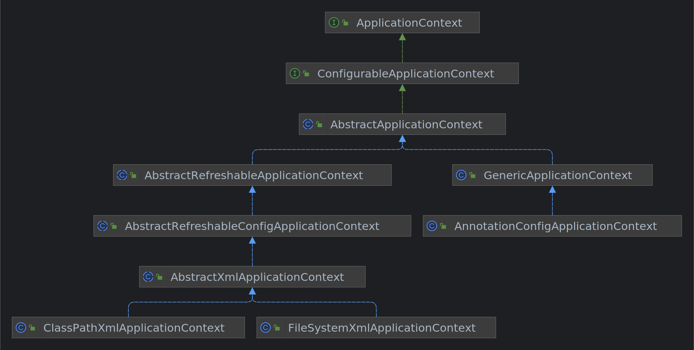
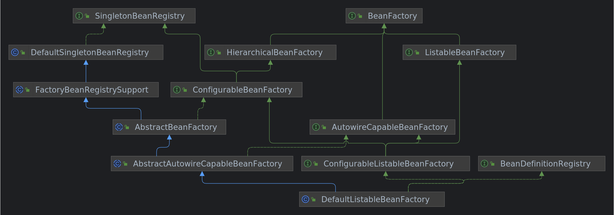
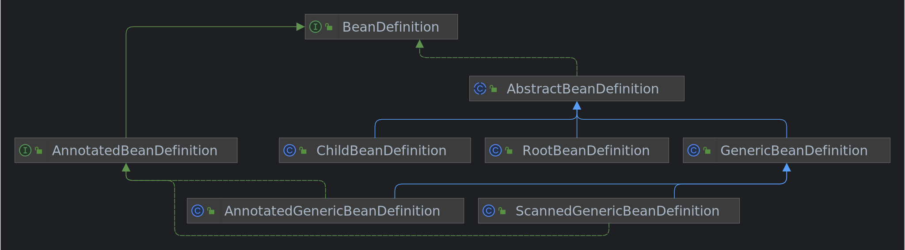

## 1. 环境搭建

利用 [Spring 源码环境搭建](../Spring源码环境搭建/README.md) 这篇文章中搭建好的 Spring 源码环境，编写一个关于 Spring BeanDefinition 的测试案例，然后根据该测试案例去逐步分析 Spring BeanDefinition 加载的整个流程。

### 1.1. 创建 spring-beandefinition-study 模块

选中项目右键新建一个模块，选择 Gradle，点击下一步，模块名填自己喜欢的即可，这里我就填 `spring-beandefinition-study`，最后点击确定即可。  


### 1.2. 引入相关依赖

在模块的 `build.gradle` 文件中引入以下依赖：

```gradle
dependencies {  
    testImplementation 'org.junit.jupiter:junit-jupiter-api:5.9.0'
    testRuntimeOnly 'org.junit.jupiter:junit-jupiter-engine:5.9.0'
    implementation(project(':spring-context'))
    implementation 'org.slf4j:slf4j-api:2.0.3'
    implementation 'ch.qos.logback:logback-classic:1.4.3'
}
```

### 1.3. 日志配置文件

由于引入了 `logback`，所以需要在资源目录 `resources` 下创建一个 `logback.xml` 配置文件：

```xml
<?xml version="1.0" encoding="UTF-8"?>
<configuration>
    <appender name="CONSOLE" class="ch.qos.logback.core.ConsoleAppender">
        <encoder>
            <pattern>%d{yyyy-MM-dd HH:mm:ss.SSS} [%t] %-5p %c{1}:%L - %m%n</pattern>
        </encoder>
    </appender>

    <appender name="FILE" class="ch.qos.logback.core.rolling.RollingFileAppender">
        <encoder>
            <pattern>%d{yyyy-MM-dd HH:mm:ss.SSS} [%t] %-5p %c{1}:%L - %m%n</pattern>
            <charset>utf-8</charset>
        </encoder>
        <file>log/output.log</file>
        <rollingPolicy class="ch.qos.logback.core.rolling.FixedWindowRollingPolicy">
            <fileNamePattern>log/output.log.%i</fileNamePattern>
        </rollingPolicy>
        <triggeringPolicy class="ch.qos.logback.core.rolling.SizeBasedTriggeringPolicy">
            <MaxFileSize>1MB</MaxFileSize>
        </triggeringPolicy>
    </appender>

    <root level="DEBUG">
        <appender-ref ref="CONSOLE"/>
        <appender-ref ref="FILE"/>
    </root>
</configuration>
```

### 1.4. 目标类

```java
public class UserService {  
   private String username;  
  
   /**  
    * 根据用户名称查询用户详细信息  
    *  
    * @return 用户详细信息  
    */  
   public String queryUserInfo() {  
      return username + "用户的详细信息";  
   }  
  
   public String getUsername() {  
      return username;  
   }  
  
   public void setUsername(String username) {  
      this.username = username;  
   }  
}
```

```java
@Component  
public class People {  
   private String name = "小白";  
  
   public String getName() {  
      return name;  
   }  
  
   public void setName(String name) {  
      this.name = name;  
   }  
  
   @Override  
   public String toString() {  
      return "People{" +  
            "name='" + name + '\'' +  
            '}';  
   }  
}
```

### 1.5. Spring 核心配置文件

在资源目录 `resources` 下创建一个 Spring 的核心配置文件 `applicationContext.xml` 。


```xml
<?xml version="1.0" encoding="UTF-8"?>
<beans xmlns:xsi="http://www.w3.org/2001/XMLSchema-instance"  
      xmlns:context="http://www.springframework.org/schema/context" xmlns="http://www.springframework.org/schema/beans"  
      xsi:schemaLocation="http://www.springframework.org/schema/beans http://www.springframework.org/schema/beans/spring-beans.xsd http://www.springframework.org/schema/context https://www.springframework.org/schema/context/spring-context.xsd">  
   <bean id="userService" class="top.xiaorang.beandefinition.service.UserService">  
      <property name="username" value="小让"/>  
   </bean>  
  
   <context:component-scan base-package="top.xiaorang.beandefinition"/>  
</beans>
```

### 1.6. 测试类

最后创建一个测试类 `SpringBeanDefinitionTests`：

```java
public class SpringBeanDefinitionTests {  
   private static final Logger LOGGER = LoggerFactory.getLogger(SpringBeanDefinitionTests.class);  
  
   public static void main(String[] args) {  
      ApplicationContext applicationContext = new ClassPathXmlApplicationContext("classpath:applicationContext.xml");  
      UserService userService = applicationContext.getBean(UserService.class);  
      LOGGER.info(userService.queryUserInfo());  
      People people = applicationContext.getBean(People.class);  
      LOGGER.info(people.toString());  
   }  
}
```

测试结果如下所示：打印出小让用户的详细信息以及 People{name=' 小白 '}。  
  
测试成功，达到预期效果！🎉 接下来，就可以根据该测试案例去逐步分析 SpringBeanDefinition 加载流程的整个源码。加油！🎯

## 2. 源码分析

因为是第一篇源码分析的文章，所以可能说的比较啰嗦点。好，现在让我们开始进入今天的主题，XML 版 Spring BeanDefinition 加载流程，一定要记住今天的主题，不要跑偏！

> 源码阅读技巧：**抓住主流程，带着问题阅读**。有的小伙伴在阅读源码的时候，很容易一直点进方法中查看，然后就迷失了方向，不知道自己刚才干了啥，然后又要重新来过，所以先把主流程给搞清楚，不要跑偏！之后，有需要的话可以再去分析分支情况。

从测试案例入手，第一行代码就创建了一个 `ClassPathXmlApplicationContext` 应用上下文对象 ，将 Spring 的核心配置文件 `applicationContext.xml` 路径作为参数传入构造函数中。

```java
public ClassPathXmlApplicationContext(String configLocation) throws BeansException {  
   this(new String[] {configLocation}, true, null);  
}

public ClassPathXmlApplicationContext(  
      String[] configLocations, boolean refresh, @Nullable ApplicationContext parent)  
      throws BeansException {  
  
   super(parent);  
   setConfigLocations(configLocations);  
   if (refresh) {  
	  // 容器刷新
      refresh();  
   }  
}
```

可以看到在其重载的构造方法中，首先调用 `setConfigLocations(configLocations)` 方法将传入进来的 Spring 配置文件路径保存起来，用于后面加载 bean 定义信息时知道从哪去加载 bean 定义信息。然后有一个非常重要的 **容器刷新方法 `refresh()`**，该方法位于父类 **`AbstractApplicationContext`** 中，分析 Spring 源码就没有不讲该方法的，该 `refresh()` 方法是重中之重，一定要记住（自己多刷几遍自然就记住了）！ 毫不夸张的说，**该 `refresh()` 方法是整个 Spring 源码分析的入口**。关于 Spring 容器刷新 `refresh()` 方法的十二大步，小伙伴们应该都有所耳闻。

### 2.1. 源码分析入口

> Spring 容器初始化核心方法 AbstractApplicationContext#refresh

- `├─` refresh Spring 初始化核心流程入口
- `│ ├─` prepareRefresh ① 上下文刷新前的准备工作，设置启动时间和 active 标志，初始化属性
- `│ ├─` **obtainFreshBeanFactory** <span style="background:#affad1"> ② 创建 bean 工厂实例以及加载 bean 定义信息到 bean 工厂</span>
- `│ ├─` prepareBeanFactory ③ 设置 beanFactory 的基本属性
- `│ ├─` postProcessBeanFactory ④ 子类处理自定义的 BeanFactoryPostProcess
- `│ ├─` invokeBeanFactoryPostProcessors ⑤ 实例化并调用所有 bean 工厂后置处理器
- `│ ├─` registerBeanPostProcessors ⑥ 注册，把实现了 BeanPostProcessor 接口的类实例化，加到 BeanFactory
- `│ ├─` initMessageSource ⑦ 初始化上下文中的资源文件，如国际化文件的处理等
- `│ ├─` initApplicationEventMulticaster ⑧ 初始化事件多播器
- `│ ├─` onRefresh ⑨ 给子类扩展初始化其他 Bean，springboot 中用来做内嵌 tomcat 启动
- `│ ├─` registerListeners ⑩ 注册监听器
- `│ ├─` finishBeanFactoryInitialization ⑪ 实例化所有非懒加载的单实例 bean
- `│ └─` finishRefresh ⑫ 完成刷新过程，发布上下文刷新完成事件

其中，绿色代表本次源码分析的重点步骤。

本节源码分析是基于 `obtainFreshBeanFactory()` 方法内的执行流程，主要包括：创建填充 `BeanFactory`、xml 标签的解析并填充到 `BeanDefinition`、并注册到 Spring IOC 容器。该方法算是 **Spring 容器刷新十二大步中的第二大步：创建 bean 工厂实例以及加载 bean 定义信息到 bean 工厂**。其余的步骤会在后续源码分析的文章中会逐个分析。  

### 2.2. 创建 BeanFactory 实例

```java
public void refresh() throws BeansException, IllegalStateException {
	// 省略...
    ConfigurableListableBeanFactory beanFactory = obtainFreshBeanFactory();
    // 省略...
}
```

在 `obtainFreshBeanFactory()` 方法中，有一个刷新 BeanFactory 的方法 `refreshBeanFactory()`，该方法是一个抽象方法，让子类去实现，典型的 **模板方法设计模式**。

```java
protected ConfigurableListableBeanFactory obtainFreshBeanFactory() {  
   refreshBeanFactory();  
  
   return getBeanFactory();  
}
```

由于咱们使用的是应用上下文是 `ClassPathXmlApplicationContext` ，F4 查看 `ApplicationContext` 的继承结构体系可以发现  
`|-` `AbstractApplicationContext`  
	`|-` `AbstractRefreshableApplicationContext`  
		`|-` `AbstractRefreshableConfigApplicationContext`  
			`|-` `AbstractXmlApplicationContext`  
				`|-` `ClassPathXmlApplicationContext`  
在 `ClassPathXmlApplicationContext` 的父类， `AbstractApplicationContext` 的子类 `AbstractRefreshableApplicationContext` 中实现了该方法。  


```java
protected final void refreshBeanFactory() throws BeansException {
    if (hasBeanFactory()) {
        // 销毁 BeanFactory
        destroyBeans();
        // 关闭容器 BeanFactory
        closeBeanFactory();
    }
    try {
        /**
		 * 为 Spring 应用上下文创建 spring 的初级容器 BeanFactory，即创建 DefaultListableBeanFactory
		 * 是保存所有 BeanDefinition 的档案馆
		 */
        DefaultListableBeanFactory beanFactory = createBeanFactory();
        
        // 为容器设置一个序列化 ID
        beanFactory.setSerializationId(getId());

        // 定制话 spring 的初级容器 BeanFactory
        customizeBeanFactory(beanFactory);

        // 加载 bean 定义信息。（开始解析并加载 xml 文件中的 bean）
        loadBeanDefinitions(beanFactory);
        this.beanFactory = beanFactory;
    }
    catch (IOException ex) {
        throw new ApplicationContextException("I/O error parsing bean definition source for " + getDisplayName(), ex);
    }
}
```

该方法中有两个最重要的方法，一个是 `createBeanFactory()` 方法，创建 `BeanFactory` 的实例对象；另外一个方法就是 `loadBeanDefinitions(beanFactory)`，解析并加载 XML 配置中配置的所有 bean 定义信息。

```java
protected DefaultListableBeanFactory createBeanFactory() {  
   return new DefaultListableBeanFactory(getInternalParentBeanFactory());  
}
```

该方法最主要的作用就是创建了一个 `BeanFactory` 的子类 `DefaultListableBeanFactory` 的实例对象。

> 题外话：初次阅读 Spring 源码的小伙伴，肯定会对 `BeanFactory` 感到陌生，别怕，其实后面多阅读几遍源码，你就会觉得别没有什么，不管是阅读什么源码都是这样，多借鉴一下前辈们的经验，不要闭门造车！

先来看下 `BeanFactory` 的继承结构体系，对 `BeanFactory` 有一个宏观上的认识。  
  

>首先需要知道的是，**如果一个类实现了某个接口，那么就具备了该接口的能力；如果一个接口继承自另一个接口，那么该接口就会同时具备另一个接口所具备的能力。**

#### 2.2.1. BeanDefinitionRegistry

别被上面 `BeanFactory` 的继承结构体系图给弄晕，咱们只关注与今天主题相关的，至于 `BeanFactory` 还具备什么能力，就留在以后的文章中分析。

>提前剧透一下，相信眼尖的小伙伴已经发现 `DefaultListableBeanFactory` 的父类实现了 `SingletonBeanRegistry` 接口，看名字不难猜出，该接口作为单实例 bean 的注册中心，那么 `BeanFactory` 肯定具备了其最主要的能力，管理单实例 bean 。

从上面可以看到 **`DefaultListableBeanFactory` 实现了 `BeanDefinitionRegistry` 接口**，那么就具备了 `BeanDefinitionRegistry` 接口的能力，该接口有什么能力呢？看名字就知道是 **bean 定义信息的注册中心，用于管理所有的 bean 定义信息**，从 XML 文件中解析出 bean 定义信息后就需要交给 `BeanDefinitionRegistry` 管理。  

```java
public interface BeanDefinitionRegistry extends AliasRegistry {
	// 注册某个bean的定义信息
	void registerBeanDefinition(String beanName, BeanDefinition beanDefinition)
			throws BeanDefinitionStoreException;

	// 删除某个bean的定义信息
	void removeBeanDefinition(String beanName) throws NoSuchBeanDefinitionException;

	// 获取某个bean的定义信息
	BeanDefinition getBeanDefinition(String beanName) throws NoSuchBeanDefinitionException;

	// 是否存在某个某个bean的定义信息
	boolean containsBeanDefinition(String beanName);

	// 获取所有bean定义信息的名称
	String[] getBeanDefinitionNames();

	// 获取所有bean定义信息的数量
	int getBeanDefinitionCount();

	// 判断当前bean定义信息的名称是否正在使用
	boolean isBeanNameInUse(String beanName);

}
```

那么 `DefaultListableBeanFactory` 作为 `BeanDefinitionRegistry` 接口的实现类，是如何实现 `BeanDefinitionRegistry` 接口的呢？

```java
public class DefaultListableBeanFactory extends AbstractAutowireCapableBeanFactory
		implements ConfigurableListableBeanFactory, BeanDefinitionRegistry, Serializable {

	/** Map of bean definition objects, keyed by bean name. */
	private final Map<String, BeanDefinition> beanDefinitionMap = new ConcurrentHashMap<>(256);

	/** List of bean definition names, in registration order. */
	private volatile List<String> beanDefinitionNames = new ArrayList<>(256);
    
    public void registerBeanDefinition(String beanName, BeanDefinition beanDefinition) throws BeanDefinitionStoreException {
		// ...
        this.beanDefinitionMap.put(beanName, beanDefinition);
        this.beanDefinitionNames.add(beanName);
        // ...
	}
    
    public void removeBeanDefinition(String beanName) throws NoSuchBeanDefinitionException {
        // ...
		BeanDefinition bd = this.beanDefinitionMap.remove(beanName);
		this.beanDefinitionNames.remove(beanName);
        // ...
	}
	
	public String[] getBeanDefinitionNames() {
		// ...	
		return StringUtils.toStringArray(this.beanDefinitionNames);
        // ...
	}
}    
```

观察上面源码不难发现，在 `DefaultListableBeanFactory` 中定义了两个集合，其中 **`beanDefinitionMap` 集合用来保存注册的 bean 定义信息，Key 是 bean 的名称，Value 是 `BeanDefinition` 的实例对象**；另外一个 List 集合专门用来保存注册的 bean 定义信息的名称。至于 `BeanDefinitionRegistry` 接口中定义的方法在 `DefaultListableBeanFactory` 中实现起来也非常简单，就是操作这两个集合。一个 bean 定义信息的注册中心就是这样实现的，是不是很简单！  

#### 2.2.2. BeanDefinition

##### 2.2.2.1. 简介

有小伙伴可能会对 `BeanDefinition` 感到疑惑，这是什么东东？有什么用呢？根据它的名字不难猜出 **bean 的定义信息**。事实上就是这样，咱们在 XML 配置文件中的 bean 标签中配置的各种属性，这些属性不仅仅是和 Bean 对象相关，还和 Bean 的生命周期、销毁、初始化等等各种操作有关，咱们定义的关于 Bean 的生命周期、销毁、初始化等操作总得有一个对象来承载，那么这个对象就是 BeanDefinition。

> 对于 Spring XML 开发不清楚的小伙伴，可以参考本篇文章 [Spring-IOC](../../基础/IOC/README.md)，里面说了 Spring 基于 XML 是怎样使用的。

**在 XML 的 bean 标签中定义的各种 Bean 的属性都会先加载到 BeanDefinition 上，然后 Spring 容器根据 BeanDefinition 来生成一个 Bean 实例对象**，从这个角度来说，BeanDefinition 和 Bean 的关系有点类似于类和对象的关系。

```java
public interface BeanDefinition extends AttributeAccessor, BeanMetadataElement {
	String SCOPE_SINGLETON = ConfigurableBeanFactory.SCOPE_SINGLETON;
	String SCOPE_PROTOTYPE = ConfigurableBeanFactory.SCOPE_PROTOTYPE;
	int ROLE_APPLICATION = 0;
	int ROLE_SUPPORT = 1;
	int ROLE_INFRASTRUCTURE = 2;
	void setParentName(@Nullable String parentName);
	@Nullable
	String getParentName();
	void setBeanClassName(@Nullable String beanClassName);
	@Nullable
	String getBeanClassName();
	void setScope(@Nullable String scope);
	@Nullable
	String getScope();
	void setLazyInit(boolean lazyInit);
	boolean isLazyInit();
	void setDependsOn(@Nullable String... dependsOn);
	@Nullable
	String[] getDependsOn();
	void setAutowireCandidate(boolean autowireCandidate);
	boolean isAutowireCandidate();
	void setPrimary(boolean primary);
	boolean isPrimary();
	void setFactoryBeanName(@Nullable String factoryBeanName);
	@Nullable
	String getFactoryBeanName();
	void setFactoryMethodName(@Nullable String factoryMethodName);
	@Nullable
	String getFactoryMethodName();
	ConstructorArgumentValues getConstructorArgumentValues();
	default boolean hasConstructorArgumentValues() {
		return !getConstructorArgumentValues().isEmpty();
	}
	MutablePropertyValues getPropertyValues();
	default boolean hasPropertyValues() {
		return !getPropertyValues().isEmpty();
	}
	void setInitMethodName(@Nullable String initMethodName);
	@Nullable
	String getInitMethodName();
	void setDestroyMethodName(@Nullable String destroyMethodName);
	@Nullable
	String getDestroyMethodName();
	void setRole(int role);
	int getRole();
	void setDescription(@Nullable String description);
	@Nullable
	String getDescription();
	ResolvableType getResolvableType();
	boolean isSingleton();
	boolean isPrototype();
	boolean isAbstract();
	@Nullable
	String getResourceDescription();
	@Nullable
	BeanDefinition getOriginatingBeanDefinition();
}
```

BeanDefinition 中的方法虽然多，但是结合我们平时在 XML 中的配置，这些方法其实都很好理解，列举一些常用的方法：<span style="background:rgba(240, 200, 0, 0.2)">TODO</span> 完善一下

1. 首先一开始定义了两个变量用来描述 Bean 是不是单例的，后面的 setScope/getScope 方法可以用来修改/获取 scope 属性。
2. setBeanClassName/getBeanClassName 这个就是配置 **Bean 的 Class 全路径**，对应 XML 中的 `<bean class="">` 配置。
3. setLazyInit/isLazyInit 配置/获取 **Bean 是否懒加载**，这个对应了 XML 中的 `<bean lazy-init="">` 配置。
4. setAutowireCandidate/isAutowireCandidate 配置/获取 Bean 是否是自动装配，对应了 XML 中的 `<bean autowire-candidate="">` 配置。
5. setPrimary/isPrimary 配置/获取 **当前 Bean 是否为首选的 Bean**，对应了 XML 中的 `<bean primary="">` 配置。
6. setFactoryBeanName/getFactoryBeanName 配置/获取 **FactoryBean** 的名字，**实例工厂创建对象**，对应了 XML 中的 `<bean factory-bean="">` 配置。
7. setFactoryMethodName/getFactoryMethodName 和上一条成对出现的，**静态工厂创建对象**，对应了 XML 中的 `<bean factory-method="">` 配置，不再赘述
8. getConstructorArgumentValues 返回该 Bean 构造方法的参数值。
9. getPropertyValues 这个是 **获取普通属性的集合**。
10. setInitMethodName/setDestroyMethodName **配置 Bean 的初始化方法、销毁方法**。
11. isSingleton Bean 是否为单例。
12. isPrototype Bean 是否为原型。
13. isAbstract Bean 是否抽象。
14. getOriginatingBeanDefinition 如果当前 BeanDefinition 是一个代理对象，那么该方法可以用来返回原始的 BeanDefinition 。

这个就是 BeanDefinition 的定义以及它里边方法的含义。

##### 2.2.2.2. 继承体系

  
这么多实现类看着有点眼花缭乱，不过搞清楚了每一个接口和类的作用，再看就很容易了。

1. AbstractBeanDefinition，AbstractBeanDefinition 是一个抽象类，它根据 BeanDefinition 中定义的接口提供了相应的属性，并实现了 BeanDefinition 中定义的一部分方法。BeanDefinition 中原本只是定义了一系列的 get/set 方法，并没有提供对应的属性，在 AbstractBeanDefinition 中将所有的属性定义出来了。后面其他的实现类也基本上都是在 AbstractBeanDefinition 的基础上完成的。
2. RootBeanDefinition，这是一个比较常用的实现类，对应了一般的元素标签。
3. ChildBeanDefinition，可以让子 BeanDefinition 定义拥有从父 BeanDefinition 那里继承配置的能力。
4. GenericBeanDefinition，GenericBeanDefinition 是从 Spring2.5 以后新加入的 BeanDefinition 实现类。GenericBeanDefinition 可以动态设置父 Bean，同时兼具 RootBeanDefinition 和 ChildBeanDefinition 的功能。
5. AnnotatedBeanDefinition，**表示注解类型 BeanDefinition，拥有获取注解元数据和方法元数据的能力**。
6. AnnotatedGenericBeanDefinition，使用了 **@Configuration 注解标记配置类会解析为 AnnotatedGenericBeanDefinition**。  

##### 2.2.2.3. 实践

理论讲了这么多，就以咱们的 `UserService` 为例，打个断点来看下 `UserService` 的 bean 定义信息长什么样。在哪打断点呢？根据上面已经分析出的， `DefaultListableBeanFactory` 作为 bean 定义信息的注册中心，那么咱们直接在该类的 `registerBeanDefinition()` 方法中打一个断点。  
  
可以看到将 XML 配置文件中的 `bean` 标签中的 `id` 作为 `beanName`，`BeanDefinition` 实例对象中的 `beanClass` 属性 = `bean` 标签中的 `class` 属性 ，`propertyValues` 属性 = `property` 标签中的 `name` 和 `value` 属性。咱们在 XML 配置文件中书写的 `bean` 标签就会对应一个 `BeanDefinition` 实例对象，`bean` 标签中的属性就会对应到 `BeanDefinition` 实例对象中相对应的属性。Spring 容器就会根据这一份 bean 定义信息图纸去生产相对应的 bean 实例对象。  

### 2.3. 解析 XML 配置文件并加载 bean 定义信息

`BeanFactory` 创建完成后，就开始解析 XML 配置文件并加载 bean 定义信息。

```java
loadBeanDefinitions(beanFactory);
```

该方法也是一个抽象方法，留给子类去实现。在 `ClassPathXmlApplicationContext` 的父类， `AbstractRefreshableApplicationContext` 的子类 `AbstractXmlApplicationContext` 中实现了该方法。  

> 源码阅读技巧：**大胆猜测，小心求证**。不要怕去猜测某个类、方法、属性、逻辑是干什么用的，反正不收钱，怕什么？之后去验证自己猜的是否准确，自己是否和编写代码的人想法是否一致。

从方法的定义咱们盲猜一波，方法名已经说明该方法用于加载 bean 定义信息，加载的 bean 定义信息存在哪呢？当然是传入的参数 `BeanFactory` 的实例对象，在前面已经分析出 **`BeanFactory` 作为 bean 定义信息的注册中心**，虽然 `BeanFactory` 还有其他的能力，但是在本篇文章中它的能力就是管理 bean 定义信息。在实现类 `DefaultListableBeanFactory` 中定义了两个集合专门用来管理 bean 定义信息，所以咱们需要将实例化的 `BeanFactory` 对象传入方法中，等解析完 XML 配置文件后就可以将解析出来的 bean 定义信息保存起来，等到后续创建 bean 的实例对象时拿出来使用。

```java
protected void loadBeanDefinitions(DefaultListableBeanFactory beanFactory) throws BeansException, IOException {
    // Create a new XmlBeanDefinitionReader for the given BeanFactory.
    // 初始化 XmlBeanDefinitionReader
    XmlBeanDefinitionReader beanDefinitionReader = new XmlBeanDefinitionReader(beanFactory);

    // Configure the bean definition reader with this context's
    // resource loading environment.
    // 配置 XmlBeanDefinitionReader 的上下文信息
    beanDefinitionReader.setEnvironment(this.getEnvironment());
    beanDefinitionReader.setResourceLoader(this);
    beanDefinitionReader.setEntityResolver(new ResourceEntityResolver(this));

    // Allow a subclass to provide custom initialization of the reader,
    // then proceed with actually loading the bean definitions.
    // 留给子类去自定义 XmlBeanDefinitionReader
    initBeanDefinitionReader(beanDefinitionReader);
    // 委托 beanDefinitionReader 来加载 XML 中的 BeanDefinition
    loadBeanDefinitions(beanDefinitionReader);
}
```

在该方法中创建出一个 `XmlBeanDefinitionReader` 实例对象，将咱们创建出来的 `beanFactory` 作为参数传入构造方法中，在 `XmlBeanDefinitionReader` 类中肯定会存在一个 `BeanDefinitionRegistry` 接口的属性用于保存该对象，为什么是 `BeanDefinitionRegistry` 接口的属性？相信应该不用再啰嗦了吧！从类名就可以看出该类专门用来从 XML 配置文件读取 bean 定义信息。

#### 2.3.1. XmlBeanDefinitionReader

创建出 `XmlBeanDefinitionReader` 对象之后，来到重载方法中，在重载方法中最终会调用 `XmlBeanDefinitionReader` 类中的 `loadBeanDefinitions()` 方法，将咱们的 Spring 配置文件路径作为参数传入。

```java
protected void loadBeanDefinitions(XmlBeanDefinitionReader reader) throws BeansException, IOException {  
   Resource[] configResources = getConfigResources();  
   if (configResources != null) {  
      reader.loadBeanDefinitions(configResources);  
   }  
  
   // 获取前面封装好的 XML 文件路径对应的 String 数组  
   String[] configLocations = getConfigLocations();  
   if (configLocations != null) {  
      reader.loadBeanDefinitions(configLocations);  
   }  
}
```

在 `XmlBeanDefinitionReader` 的父类 `AbstractBeanDefinitionReader` 中存在该方法的多个重载方法，最终会来到下面的重载方法。

```java
public int loadBeanDefinitions(String location, @Nullable Set<Resource> actualResources) throws BeanDefinitionStoreException {
    ResourceLoader resourceLoader = getResourceLoader();
    if (resourceLoader == null) {
        throw new BeanDefinitionStoreException(
            "Cannot load bean definitions from location [" + location + "]: no ResourceLoader available");
    }

    if (resourceLoader instanceof ResourcePatternResolver) {
        // Resource pattern matching available.
        try {
            Resource[] resources = ((ResourcePatternResolver) resourceLoader).getResources(location);
            int count = loadBeanDefinitions(resources);
            if (actualResources != null) {
                Collections.addAll(actualResources, resources);
            }
            if (logger.isTraceEnabled()) {
                logger.trace("Loaded " + count + " bean definitions from location pattern [" + location + "]");
            }
            return count;
        }
        catch (IOException ex) {
            throw new BeanDefinitionStoreException(
                "Could not resolve bean definition resource pattern [" + location + "]", ex);
        }
    }
    else {
        // Can only load single resources by absolute URL.
        Resource resource = resourceLoader.getResource(location);
        int count = loadBeanDefinitions(resource);
        if (actualResources != null) {
            actualResources.add(resource);
        }
        if (logger.isTraceEnabled()) {
            logger.trace("Loaded " + count + " bean definitions from location [" + location + "]");
        }
        return count;
    }
}
```

在该方法中，首先获取一个 `ResourceLoader` 对象，资源加载器，用于加载对应路径的资源。<span style="background:#d3f8b6">TODO</span> 关于资源加载器在后续会专门写一篇文章分析，此处不做详细的描述，不然很容易跑题。通过资源加载器将传入的 Spring 配置文件路径解析之后封装成一个 `Resource` 资源对象，然后将资源对象传入到另一个重载方法中，有意思的是，另外一个重载方法在父类中并没有被实现，所以兜兜转转又回到子类 `XmlBeanDefinitionReader` 中的 `loadBeanDefinitions(resource)` 方法，相信有的小伙伴看到这，都被 Spring 给弄糊涂了，但你又不得不服，Spring 整个源码中真是将 **模板方法设计模式** 使用的是淋漓尽致。

```java
public int loadBeanDefinitions(Resource resource) throws BeanDefinitionStoreException {  
   // 将 Resource 封装成 EncodedResource   
   return loadBeanDefinitions(new EncodedResource(resource));  
}

public int loadBeanDefinitions(EncodedResource encodedResource) throws BeanDefinitionStoreException {  
   Assert.notNull(encodedResource, "EncodedResource must not be null");  
   if (logger.isTraceEnabled()) {  
      logger.trace("Loading XML bean definitions from " + encodedResource);  
   }  
  
   Set<EncodedResource> currentResources = this.resourcesCurrentlyBeingLoaded.get();  
  
   if (!currentResources.add(encodedResource)) {  
      throw new BeanDefinitionStoreException(  
            "Detected cyclic loading of " + encodedResource + " - check your import definitions!");  
   }  
  
   try (InputStream inputStream = encodedResource.getResource().getInputStream()) {  
      InputSource inputSource = new InputSource(inputStream);  
      if (encodedResource.getEncoding() != null) {  
         inputSource.setEncoding(encodedResource.getEncoding());  
      }  
      return doLoadBeanDefinitions(inputSource, encodedResource.getResource());  
   }  
   catch (IOException ex) {  
      throw new BeanDefinitionStoreException(  
            "IOException parsing XML document from " + encodedResource.getResource(), ex);  
   }  
   finally {  
      currentResources.remove(encodedResource);  
      if (currentResources.isEmpty()) {  
         this.resourcesCurrentlyBeingLoaded.remove();  
      }  
   }  
}
```

> 源码阅读技巧：在分析 Spring 源码时，**需要着重关注 try 中的代码和带 do 前缀的方法**，因为此处的代码是真正干实事的代码。

将资源转变成输入流之后传入 `doLoadBeanDefinitions()` 方法中，分析了半天，前戏做足，终于看到真正加载 bean 定义信息的方法。

```java
protected int doLoadBeanDefinitions(InputSource inputSource, Resource resource) throws BeanDefinitionStoreException {
    try {
        Document doc = doLoadDocument(inputSource, resource);
        int count = registerBeanDefinitions(doc, resource);
        if (logger.isDebugEnabled()) {
            logger.debug("Loaded " + count + " bean definitions from " + resource);
        }
        return count;
    }
    catch (Exception ex) {
        throw ex;
    }
}
```

在该方法中，将 Spring 配置文件的输入流转化成 `Document` 对象，不用说，接下来肯定是解析 XML 配置文件并注册 bean 定义信息，废话，这就是今天的主题！

```java
public int registerBeanDefinitions(Document doc, Resource resource) throws BeanDefinitionStoreException {  
   BeanDefinitionDocumentReader documentReader = createBeanDefinitionDocumentReader();  
   int countBefore = getRegistry().getBeanDefinitionCount();  
   documentReader.registerBeanDefinitions(doc, createReaderContext(resource));  
   return getRegistry().getBeanDefinitionCount() - countBefore;  
}

public XmlReaderContext createReaderContext(Resource resource) {  
   return new XmlReaderContext(resource, this.problemReporter, this.eventListener,  
         this.sourceExtractor, this, getNamespaceHandlerResolver());  
}

public NamespaceHandlerResolver getNamespaceHandlerResolver() {  
   if (this.namespaceHandlerResolver == null) {  
      this.namespaceHandlerResolver = createDefaultNamespaceHandlerResolver();  
   }  
   return this.namespaceHandlerResolver;  
}  
  
protected NamespaceHandlerResolver createDefaultNamespaceHandlerResolver() {  
   ClassLoader cl = (getResourceLoader() != null ? getResourceLoader().getClassLoader() : getBeanClassLoader());  
   return new DefaultNamespaceHandlerResolver(cl);  
}
```

#### 2.3.2. BeanDefinitionDocumentReader

在该方法中又创建一个 `BeanDefinitionDocumentReader` 对象，将 `document` 以及 `XmlBeanDefinitionReader` 的上下文信息一并传入到 `BeanDefinitionDocumentReader` 类中的 `registerBeanDefinitions()` 方法，在上下文信息中存在一个 `NamespaceHandlerResolver` 类型的实例对象，该实例对象在后面解析自定义标签元素的时候会被使用到，现在先提一嘴。有的小伙伴可能就很疑惑，Spring 这样传来传去到底是在干什么？其实 Spring 将每个类的职责分的很清楚，符合单一职责原则，专人做专事。

```java
public void registerBeanDefinitions(Document doc, XmlReaderContext readerContext) {
    this.readerContext = readerContext;
    doRegisterBeanDefinitions(doc.getDocumentElement());
}

protected void doRegisterBeanDefinitions(Element root) {
    // Any nested <beans> elements will cause recursion in this method. In
    // order to propagate and preserve <beans> default-* attributes correctly,
    // keep track of the current (parent) delegate, which may be null. Create
    // the new (child) delegate with a reference to the parent for fallback purposes,
    // then ultimately reset this.delegate back to its original (parent) reference.
    // this behavior emulates a stack of delegates without actually necessitating one.
    BeanDefinitionParserDelegate parent = this.delegate;
    this.delegate = createDelegate(getReaderContext(), root, parent);

    if (this.delegate.isDefaultNamespace(root)) {
        String profileSpec = root.getAttribute(PROFILE_ATTRIBUTE);
        if (StringUtils.hasText(profileSpec)) {
            String[] specifiedProfiles = StringUtils.tokenizeToStringArray(
                profileSpec, BeanDefinitionParserDelegate.MULTI_VALUE_ATTRIBUTE_DELIMITERS);
            // We cannot use Profiles.of(...) since profile expressions are not supported
            // in XML config. See SPR-12458 for details.
            if (!getReaderContext().getEnvironment().acceptsProfiles(specifiedProfiles)) {
                if (logger.isDebugEnabled()) {
                    logger.debug("Skipped XML bean definition file due to specified profiles [" + profileSpec +
                                 "] not matching: " + getReaderContext().getResource());
                }
                return;
            }
        }
    }

    preProcessXml(root);
    // 委派模式，解析所有的bean定义信息
    parseBeanDefinitions(root, this.delegate);
    postProcessXml(root);

    this.delegate = parent;
}
```

#### 2.3.3. BeanDefinitionParserDelegate

在该方法中创建一个 `BeanDefinitionParserDelegate` 对象，将当前 root 标签元素以及上下文信息当作参数传入到构造方法中。看名字不难知道，bean 定义信息解析委托类，专门用来解析 XML 中的 `bean` 标签元素。

```java
protected void parseBeanDefinitions(Element root, BeanDefinitionParserDelegate delegate) {  
   // 判断当前元素是否是默认标签  
   if (delegate.isDefaultNamespace(root)) {  
      NodeList nl = root.getChildNodes();  
      for (int i = 0; i < nl.getLength(); i++) {  
         Node node = nl.item(i);  
         if (node instanceof Element) {  
            Element ele = (Element) node;  
            if (delegate.isDefaultNamespace(ele)) {  
               // 解析默认标签元素（import、bean、alias、beans标签）  
               parseDefaultElement(ele, delegate);  
            }  
            else {  
               // 解析自定义标签元素，例如开启 AOP 功能的标签：aop:aspectj-autoproxy，context:component-scan  
               delegate.parseCustomElement(ele);  
            }  
         }  
      }  
   }  
   else {  
      // 解析自定义标签元素，例如开启 AOP 功能的标签：aop:aspectj-autoproxy，context:component-scan  
      delegate.parseCustomElement(root);  
   }  
}
```

在该方法中，首先会判断当前 root 元素是否是默认标签元素，即该标签元素的 `namespaceURI` 是否等于 "http://www.springframework.org/schema/beans" 。  
  
通过打断点可以知道当前 root 元素是 beans 标签元素，它的 `namespaceURI` = "http://www.springframework.org/schema/beans" ，所以满足条件，进入 if 中，获取该 beans 标签中所有的子标签元素，也就是咱们定义在 XML 配置文件中的所有标签元素。循环遍历每个标签元素，挨个判断每个标签是默认标签元素还是自定义标签元素，如果是 **默认标签元素，如 `import`、`bean`、`alias`、`beans` 标签**，则走默认标签解析流程；如果是 **自定义标签元素，如 `context:component-scan`、`aop:aspectj-autoproxy ` 等标签**，则走自定义标签解析流程。

##### 2.3.3.1. 默认标签解析

```java
private void parseDefaultElement(Element ele, BeanDefinitionParserDelegate delegate) {  
   if (delegate.nodeNameEquals(ele, IMPORT_ELEMENT)) {  
      importBeanDefinitionResource(ele);  
   }  
   else if (delegate.nodeNameEquals(ele, ALIAS_ELEMENT)) {  
      processAliasRegistration(ele);  
   }  
   else if (delegate.nodeNameEquals(ele, BEAN_ELEMENT)) {  
      processBeanDefinition(ele, delegate);  
   }  
   else if (delegate.nodeNameEquals(ele, NESTED_BEANS_ELEMENT)) {  
      // recurse  
      doRegisterBeanDefinitions(ele);  
   }  
}
```

在该方法中，会依次根据当前标签元素的名称判断是 4 种默认标签元素中的哪一个，最值得咱们关注的是 bean 标签元素，因为咱们今天的主题就是解析 XML 配置文件加载 bean 定义信息，这里正是将 bean 标签解析成 bean 定义信息的地方。

```java
protected void processBeanDefinition(Element ele, BeanDefinitionParserDelegate delegate) {  
   BeanDefinitionHolder bdHolder = delegate.parseBeanDefinitionElement(ele);  
   if (bdHolder != null) {  
      bdHolder = delegate.decorateBeanDefinitionIfRequired(ele, bdHolder);  
      try {  
         // Register the final decorated instance.  
         BeanDefinitionReaderUtils.registerBeanDefinition(bdHolder, getReaderContext().getRegistry());  
      }  
      catch (BeanDefinitionStoreException ex) {  
         getReaderContext().error("Failed to register bean definition with name '" +  
               bdHolder.getBeanName() + "'", ele, ex);  
      }  
      // Send registration event.  
      getReaderContext().fireComponentRegistered(new BeanComponentDefinition(bdHolder));  
   }  
}
```

在该方法中，使用 bean 定义信息解析委托类的 `parseBeanDefinitionElement(ele)` 方法解析当前 bean 标签元素，解析完成之后返回一个 bean 定义信息的包装类，最后使用 `BeanDefinitionReaderUtils` 工具类的 `registerBeanDefinition()` 方法注册 bean 定义信息，工具类的 `registerBeanDefinition()` 方法肯定需要一个 `BeanDefinition` 以及一个 bean 定义信息的注册中心，细想一下，只有将这两个参数传入，才能完成注册 bean 定义信息的功能，不是吗？现在重点落在 bean 标签元素是如何解析成 bean 定义信息的。

```java
public BeanDefinitionHolder parseBeanDefinitionElement(Element ele) {
    return parseBeanDefinitionElement(ele, null);
}

public BeanDefinitionHolder parseBeanDefinitionElement(Element ele, @Nullable BeanDefinition containingBean) {
    String id = ele.getAttribute(ID_ATTRIBUTE);
    String nameAttr = ele.getAttribute(NAME_ATTRIBUTE);

    List<String> aliases = new ArrayList<>();
    if (StringUtils.hasLength(nameAttr)) {
        String[] nameArr = StringUtils.tokenizeToStringArray(nameAttr, MULTI_VALUE_ATTRIBUTE_DELIMITERS);
        aliases.addAll(Arrays.asList(nameArr));
    }

    String beanName = id;
    if (!StringUtils.hasText(beanName) && !aliases.isEmpty()) {
        beanName = aliases.remove(0);
        if (logger.isTraceEnabled()) {
            logger.trace("No XML 'id' specified - using '" + beanName +
                         "' as bean name and " + aliases + " as aliases");
        }
    }

    if (containingBean == null) {
        checkNameUniqueness(beanName, aliases, ele);
    }

    AbstractBeanDefinition beanDefinition = parseBeanDefinitionElement(ele, beanName, containingBean);
    if (beanDefinition != null) {
        if (!StringUtils.hasText(beanName)) {
            try {
                if (containingBean != null) {
                    beanName = BeanDefinitionReaderUtils.generateBeanName(
                        beanDefinition, this.readerContext.getRegistry(), true);
                }
                else {
                    beanName = this.readerContext.generateBeanName(beanDefinition);
                    // Register an alias for the plain bean class name, if still possible,
                    // if the generator returned the class name plus a suffix.
                    // This is expected for Spring 1.2/2.0 backwards compatibility.
                    String beanClassName = beanDefinition.getBeanClassName();
                    if (beanClassName != null &&
                        beanName.startsWith(beanClassName) && beanName.length() > beanClassName.length() &&
                        !this.readerContext.getRegistry().isBeanNameInUse(beanClassName)) {
                        aliases.add(beanClassName);
                    }
                }
                if (logger.isTraceEnabled()) {
                    logger.trace("Neither XML 'id' nor 'name' specified - " +
                                 "using generated bean name [" + beanName + "]");
                }
            }
            catch (Exception ex) {
                error(ex.getMessage(), ele);
                return null;
            }
        }
        String[] aliasesArray = StringUtils.toStringArray(aliases);
        return new BeanDefinitionHolder(beanDefinition, beanName, aliasesArray);
    }

    return null;
}
```

在该方法中，首先拿到 bean 标签中两个的属性 id 与 class，用于分析当前 bean 定义信息的名称到底是什么？之后调用另一个重载方法 `parseBeanDefinitionElement(ele, beanName, containingBean)`，盲猜一波，肯定会创建出一个 `BeanDefinition` 的实例对象，然后给实例对象中的各个属性赋值，让咱们来看看是不是呢？

```java
public AbstractBeanDefinition parseBeanDefinitionElement(
			Element ele, String beanName, @Nullable BeanDefinition containingBean) {

    this.parseState.push(new BeanEntry(beanName));

    String className = null;
    if (ele.hasAttribute(CLASS_ATTRIBUTE)) {
        className = ele.getAttribute(CLASS_ATTRIBUTE).trim();
    }
    String parent = null;
    if (ele.hasAttribute(PARENT_ATTRIBUTE)) {
        parent = ele.getAttribute(PARENT_ATTRIBUTE);
    }

    try {
        AbstractBeanDefinition bd = createBeanDefinition(className, parent);

        parseBeanDefinitionAttributes(ele, beanName, containingBean, bd);
        bd.setDescription(DomUtils.getChildElementValueByTagName(ele, DESCRIPTION_ELEMENT));
        //以下是解析Bean标签里面的元数据，并填充BeanDefinition
        parseMetaElements(ele, bd);
        parseLookupOverrideSubElements(ele, bd.getMethodOverrides());
        parseReplacedMethodSubElements(ele, bd.getMethodOverrides());

        parseConstructorArgElements(ele, bd);
        parsePropertyElements(ele, bd);
        parseQualifierElements(ele, bd);

        bd.setResource(this.readerContext.getResource());
        bd.setSource(extractSource(ele));

        return bd;
    }
    catch (ClassNotFoundException ex) {
        error("Bean class [" + className + "] not found", ele, ex);
    }
    catch (NoClassDefFoundError err) {
        error("Class that bean class [" + className + "] depends on not found", ele, err);
    }
    catch (Throwable ex) {
        error("Unexpected failure during bean definition parsing", ele, ex);
    }
    finally {
        this.parseState.pop();
    }

    return null;
}
```

看人真准！在该方法中，首先获取 `bean` 标签中的 class 属性，调用 `createBeanDefinition()` 方法创建 `BeanDefinition` 实例对象，之后就是解析 bean 标签中的各种属性和 `bean` 标签的子标签，如 `property` 和 `constructor-arg` 标签，解析完成之后就会填充到 `BeanDefinition` 实例对象中相对应的属性上，有兴趣的小伙伴可以自己分析一波，咱们明白 bean 标签元素是如何被解析成 `BeanDefinition` 对象的原理即可。  
至此，bean 定义信息的解析与注册流程就已经分析完毕！对此，还不清楚的小伙伴，可以自己打断点的同时再根据该文章逐步逐步走几遍流程，自然就很清楚了！

> 源码阅读技巧：搭建开发调试环境，编写 Demo 示例，然后通过 **打断点 DEBUG** 的方式，结合运行时数据，方便对代码的理解。

##### 2.3.3.2. 自定义标签解析

如果当前标签元素不属于默认标签元素中的任何一种，则直接调用 `BeanDefinitionParserDelegate` 类中的 `parseCustomElement(ele)` 方法，解析当前标签元素。

```java
public BeanDefinition parseCustomElement(Element ele) {
    // 解析自定义标签元素，例如开启 AOP 功能的：aop:aspectj-autoproxy，包扫描功能的:context:component-scan
    return parseCustomElement(ele, null);
}

public BeanDefinition parseCustomElement(Element ele, @Nullable BeanDefinition containingBd) {
    /**
	 * 获取标签元素的命名空间 URI，
	 * 例如:
	 * AOP 的命名空间 URI 为："http://www.springframework.org/schema/aop"
	 * 事务 的命名空间 URI 为："http://www.springframework.org/schema/tx"
	 * 包扫描的命名空间 URI 为："http://www.springframework.org/schema/context"
	 */
    String namespaceUri = getNamespaceURI(ele);
    if (namespaceUri == null) {
        return null;
    }

    // 基于 META-INFO/spring.handlers 配置文件，获取命名空间 uri 对应的命名空间处理器
    NamespaceHandler handler = this.readerContext.getNamespaceHandlerResolver().resolve(namespaceUri);
    if (handler == null) {
        error("Unable to locate Spring NamespaceHandler for XML schema namespace [" + namespaceUri + "]", ele);
        return null;
    }
    // 解析标签元素
    return handler.parse(ele, new ParserContext(this.readerContext, this, containingBd));
}
```

咱们在该方法中打个断点调试一下，看下当前当前标签元素是不是咱们在 XML 配置文件书写的 `context:component-scan` 标签元素。咱们就以 `context:component-scan` 标签元素为例，其他自定义标签的解析流程都与之类似，一法通万法通。  
  
现在已经知道当前标签元素是 `context:component-scan`，那么怎么解析该标签元素呢？  

###### 2.3.3.2.1. NamespaceHandlerResolver  

细心的小伙伴可能已经知道 `this.readerContext.getNamespaceHandlerResolver()` 获取出来的对象是什么类型，在前面咱们提过一嘴，不过不知道的小伙伴不用慌，咱们还有绝招，在 DEBUG 的时候选中该代码使用 `CTRL+U` 计算一下结果。  
  
从上图可以知道，当前 `NamespaceHandlerResolver` 接口的实例对象类型为其默认的实现类 `DefaultNamespaceHandlerResolver` 类型。现在调用 `DefaultNamespaceHandlerResolver` 中的 `resolve()` 方法，找到与当前 `namespaceURI` = "http://www.springframework.org/schema/contex" 匹配的 `NamespaceHandler` 处理器。

```java
public NamespaceHandler resolve(String namespaceUri) {  
   Map<String, Object> handlerMappings = getHandlerMappings();  
   Object handlerOrClassName = handlerMappings.get(namespaceUri);  
   if (handlerOrClassName == null) {  
      return null;  
   }  
   else if (handlerOrClassName instanceof NamespaceHandler) {  
      return (NamespaceHandler) handlerOrClassName;  
   }  
   else {  
      String className = (String) handlerOrClassName;  
      try {  
         Class<?> handlerClass = ClassUtils.forName(className, this.classLoader);  
         if (!NamespaceHandler.class.isAssignableFrom(handlerClass)) {  
            throw new FatalBeanException("Class [" + className + "] for namespace [" + namespaceUri +  
                  "] does not implement the [" + NamespaceHandler.class.getName() + "] interface");  
         }  
         NamespaceHandler namespaceHandler = (NamespaceHandler) BeanUtils.instantiateClass(handlerClass);  
         namespaceHandler.init();  
         handlerMappings.put(namespaceUri, namespaceHandler);  
         return namespaceHandler;  
      }  
      catch (ClassNotFoundException ex) {  
         throw new FatalBeanException("Could not find NamespaceHandler class [" + className +  
               "] for namespace [" + namespaceUri + "]", ex);  
      }  
      catch (LinkageError err) {  
         throw new FatalBeanException("Unresolvable class definition for NamespaceHandler class [" +  
               className + "] for namespace [" + namespaceUri + "]", err);  
      }  
   }  
}
```

在该方法中，首先会获取所有命名空间 URI 与命名空间处理器的映射关系，用一个 Map 集合存起来。

```java
private Map<String, Object> getHandlerMappings() {  
   Map<String, Object> handlerMappings = this.handlerMappings;  
   if (handlerMappings == null) {  
      synchronized (this) {  
         handlerMappings = this.handlerMappings;  
         if (handlerMappings == null) {  
            if (logger.isTraceEnabled()) {  
               logger.trace("Loading NamespaceHandler mappings from [" + this.handlerMappingsLocation + "]");  
            }  
            try {  
               Properties mappings =  
                     PropertiesLoaderUtils.loadAllProperties(this.handlerMappingsLocation, this.classLoader);  
               if (logger.isTraceEnabled()) {  
                  logger.trace("Loaded NamespaceHandler mappings: " + mappings);  
               }  
               handlerMappings = new ConcurrentHashMap<>(mappings.size());  
               CollectionUtils.mergePropertiesIntoMap(mappings, handlerMappings);  
               this.handlerMappings = handlerMappings;  
            }  
            catch (IOException ex) {  
               throw new IllegalStateException(  
                     "Unable to load NamespaceHandler mappings from location [" + this.handlerMappingsLocation + "]", ex);  
            }  
         }  
      }  
   }  
   return handlerMappings;  
}
```

在该方法中使用 `PropertiesLoaderUtils` 工具类中的 `loadAllProperties()` 方法 **加载所有 `META-INF` 目录下的 `spring.handlers` 配置文件，建立命名空间 URI 与命名空间处理器的映射关系**。  
  


###### 2.3.3.2.2. NamespaceHandler

命名空间 URI 与命名空间处理器的映射关系建立完成之后，非常容易地就可以找到当前命名空间 URI 所对应的命名空间处理器，以当前测试案例来说，获取出来的命名空间处理器类的全限定名为 `org.springframework.context.config.ContextNamespaceHandler`，之后根据全限定名反射创建出 `ContextNamespaceHandler` 的实例对象，调用 `ContextNamespaceHandler` 的 `init()` 方法。

```java
public class ContextNamespaceHandler extends NamespaceHandlerSupport {  
  
   @Override  
   public void init() {  
      registerBeanDefinitionParser("property-placeholder", new PropertyPlaceholderBeanDefinitionParser());  
      registerBeanDefinitionParser("property-override", new PropertyOverrideBeanDefinitionParser());  
      registerBeanDefinitionParser("annotation-config", new AnnotationConfigBeanDefinitionParser());  
      registerBeanDefinitionParser("component-scan", new ComponentScanBeanDefinitionParser());  
      registerBeanDefinitionParser("load-time-weaver", new LoadTimeWeaverBeanDefinitionParser());  
      registerBeanDefinitionParser("spring-configured", new SpringConfiguredBeanDefinitionParser());  
      registerBeanDefinitionParser("mbean-export", new MBeanExportBeanDefinitionParser());  
      registerBeanDefinitionParser("mbean-server", new MBeanServerBeanDefinitionParser());  
   }  
  
}
```

可以发现 `ContextNamespaceHandler` 继承自 `NamespaceHandlerSupport` 类，在 `ContextNamespaceHandler` 的 `init()` 方法中又建立起了自定义标签与 bean 定义信息解析器之间的映射关系，保存在父类 `NamespaceHandlerSupport` 的 `parsers` 属性中。可以发现 **`context:component-scan` 标签对应的 bean 定义信息解析器为 `ComponentScanBeanDefinitionParser`**，后续在解析 `context:component-scan` 标签时肯定是用 `ComponentScanBeanDefinitionParser` 来解析。  
回到 `parseCustomElement()` 方法，现在已经知道获取出来的 `NamespaceHandler` 为 `ContextNamespaceHandler` 类型的实例对象，紧接着调用 `ContextNamespaceHandler` 中的 `parse()` 方法来解析当前标签元素。

```java
public BeanDefinition parse(Element element, ParserContext parserContext) {  
   BeanDefinitionParser parser = findParserForElement(element, parserContext);  
   return (parser != null ? parser.parse(element, parserContext) : null);  
}

private BeanDefinitionParser findParserForElement(Element element, ParserContext parserContext) {  
   String localName = parserContext.getDelegate().getLocalName(element);  
   BeanDefinitionParser parser = this.parsers.get(localName);  
   if (parser == null) {  
      parserContext.getReaderContext().fatal(  
            "Cannot locate BeanDefinitionParser for element [" + localName + "]", element);  
   }  
   return parser;  
}
```

代码果然和上面分析的一样，根据当前标签元素的名称找到对应的 bean 定义信息解析器，如 `component-scan` 标签对应的 bean 定义信息解析器为 `ComponentScanBeanDefinitionParser`，调用解析器中的 `parse()` 解析当前标签元素。

###### 2.3.3.2.3. BeanDefinitionParser

```java
public BeanDefinition parse(Element element, ParserContext parserContext) {
    String basePackage = element.getAttribute(BASE_PACKAGE_ATTRIBUTE);
    basePackage = parserContext.getReaderContext().getEnvironment().resolvePlaceholders(basePackage);
    String[] basePackages = StringUtils.tokenizeToStringArray(basePackage, ConfigurableApplicationContext.CONFIG_LOCATION_DELIMITERS);

    // Actually scan for bean definitions and register them.
    ClassPathBeanDefinitionScanner scanner = configureScanner(parserContext, element);
    Set<BeanDefinitionHolder> beanDefinitions = scanner.doScan(basePackages);
    registerComponents(parserContext.getReaderContext(), beanDefinitions, element);

    return null;
}
```

在该方法中，可以发现首先就获取当前 `context:component-scan` 标签中的 `base-package` 属性的值，然后使用 `Environment` 对象中的 `resolvePlaceholders()` 方法替换 `base-package` 字符串中占位符 `${}` 内的值。关于 `Environment` 对象，环境变量，收集所有的配置信息。<span style="background:#d3f8b6">TODO</span> 关于 **环境变量** 在后续也会专门写一篇文章分析，此处就不再做详细的描述。将 `base-package` 字符串按照逗号拆开成字符串数组，也就说咱们在使用 `context:component-scan` 标签时，其中的 `base-package` 属性可以定义多个包扫描路径，以逗号分隔即可。紧接着，调用 `configureScanner()` 方法返回一个 `ClassPathBeanDefinitionScanner` 实例对象，然后调用 `ClassPathBeanDefinitionScanner` 对象的 `doScan(basePackages)` 方法扫描包路径下所有符合条件的类，然后将类封装成 bean 定义信息保存到 bean 定义信息注册中心。  
在 `parse()` 方法的最后还调用 **`registerComponents()` 方法往容器中注册其他组件**，让咱们一起来看下注册了哪些组件？

```java
protected void registerComponents(  
      XmlReaderContext readerContext, Set<BeanDefinitionHolder> beanDefinitions, Element element) {  
  
   Object source = readerContext.extractSource(element);  
   CompositeComponentDefinition compositeDef = new CompositeComponentDefinition(element.getTagName(), source);  
  
   for (BeanDefinitionHolder beanDefHolder : beanDefinitions) {  
      compositeDef.addNestedComponent(new BeanComponentDefinition(beanDefHolder));  
   }  
  
   // Register annotation config processors, if necessary.  
   boolean annotationConfig = true;  
   if (element.hasAttribute(ANNOTATION_CONFIG_ATTRIBUTE)) {  
      annotationConfig = Boolean.parseBoolean(element.getAttribute(ANNOTATION_CONFIG_ATTRIBUTE));  
   }  
   if (annotationConfig) {  
      Set<BeanDefinitionHolder> processorDefinitions =  
            AnnotationConfigUtils.registerAnnotationConfigProcessors(readerContext.getRegistry(), source);  
      for (BeanDefinitionHolder processorDefinition : processorDefinitions) {  
         compositeDef.addNestedComponent(new BeanComponentDefinition(processorDefinition));  
      }  
   }  
  
   readerContext.fireComponentRegistered(compositeDef);  
}
```

在该方法中，最终会调用 `AnnotationConfigUtils` 工具类中的 `registerAnnotationConfigProcessors()` 方法 **往 Spring 容器中注册一些与注解有关的后置处理器的 bean 定义信息**，比较重要的有 `ConfigurationClassPostProcessor`、`AutowiredAnnotationBeanPostProcessor`、`CommonAnnotationBeanPostProcessor`、`EventListenerMethodProcessor` 这几个后置处理器和一个 `DefaultEventListenerFactory` 默认的事件监听器工厂类。  

- **`ConfigurationClassPostProcessor` 后置处理器就是在 Spring 注解驱动开发时专门被用来扫描组件的后置处理器**。
- `EventListenerMethodProcessor` 后置处理器和 `DefaultEventListenerFactory` 事件监听器工厂类与 Spring 事件的订阅发布功能有关，详情可以查看 [Spring事件的订阅发布原理分析](../Spring事件的订阅发布原理分析/README.md) 这一篇文章。

可能有很多小伙伴阅读过 Spring 源码之后，在执行后置处理器阶段时，始终不明白为什么容器中已经存在 `ConfigurationClassPostProcessor` 的后置处理器，这就是原因。  
<span style="background:#d3f8b6">TODO</span> 关于这些后置处理器是是什么以及有什么用？在后续的源码分析文章中会详细地说清楚。

```java
public static Set<BeanDefinitionHolder> registerAnnotationConfigProcessors(
			BeanDefinitionRegistry registry, @Nullable Object source) {

	// 将注册中心 registry 转换成 DefaultListableBeanFactory 类型的注册中心
	DefaultListableBeanFactory beanFactory = unwrapDefaultListableBeanFactory(registry);
	if (beanFactory != null) {
		if (!(beanFactory.getDependencyComparator() instanceof AnnotationAwareOrderComparator)) {
			beanFactory.setDependencyComparator(AnnotationAwareOrderComparator.INSTANCE);
		}
		if (!(beanFactory.getAutowireCandidateResolver() instanceof ContextAnnotationAutowireCandidateResolver)) {
			beanFactory.setAutowireCandidateResolver(new ContextAnnotationAutowireCandidateResolver());
		}
	}

	// 封装 BeanDefinition 的集合
	Set<BeanDefinitionHolder> beanDefs = new LinkedHashSet<>(8);

	// 注册底层的处理配置类的后置处理器 ConfigurationClassPostProcessor 的 BeanDefinition
	if (!registry.containsBeanDefinition(CONFIGURATION_ANNOTATION_PROCESSOR_BEAN_NAME)) {
		RootBeanDefinition def = new RootBeanDefinition(ConfigurationClassPostProcessor.class);
		def.setSource(source);
		beanDefs.add(registerPostProcessor(registry, def, CONFIGURATION_ANNOTATION_PROCESSOR_BEAN_NAME));
	}

	// 注册底层的自动装配功能的后置处理器 AutowiredAnnotationBeanPostProcessor 的 BeanDefinition
	if (!registry.containsBeanDefinition(AUTOWIRED_ANNOTATION_PROCESSOR_BEAN_NAME)) {
		RootBeanDefinition def = new RootBeanDefinition(AutowiredAnnotationBeanPostProcessor.class);
		def.setSource(source);
		beanDefs.add(registerPostProcessor(registry, def, AUTOWIRED_ANNOTATION_PROCESSOR_BEAN_NAME));
	}

	// 注册支持 JSR-250 规范的后置处理器 CommonAnnotationBeanPostProcessor 的 BeanDefinition
	// Check for JSR-250 support, and if present add the CommonAnnotationBeanPostProcessor.
	if (jsr250Present && !registry.containsBeanDefinition(COMMON_ANNOTATION_PROCESSOR_BEAN_NAME)) {
		RootBeanDefinition def = new RootBeanDefinition(CommonAnnotationBeanPostProcessor.class);
		def.setSource(source);
		beanDefs.add(registerPostProcessor(registry, def, COMMON_ANNOTATION_PROCESSOR_BEAN_NAME));
	}

	// 注册支持 JPA 功能的后置处理器 PersistenceAnnotationBeanPostProcessor 的 BeanDefinition
	// Check for JPA support, and if present add the PersistenceAnnotationBeanPostProcessor.
	if (jpaPresent && !registry.containsBeanDefinition(PERSISTENCE_ANNOTATION_PROCESSOR_BEAN_NAME)) {
		RootBeanDefinition def = new RootBeanDefinition();
		try {
			def.setBeanClass(ClassUtils.forName(PERSISTENCE_ANNOTATION_PROCESSOR_CLASS_NAME,
					AnnotationConfigUtils.class.getClassLoader()));
		}
		catch (ClassNotFoundException ex) {
			throw new IllegalStateException(
					"Cannot load optional framework class: " + PERSISTENCE_ANNOTATION_PROCESSOR_CLASS_NAME, ex);
		}
		def.setSource(source);
		beanDefs.add(registerPostProcessor(registry, def, PERSISTENCE_ANNOTATION_PROCESSOR_BEAN_NAME));
	}

	// 注册支持事件方法功能的后置处理器 EventListenerMethodProcessor 的 BeanDefinition
	if (!registry.containsBeanDefinition(EVENT_LISTENER_PROCESSOR_BEAN_NAME)) {
		RootBeanDefinition def = new RootBeanDefinition(EventListenerMethodProcessor.class);
		def.setSource(source);
		beanDefs.add(registerPostProcessor(registry, def, EVENT_LISTENER_PROCESSOR_BEAN_NAME));
	}

	// 注册支持事件工厂功能的后置处理器 DefaultEventListenerFactory 的 BeanDefinition
	if (!registry.containsBeanDefinition(EVENT_LISTENER_FACTORY_BEAN_NAME)) {
		RootBeanDefinition def = new RootBeanDefinition(DefaultEventListenerFactory.class);
		def.setSource(source);
		beanDefs.add(registerPostProcessor(registry, def, EVENT_LISTENER_FACTORY_BEAN_NAME));
	}

	return beanDefs;
}
```

###### 2.3.3.2.4. ClassPathBeanDefinitionScanner

```java
protected ClassPathBeanDefinitionScanner configureScanner(ParserContext parserContext, Element element) {
    boolean useDefaultFilters = true;
    if (element.hasAttribute(USE_DEFAULT_FILTERS_ATTRIBUTE)) {
        useDefaultFilters = Boolean.parseBoolean(element.getAttribute(USE_DEFAULT_FILTERS_ATTRIBUTE));
    }

    // Delegate bean definition registration to scanner class.
    ClassPathBeanDefinitionScanner scanner = createScanner(parserContext.getReaderContext(), useDefaultFilters);
    scanner.setBeanDefinitionDefaults(parserContext.getDelegate().getBeanDefinitionDefaults());
    scanner.setAutowireCandidatePatterns(parserContext.getDelegate().getAutowireCandidatePatterns());

    if (element.hasAttribute(RESOURCE_PATTERN_ATTRIBUTE)) {
        scanner.setResourcePattern(element.getAttribute(RESOURCE_PATTERN_ATTRIBUTE));
    }

    try {
        parseBeanNameGenerator(element, scanner);
    }
    catch (Exception ex) {
        parserContext.getReaderContext().error(ex.getMessage(), parserContext.extractSource(element), ex.getCause());
    }

    try {
        parseScope(element, scanner);
    }
    catch (Exception ex) {
        parserContext.getReaderContext().error(ex.getMessage(), parserContext.extractSource(element), ex.getCause());
    }

    parseTypeFilters(element, scanner, parserContext);

    return scanner;
}
```

在该方法中，首先判断咱们是否配置 `context:component-scan` 标签中的 `use-default-filters` 属性，如果配置的话，则以咱们配置的为准，如果没有配置的话，则按默认的来。然后调用 `createScanner()` 创建一个 `ClassPathBeanDefinitionScanner` 的实例对象，在该方法中无非是使用构造方法创建一个对象。

```java
public ClassPathBeanDefinitionScanner(BeanDefinitionRegistry registry, boolean useDefaultFilters,  
      Environment environment, @Nullable ResourceLoader resourceLoader) {  
  
   Assert.notNull(registry, "BeanDefinitionRegistry must not be null");  
   this.registry = registry;  
  
   if (useDefaultFilters) {  
      registerDefaultFilters();  
   }  
   setEnvironment(environment);  
   setResourceLoader(resourceLoader);  
}
```

构造方法中的每个参数都有意义，`registry` 代表 bean 定义信息注册中心，`useDefaultFilters` 代表是否使用默认的过滤策略，`environment` 代表着封装的配置信息，`resourceLoader` 代表资源加载器，用于加载某路径下的文件将其转化成 `Resoure` 接口对象。当使用默认的过滤策略时，则会注册一些默认的过滤策略，包含 @Component、@Inject 注解，由于@Repository、@Service、@Controller 注解具有 @Component 注解，所以标注这些注解的类也会被保留下来。

```java
protected void registerDefaultFilters() {  
   this.includeFilters.add(new AnnotationTypeFilter(Component.class));  
   ClassLoader cl = ClassPathScanningCandidateComponentProvider.class.getClassLoader();  
   try {  
      this.includeFilters.add(new AnnotationTypeFilter(  
            ((Class<? extends Annotation>) ClassUtils.forName("javax.annotation.ManagedBean", cl)), false));  
      logger.trace("JSR-250 'javax.annotation.ManagedBean' found and supported for component scanning");  
   }  
   catch (ClassNotFoundException ex) {  
      // JSR-250 1.1 API (as included in Java EE 6) not available - simply skip.  
   }  
   try {  
      this.includeFilters.add(new AnnotationTypeFilter(  
            ((Class<? extends Annotation>) ClassUtils.forName("javax.inject.Named", cl)), false));  
      logger.trace("JSR-330 'javax.inject.Named' annotation found and supported for component scanning");  
   }  
   catch (ClassNotFoundException ex) {  
      // JSR-330 API not available - simply skip.  
   }  
}
```

该方法说白了就是给类中的 `includeFilters` 集合属性增加元素，如 `AnnotationTypeFilter(Component.class)`，那么这个集合有什么用呢？结合咱们使用 Spring 时的经验，大胆猜测一下，只有被 `@Component` 注解标注的类才会再扫描到之后保留下来。到底是不是这样呢？咱们接着往下看。  
`ClassPathBeanDefinitionScanner` 对象创建出来后，肯定就要使用，调用 `doScan()` 方法，把要扫描的包路径数组传进去。

```java
protected Set<BeanDefinitionHolder> doScan(String... basePackages) {
    Assert.notEmpty(basePackages, "At least one base package must be specified");
    Set<BeanDefinitionHolder> beanDefinitions = new LinkedHashSet<>();
    // 遍历basePackages路径
    for (String basePackage : basePackages) {
        // 扫描所有组件，找到候选组件，需要扫描进来的组件的 BeanDefinition 集合
        Set<BeanDefinition> candidates = findCandidateComponents(basePackage);
        for (BeanDefinition candidate : candidates) {
            // 获取 BeanDefinition 中，@Scope 注解的元数据
            ScopeMetadata scopeMetadata = this.scopeMetadataResolver.resolveScopeMetadata(candidate);
            // 注解 @Scope 默认的作用域是单例：SINGLETON
            candidate.setScope(scopeMetadata.getScopeName());
            // 生成 bean 的名称
            String beanName = this.beanNameGenerator.generateBeanName(candidate, this.registry);

            // 判断 BeanDefinition 是否是 AbstractBeanDefinition 类型的实例
            if (candidate instanceof AbstractBeanDefinition) {
                // 为当前 BeanDefinition 注册一些默认的属性值
                postProcessBeanDefinition((AbstractBeanDefinition) candidate, beanName);
            }

            // 判断 BeanDefinition 是否是 AnnotatedBeanDefinition 类型的实例，即是否是注解类型的 BeanDefinition
            if (candidate instanceof AnnotatedBeanDefinition) {
                /**
				 * 将其它各注解上的信息设置到 BeanDefinition 中（@Lazy/@Primary/@DependsOn/@Role/@Description）
				 * 即再设置一次值
				 */
                AnnotationConfigUtils.processCommonDefinitionAnnotations((AnnotatedBeanDefinition) candidate);
            }

            // 判断当前 candidate 与容器中已经注册的 BeanDefinition 是否兼容
            if (checkCandidate(beanName, candidate)) {
                // 封装成 BeanDefinitionHolder
                BeanDefinitionHolder definitionHolder = new BeanDefinitionHolder(candidate, beanName);
                definitionHolder =
                    AnnotationConfigUtils.applyScopedProxyMode(scopeMetadata, definitionHolder, this.registry);
                beanDefinitions.add(definitionHolder);
                // 将 BeanDefinition 注册到容器中
                registerBeanDefinition(definitionHolder, this.registry);
            }
        }
    }
    return beanDefinitions;
}
```

在该方法中，循环遍历传入进来的包扫描路径数组，找到候选的组件，也就是将符合条件的类封装成 bean 定义信息，找到之后，开始给找到的每一个 bean 定义信息填充属性，如 (lazy，primary...)，最后，将其保存到 bean 定义信息注册中心，也就是咱们的 `DefaultListableBeanFactory` 实例对象中的 `beanDefinitionMap` 集合中。Spring 是怎样扫描包路径下的类并将其转化成 bean 定义信息的呢？搞懂这个问题，就差不多结束了。

```java
public Set<BeanDefinition> findCandidateComponents(String basePackage) {  
   /**  
    * Spring 虽然支持 Component 索引技术，但需要引入一个组件，因此大部分情况不会引入这个组件，所以不会进入到这个 if 条件  
    */  
   if (this.componentsIndex != null && indexSupportsIncludeFilters()) {  
      return addCandidateComponentsFromIndex(this.componentsIndex, basePackage);  
   }  
   else {  
      // 扫描所有组件  
      return scanCandidateComponents(basePackage);  
   }  
}

private Set<BeanDefinition> scanCandidateComponents(String basePackage) {
	Set<BeanDefinition> candidates = new LinkedHashSet<>();
	try {

		// 把传进来的类似命名空间形式的字符串转换成类似文件地址的形式，然后再前面加上 "classpath*:"
		// 即 com.xx  ==>  classpath*:com/xx/**/*.class
		String packageSearchPath = ResourcePatternResolver.CLASSPATH_ALL_URL_PREFIX +
				resolveBasePackage(basePackage) + '/' + this.resourcePattern;
		// 加载 packageSearchPath 路径下的所有资源
		Resource[] resources = getResourcePatternResolver().getResources(packageSearchPath);
		boolean traceEnabled = logger.isTraceEnabled();
		boolean debugEnabled = logger.isDebugEnabled();

		// 遍历处理每个资源 Resource
		for (Resource resource : resources) {
			if (traceEnabled) {
				logger.trace("Scanning " + resource);
			}
			// 判断资源是否可读，并且不是一个目录
			if (resource.isReadable()) {
				try {
					/**
					 * 生成每个资源的元数据信息
					 * metadataReader：元数据读取器，解析 resource，也可以理解为描述资源的数据结构
					 */
					MetadataReader metadataReader = getMetadataReaderFactory().getMetadataReader(resource);
					// 判断当前资源是否符合候选条件
					if (isCandidateComponent(metadataReader)) {
						// 封装成 ScannedGenericBeanDefinition 类型
						ScannedGenericBeanDefinition sbd = new ScannedGenericBeanDefinition(metadataReader);
						sbd.setSource(resource);
						// 判断 ScannedGenericBeanDefinition 是否符合条件，即真正执行匹配规则，注册配置类自身会被排除，不会进入
						if (isCandidateComponent(sbd)) {
							if (debugEnabled) {
								logger.debug("Identified candidate component class: " + resource);
							}
							candidates.add(sbd);
						}
						else {
							if (debugEnabled) {
								logger.debug("Ignored because not a concrete top-level class: " + resource);
							}
						}
					}
					else {
						if (traceEnabled) {
							logger.trace("Ignored because not matching any filter: " + resource);
						}
					}
				}
				catch (Throwable ex) {
					throw new BeanDefinitionStoreException(
							"Failed to read candidate component class: " + resource, ex);
				}
			}
			else {
				if (traceEnabled) {
					logger.trace("Ignored because not readable: " + resource);
				}
			}
		}
	}
	catch (IOException ex) {
		throw new BeanDefinitionStoreException("I/O failure during classpath scanning", ex);
	}
	return candidates;
}
```

其实就是 **递归遍历找到包路径及其子包下所有的.class 文件**，打个断点调试一下，看看找到了哪些类。  
  
以本测试案例来说，在包扫描路径下的类存在三个，分别是 `People`、`UserService` 和 `SpringBeanDefinitionTests`。肯定不可能三个类都需要，接下来就是过滤掉不需要的类，保留满足条件的类，此时过滤策略是不是就该起作用了？

```java
/**
 * 确定给定的类是否不匹配任何排除过滤器并且匹配至少一个包含过滤器
 * @return 该类是否有资格作为候选组件
 */
protected boolean isCandidateComponent(MetadataReader metadataReader) throws IOException {
    for (TypeFilter tf : this.excludeFilters) {
        if (tf.match(metadataReader, getMetadataReaderFactory())) {
            return false;
        }
    }
    for (TypeFilter tf : this.includeFilters) {
        if (tf.match(metadataReader, getMetadataReaderFactory())) {
            return isConditionMatch(metadataReader);
        }
    }
    return false;
}
```

在前面的分析中，`includeFilters` 集合中已经存放了一个 `@Component` 注解的过滤策略，所以才说标注了 `@Component` 注解的类才会被扫描到 Spring 容器中。现在想一下，咱们是不是可以基于这一点，模仿着自定义一个过滤策略，然后将咱们想要注册到 Spring 容器中的组件扫描进来，<span style="background:#d3f8b6">TODO</span> 至于这个 Spring 的扩展点，后续会在专门的 [Spring 扩展](../../扩展/Spring%20扩展.md) 这一篇文章中提到。

> 源码阅读技巧：学完某一块源码，要学会思考，咱们是不是可以基于咱们的学到的做一些扩展，模仿，不要只会死记硬背！

至此，关于 XML 版的 `BeanDefinition` 的整个加载流程的分析流程就已经圆满结束了，一起跟下来的小伙伴想必也有所收获，让咱们一起加油。🥳🥳🥳  
