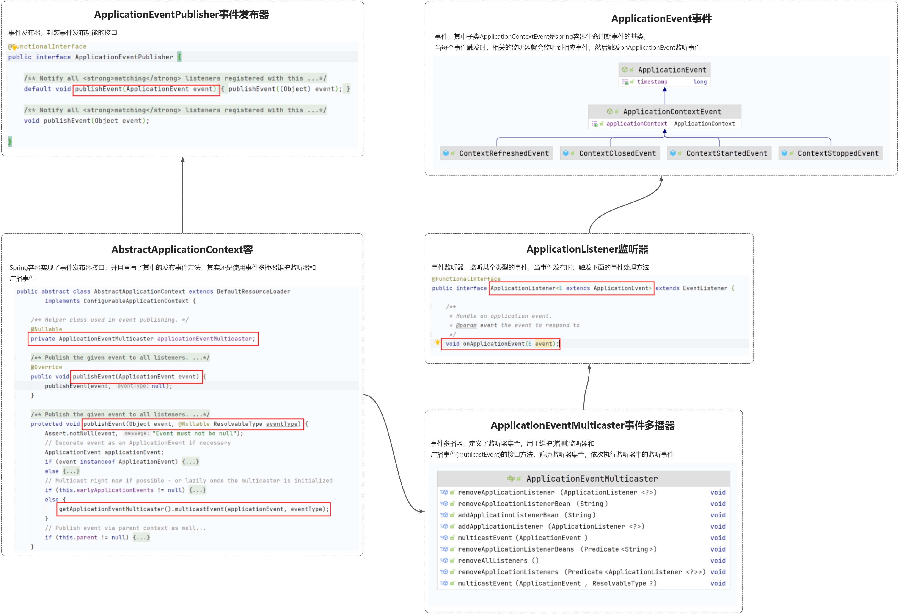

> 对于 **观察者设计模式** 不清楚的小伙伴先可以查看 [观察者模式](../../../设计模式/观察者模式.md) 这一篇文章，文章中详细地介绍了观察者模式的结构以及一个简单的案例。  

## 1. ApplicationEvent

## 2. ApplicationListener

## 3. ApplicationEventMulticaster

## 4. ApplicationEventPublisher

## 5. AbstractApplicationContext
