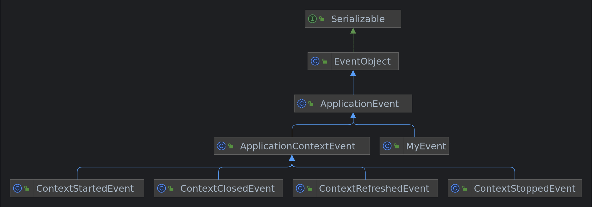
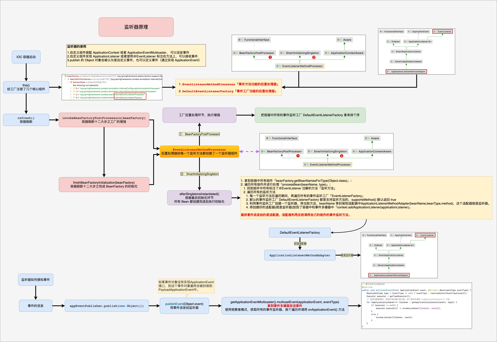

## 1. 环境搭建

利用 [Spring 源码环境搭建](../Spring源码环境搭建/README.md) 这篇文章中搭建好的 Spring 源码环境，编写一个关于 Spring 事件订阅与发布的测试案例，然后根据该测试案例去逐步分析 Spring 事件订阅与发布的整个流程。

### 1.1. 创建 spring-event-study 模块

选中项目右键新建一个模块，选择 Gradle，模块名填自己喜欢的即可，这里我就填 `spring-event-study`，最后点击确定即可。  


### 1.2. 引入相关依赖

在模块的 `build.gradle` 文件中引入以下依赖：

```gradle
dependencies {
    testImplementation 'org.junit.jupiter:junit-jupiter-api:5.9.0'
    testRuntimeOnly 'org.junit.jupiter:junit-jupiter-engine:5.9.0'
    implementation(project(':spring-context'))
    implementation 'org.slf4j:slf4j-api:2.0.3'
    implementation 'ch.qos.logback:logback-classic:1.4.3'
}
```

### 1.3. 日志配置文件

由于引入了 `logback`，所以需要在资源目录 `resources` 下创建一个 `logback.xml` 配置文件：

```xml
<?xml version="1.0" encoding="UTF-8"?>
<configuration>
    <appender name="CONSOLE" class="ch.qos.logback.core.ConsoleAppender">
        <encoder>
            <pattern>%d{yyyy-MM-dd HH:mm:ss.SSS} [%t] %-5p %c{1}:%L - %m%n</pattern>
        </encoder>
    </appender>

    <appender name="FILE" class="ch.qos.logback.core.rolling.RollingFileAppender">
        <encoder>
            <pattern>%d{yyyy-MM-dd HH:mm:ss.SSS} [%t] %-5p %c{1}:%L - %m%n</pattern>
            <charset>utf-8</charset>
        </encoder>
        <file>log/output.log</file>
        <rollingPolicy class="ch.qos.logback.core.rolling.FixedWindowRollingPolicy">
            <fileNamePattern>log/output.log.%i</fileNamePattern>
        </rollingPolicy>
        <triggeringPolicy class="ch.qos.logback.core.rolling.SizeBasedTriggeringPolicy">
            <MaxFileSize>1MB</MaxFileSize>
        </triggeringPolicy>
    </appender>

    <root level="DEBUG">
        <appender-ref ref="CONSOLE"/>
        <appender-ref ref="FILE"/>
    </root>
</configuration>
```

### 1.4. 自定义事件与事件监听器

1. 自定义事件，继承自 `ApplicationEvent`。
	
	 ```java
   public class MyEvent extends ApplicationEvent {
   	private static final long serialVersionUID = -7898050348071234064L;
   
   	public MyEvent(Object source) {
   		super(source);
   	}
   }
   ```
	
2. 自定义事件监听器，两种方式：

    - 实现 `ApplicationListener` 接口，重写 `onApplicationEvent()` 方法来自定义相关事件发生时的处理逻辑。

      ```java
      @Component
      public class MyApplicationEventListener implements ApplicationListener<ApplicationEvent> {
          private static final Logger LOGGER = LoggerFactory.getLogger(MyApplicationEventListener.class);
      
          @Override
          public void onApplicationEvent(ApplicationEvent event) {
              LOGGER.info("接收到事件：{}", event);
          }
      }
      ```

    - 在组件中的某个方法上标注 `@EventListener` 注解。

      ```java
      @Component
      public class MyEventHandler {
       	private static final Logger LOGGER = LoggerFactory.getLogger(MyEventHandler.class);
       
       	@EventListener(classes = {MyEvent.class})
       	public void handleEvent(MyEvent event) {
       		LOGGER.info("接收到自定义事件：{}", event);
       	}
       }
      ```

3. 注册监听器的两种常见方式：

    - 通过在监听器类上标注 `@Component` 注解的方式，就像上面的 `MyApplicationEventListener` 类，**推荐使用**！可以搭配 `@Async` 注解进行异步监听。
     - 通过调用容器中的 `addApplicationListener()` 方法的方式，也就说监听器类不需要标注 `@Component` 注解，使用方式对应到测试类中的这一行代码 `applicationContext.addApplicationListener(new MyEventListener());`。

       ```java
        public class MyEventListener implements ApplicationListener<MyEvent> {
        	private static final Logger LOGGER = LoggerFactory.getLogger(MyEventListener.class);
        
        	@Override
        	public void onApplicationEvent(MyEvent event) {
        		LOGGER.info("接收到自定义事件：{}", event);
        	}
        }
       ```

### 1.5. Spring 核心配置文件

在资源目录 `resources` 下创建一个 Spring 的核心配置文件 `applicationContext.xml` 。


```xml
<?xml version="1.0" encoding="UTF-8"?>
<beans xmlns:xsi="http://www.w3.org/2001/XMLSchema-instance"
	   xmlns:context="http://www.springframework.org/schema/context" xmlns="http://www.springframework.org/schema/beans"
	   xsi:schemaLocation="http://www.springframework.org/schema/beans http://www.springframework.org/schema/beans/spring-beans.xsd http://www.springframework.org/schema/context https://www.springframework.org/schema/context/spring-context.xsd">

	<context:component-scan base-package="top.xiaorang.event"/>
</beans>
```

### 1.6. 测试类

最后创建一个测试类 `SpringEventTests`：

```java
public class SpringEventTests {
	private static final Logger LOGGER = LoggerFactory.getLogger(SpringEventTests.class);

	public static void main(String[] args) {
		ClassPathXmlApplicationContext applicationContext = new ClassPathXmlApplicationContext("classpath:applicationContext.xml");
		applicationContext.addApplicationListener(new MyEventListener());
		applicationContext.publishEvent(new MyEvent("成功！"));
		applicationContext.close();
	}
}
```

测试结果如下所示：  


## 2. 源码分析

> Spring 容器初始化核心方法 AbstractApplicationContext#refresh

- `├─` refresh Spring 初始化核心流程入口
- `│ ├─` prepareRefresh ① 上下文刷新前的准备工作，设置启动时间和 active 标志，初始化属性
- `│ ├─` obtainFreshBeanFactory <span style="background:rgba(92, 92, 92, 0.2)">② 创建 bean 工厂实例以及加载 bean 定义信息到 bean 工厂</span>
- `│ ├─` prepareBeanFactory ③ 设置 beanFactory 的基本属性
- `│ ├─` postProcessBeanFactory ④ 子类处理自定义的 BeanFactoryPostProcess
- `│ ├─` invokeBeanFactoryPostProcessors <span style="background:rgba(3, 135, 102, 0.2)">⑤ 实例化并调用所有 bean 工厂后置处理器</span>
- `│ ├─` registerBeanPostProcessors ⑥ 注册，把实现了 BeanPostProcessor 接口的类实例化，加到 BeanFactory
- `│ ├─` initMessageSource ⑦ 初始化上下文中的资源文件，如国际化文件的处理等
- `│ ├─` **initApplicationEventMulticaster** <span style="background:#affad1">⑧ 初始化事件多播器</span>
- `│ ├─` onRefresh ⑨ 给子类扩展初始化其他 Bean，springboot 中用来做内嵌 tomcat 启动
- `│ ├─` **registerListeners** <span style="background:#affad1">⑩ 注册监听器</span>
- `│ ├─` finishBeanFactoryInitialization <span style="background:rgba(3, 135, 102, 0.2)">⑪ 实例化所有非懒加载的单实例 bean</span>
- `│ └─` **finishRefresh** <span style="background:#affad1">⑫ 完成刷新过程，发布上下文刷新完成事件</span>

其中，灰色代表已经分析过的步骤，浅绿色代表本次源码分析中会涉及到该步骤中的某些方法，绿色则代表本次源码分析的重点步骤。

本节源码分析是基于 `initApplicationEventMulticaster()` 方法、`registerListeners()` 方法和 `finishRefresh()` 方法内的执行流程，这三个方法算是 **Spring 容器刷新十二大步中的第八、第十和第十二大步：初始化事件多播器、注册监听器以及发布容器刷新完成事件**（其实除了上面主要的三步之外，为了实现使用 `@EventListener` 注解的方式注册监听器还会涉及到第五步和第十一步）。其余的步骤会在后续源码分析的文章中会逐个分析。  

### 2.1. 几个重要接口

> Spring 事件的订阅与发布是对观察者设计模式的一种实现，对于 **观察者设计模式** 不清楚的小伙伴可以先去查看 [观察者设计模式](../../../设计模式/观察者模式.md) 这一篇文章，文章中详细地介绍了观察者设计模式的结构与实现。  

Spring 事件的订阅与发布主要由这几部分来实现：`ApplicationEvent`、`ApplicationListener`、`ApplicationEventMulticaster` 和 `ApplicationEventPublisher`。

#### 2.1.1. ApplicationEvent

> **事件**，当发布某事件时所有监听该事件的监听器会执行相应的动作，是某一个特定的事件监听器触发的原因。

`ApplicationEvent` 是 Spring 提供的事件抽象类，继承自 `java.util.EventObject` 类。

```java
public abstract class ApplicationEvent extends EventObject {
	private static final long serialVersionUID = 7099057708183571937L;

	private final long timestamp;

	public ApplicationEvent(Object source) {
		super(source);
		this.timestamp = System.currentTimeMillis();
	}

	public ApplicationEvent(Object source, Clock clock) {
		super(source);
		this.timestamp = clock.millis();
	}

	public final long getTimestamp() {
		return this.timestamp;
	}
}
```

继承结构体系图如下所示：

从上图中可以看到除了咱们自定义的 `MyEvent` 事件之外，在 Spring 中还内置了很多其他事件，其中主要包括四个与 Spring 容器生命周期相关的事件：

- `ContextStartedEvent`：当容器启动时发布，即调用 `start()` 方法，已启用意味着所有的 Lifecycle Bean 都已显示接收到了 start 信号。

  ```java
  public void start() {
      getLifecycleProcessor().start();
      publishEvent(new ContextStartedEvent(this));
  }
  ```

- `ContextStoppedEvent`：当容器停止时发布，即调用 `stop()` 方法，即所有的 Lifecycle Bean 都已显示接收到了 stop 信号，停止的容器可以通过 `start()` 方法重启。

  ```java
  public void stop() {
      getLifecycleProcessor().stop();
      publishEvent(new ContextStoppedEvent(this));
  }
  ```

- `ContextRefreshedEvent`：当容器被实例化或刷新完成时发布，如调用 `refresh()` 方法，此处的实例化是指所有的 bean 都已被加载，后置处理器都被激活，所有的单实例 bean 都已被实例化，所有的容器对象都已准备好可使用。在 `refresh()` 方法的第十二大步的 `finishRefresh()` 方法中会发布该事件。

  ```java
  protected void finishRefresh() {
      // Clear context-level resource caches (such as ASM metadata from scanning).
      clearResourceCaches();
  
      // 初始化生命周期的处理器
      initLifecycleProcessor();
  
      // 将刷新完毕事件传播到生命周期处理器，触发 isAutoStartup() 方法返回 true 的 SmartLifecycle 的 start() 方法
      getLifecycleProcessor().onRefresh();
  
      // 事件发布（发布上下文环境刷新完成的事件），推送上下文刷新完毕事件到相应的监听器
      publishEvent(new ContextRefreshedEvent(this));
  
      // 将 Spring 容器注册到 LiveBeansView 中
      // Participate in LiveBeansView MBean, if active.
      if (!NativeDetector.inNativeImage()) {
          LiveBeansView.registerApplicationContext(this);
      }
  }
  ```

- `ContextClosedEvent`：当容器关闭时发布，即调用 `close()` 方法，关闭意味着所有的单例 bean 都已被销毁，关闭的容器不能被重启或刷新。

  ```java
  public void close() {
      synchronized (this.startupShutdownMonitor) {
          doClose();
          // If we registered a JVM shutdown hook, we don't need it anymore now:
          // We've already explicitly closed the context.
          if (this.shutdownHook != null) {
              try {
                  Runtime.getRuntime().removeShutdownHook(this.shutdownHook);
              }
              catch (IllegalStateException ex) {
                  // ignore - VM is already shutting down
              }
          }
      }
  }
  
  protected void doClose() {
      // Check whether an actual close attempt is necessary...
      if (this.active.get() && this.closed.compareAndSet(false, true)) {
          ...
  
          try {
              // Publish shutdown event.
              publishEvent(new ContextClosedEvent(this));
          }
          catch (Throwable ex) {
              logger.warn("Exception thrown from ApplicationListener handling ContextClosedEvent", ex);
          }
  
          // Destroy all cached singletons in the context's BeanFactory.
  		destroyBeans();
          
          ...
      }
  }
  ```

#### 2.1.2. ApplicationListener

> **事件监听器**，对应于观察者设计模式中的观察者。事件监听器用于监听特定的事件，并在内部定义了监听的事件发生后的响应逻辑。

`ApplicationListener` 是 Spring 提供的事件监听器接口，继承自 `java.util.EventListener`，提供一个 `onApplicationEvent()` 方法，用于定义监听的事件发生后的响应逻辑。

```java
@FunctionalInterface
public interface ApplicationListener<E extends ApplicationEvent> extends EventListener {
	void onApplicationEvent(E event);

	static <T> ApplicationListener<PayloadApplicationEvent<T>> forPayload(Consumer<T> consumer) {
		return event -> consumer.accept(event.getPayload());
	}
}
```

#### 2.1.3. ApplicationEventMulticaster

> **事件多播器**，对应于观察者设计模式中的被观察者/主题，负责通知观察者，对外提供发布事件和增删事件监听器的方法，维护事件与事件监听器之间的映射关系，并在事件发生时，负责通知相关的监听器。

`ApplicationEventMulticaster` 是 Spring 提供的事件多播器接口，默认实现为 `SimpleApplicationEventMulticaster`，该组件会在容器刷新时被创建，并以单例的形式存放在容器中，并且该组件实现了事件发生时通知相关监听器的方法。继承自 `AbstractApplicationEventMulticaster` 抽象类，在抽象父类中专门定义了一个内部类用于维护所有事件监听器。

```java
public interface ApplicationEventMulticaster {
	void addApplicationListener(ApplicationListener<?> listener);

	void addApplicationListenerBean(String listenerBeanName);

	void removeApplicationListener(ApplicationListener<?> listener);

	void removeApplicationListenerBean(String listenerBeanName);

	void removeApplicationListeners(Predicate<ApplicationListener<?>> predicate);

	void removeApplicationListenerBeans(Predicate<String> predicate);

	void removeAllListeners();

	void multicastEvent(ApplicationEvent event);

	void multicastEvent(ApplicationEvent event, @Nullable ResolvableType eventType);
}
```

#### 2.1.4. ApplicationEventPublisher

> **事件发布器**，封装事件发布功能的接口。事件发布器将事件转发给事件多播器，然后由事件多播器根据事件类型决定转发给哪些事件监听器。
>

`ApplicationEventPublisher` Spring 提供的的事件发布器接口，在该接口中提供了一个 `publishEvent()` 方法。

```java
@FunctionalInterface
public interface ApplicationEventPublisher {
	default void publishEvent(ApplicationEvent event) {
		publishEvent((Object) event);
	}
    
	void publishEvent(Object event);
}
```

`ApplicationContext` 继承了该接口，并且 `ApplicationContext` 接口的抽象实现类 `AbstractApplicationContext` 中维护了一个事件多播器 `ApplicationEventMulticaster` 的引用，在实现 `publishEvent()` 方法时，其实就是使用维护的事件多播器 `ApplicationEventMulticaster` 引用对象来广播事件给相关的事件监听器。

```java
public abstract class AbstractApplicationContext extends DefaultResourceLoader implements ConfigurableApplicationContext {
    /** Helper class used in event publishing. */
	@Nullable
	private ApplicationEventMulticaster applicationEventMulticaster;
    
    @Override
	public void publishEvent(ApplicationEvent event) {
		publishEvent(event, null);
	}
    
    @Override
	public void publishEvent(Object event) {
		publishEvent(event, null);
	}
    
    protected void publishEvent(Object event, @Nullable ResolvableType eventType) {
        Assert.notNull(event, "Event must not be null");

        // Decorate event as an ApplicationEvent if necessary
        ApplicationEvent applicationEvent;
        if (event instanceof ApplicationEvent) {
            // 若事件实现了 ApplicationEvent 接口，则将事件封装成 ApplicationEvent
            applicationEvent = (ApplicationEvent) event;
        }
        else {
            // 没有实现 ApplicationEvent 接口的任意对象作为事件最终被封装到了 PayloadApplicationEvent 中
            applicationEvent = new PayloadApplicationEvent<>(this, event);
            if (eventType == null) {
                eventType = ((PayloadApplicationEvent<?>) applicationEvent).getResolvableType();
            }
        }

        // Multicast right now if possible - or lazily once the multicaster is initialized
        if (this.earlyApplicationEvents != null) {
            this.earlyApplicationEvents.add(applicationEvent);
        }
        else {
            // 拿到事件多播器发送事件，使用事件多播器广播事件到相应的监听器
            getApplicationEventMulticaster().multicastEvent(applicationEvent, eventType);
        }

        // 同样，通过 parent 发布事件。Publish event via parent context as well...
        if (this.parent != null) {
            if (this.parent instanceof AbstractApplicationContext) {
                ((AbstractApplicationContext) this.parent).publishEvent(event, eventType);
            }
            else {
                this.parent.publishEvent(event);
            }
        }
    }
}
```

### 2.2. Spring 事件订阅与发布原理

咱们就通过分析 `AbstractApplicationContext` 中的容器刷新 `refresh()` 方法中的十二大步中的 **第八、第十和第十二大步：初始化事件多播器、注册监听器以及发布容器刷新完成事件**（其实除了上面主要的三步之外，为了实现使用 `@EventListener` 注解的方式注册监听器还会涉及到第五步和第十一步）来分析 Spring 事件订阅与发布原理。

#### 2.2.1. 初始化事件多播器

判断容器中是否存在名称为 `applicationEventMulticaster` 的 bean，如果存在的话，则从容器中获取 bean 实例对象赋值给 `applicationEventMulticaster` 属性；如果不存在的话，则 `new` 一个 `SimpleApplicationEventMulticaster` 类型的实例对象赋值给 `applicationEventMulticaster` 属性，然后将该对象注册到容器中。

```java
protected void initApplicationEventMulticaster() {
    ConfigurableListableBeanFactory beanFactory = getBeanFactory();
    if (beanFactory.containsLocalBean(APPLICATION_EVENT_MULTICASTER_BEAN_NAME)) {
        this.applicationEventMulticaster =
            beanFactory.getBean(APPLICATION_EVENT_MULTICASTER_BEAN_NAME, ApplicationEventMulticaster.class);
        if (logger.isTraceEnabled()) {
            logger.trace("Using ApplicationEventMulticaster [" + this.applicationEventMulticaster + "]");
        }
    }
    else {
        // 容器中没有名称为为 applicationEventMulticaster 的 bean，则注册一个事件派发器(SimpleApplicationEventMulticaster)
        this.applicationEventMulticaster = new SimpleApplicationEventMulticaster(beanFactory);
        beanFactory.registerSingleton(APPLICATION_EVENT_MULTICASTER_BEAN_NAME, this.applicationEventMulticaster);
        if (logger.isTraceEnabled()) {
            logger.trace("No '" + APPLICATION_EVENT_MULTICASTER_BEAN_NAME + "' bean, using " +
                         "[" + this.applicationEventMulticaster.getClass().getSimpleName() + "]");
        }
    }
}
```

#### 2.2.2. 注册事件监听器

在咱们的测试案例中，自定义事件监听器有两种方式：实现 `ApplicationListener` 接口和在方法上标注 `@EventListener` 注解，咱们分析一下使用这两种方式自定义的事件监听器为什么就被维护到了事件多播器中，就可以搞清楚 Spring 注册事件监听器的流程。

##### 2.2.2.1. 实现 `ApplicationListener` 接口方式

```java
protected void registerListeners() {
    // Register statically specified listeners first.
    for (ApplicationListener<?> listener : getApplicationListeners()) {
        getApplicationEventMulticaster().addApplicationListener(listener);
    }

    // Do not initialize FactoryBeans here: We need to leave all regular beans
    // uninitialized to let post-processors apply to them!
    String[] listenerBeanNames = getBeanNamesForType(ApplicationListener.class, true, false);
    for (String listenerBeanName : listenerBeanNames) {
        getApplicationEventMulticaster().addApplicationListenerBean(listenerBeanName);
    }

    // Publish early application events now that we finally have a multicaster...
    Set<ApplicationEvent> earlyEventsToProcess = this.earlyApplicationEvents;
    this.earlyApplicationEvents = null;
    if (!CollectionUtils.isEmpty(earlyEventsToProcess)) {
        for (ApplicationEvent earlyEvent : earlyEventsToProcess) {
            getApplicationEventMulticaster().multicastEvent(earlyEvent);
        }
    }
}
```

分析源码最好的方式就是 Debug，咱们就在该方法处打一个断点，看下方法中各个变量的值。


从上图中可以看到，从容器中获取所有 `ApplicationListener` 类型的事件监听器组件的名称，获取到的组件名称有 `myApplicationEventListener`，该组件不正是咱们在测试案例中自定义事件监听器的第一种方式编写的事件监听器类的名称吗？

🤔：在这里我有一个小小的疑问，为什么用 `getBeanNamesForType()` 方法获取所有事件监听器的名称，而不是用 `getBeansOfType()` 方法直接获取所有的事件监听器组件呢？

🤓：其实在代码上面的注释中有提到，翻译过来就是 **不要在这里就初始化这些 bean，需要让所有常规 bean 保持未初始化状态，以便让==后置处理器==应用于它们！**

最后将从容器中获取到的所有事件监听器的名称保存到上一小节初始化好的事件多播器中，让事件多播器来管理所有的事件监听器。

##### 2.2.2.2. 方法上标注 `@EventListener` 注解方式

前面一种注册事件监听器的方式还是很简单的，那么在方法上标注 `@EventListener` 注解的这种方式是如何注册事件监听器的呢？

记性好的小伙伴可能还记得在 [Spring-BeanDefinition加载流程分析](../Spring-BeanDefinition加载流程分析/README.md) 这一篇文章中的 `2.3.3.2.3` 小节有提到过现在源码分析时需要用到的两个类，`EventListenerMethodProcessor` 后置处理器和 `DefaultEventListenerFactory` 默认的事件监听器工厂类，已经不记得的小伙伴可以回过头看一下。

在上面咱们不是说在本章的源码分析中，容器刷新方法除了上面主要的三步之外，为了实现使用 `@EventListener` 注解的方式注册监听器还会涉及到第五步和第十一步吗？现在正是时候！

Spring 中大部分功能都是通过 bean 后置处理器扩展出来的，有时间的话一定要写一篇关于后置处理器的文章。

###### 2.2.2.2.1. 注册事件监听器工厂

在容器刷新的第五步：实例化并调用所有 bean 工厂后置处理器。

```java
// 实例化并调用所有已注册的 BeanFactoryPostProcessor 后置处理器，如果给定顺序，则按照给定顺序执行。
// 必须在单例实例化之前调用。
protected void invokeBeanFactoryPostProcessors(ConfigurableListableBeanFactory beanFactory) {
    PostProcessorRegistrationDelegate.invokeBeanFactoryPostProcessors(beanFactory, getBeanFactoryPostProcessors());

    // Detect a LoadTimeWeaver and prepare for weaving, if found in the meantime
    // (e.g. through an @Bean method registered by ConfigurationClassPostProcessor)
    if (!NativeDetector.inNativeImage() && beanFactory.getTempClassLoader() == null && beanFactory.containsBean(LOAD_TIME_WEAVER_BEAN_NAME)) {
        beanFactory.addBeanPostProcessor(new LoadTimeWeaverAwareProcessor(beanFactory));
        beanFactory.setTempClassLoader(new ContextTypeMatchClassLoader(beanFactory.getBeanClassLoader()));
    }
}
```

为了方便分析，该方法只贴出了部分代码，与此时无关的一部分代码就被省略了。别看这个方法代码挺多的，结构其实还是听清晰的。

1. 首先，从容器中获取所有 bean 工厂后置处理器的组件的名称，为什么又是名称？在注释上解释得很清楚，不要在这里初始化它们，以便 bean 工厂后处理器应用到它们！真的服了，现在是在获取 bean 工厂后置处理器的组件，还在想着让 bean 工厂后置处理器应用到它们！小伙伴们是不是很困惑？这是在干嘛？其实，你看到后面就清楚了！
2. 将获取出来的 bean 工厂后置处理器按照是否实现 `PriorityOrdered`、`Ordered` 接口进行分组，分完组之后，先将实现了 `PriorityOrdered` 接口的 bean 工厂后置处理器实例化（调用 `getBean()` 方法）和执行 bean 工厂后置处理器中的 `postProcessBeanFactory()` 方法，然后再是实现了 `Ordered` 接口的 bean 工厂后置处理器，最后是没有实现接口的 bean 工厂后置处理器。为什么要将 bean 工厂后置处理器按照是否实现 `PriorityOrdered`、`Ordered` 接口进行分组呢？其实结合上一点不难猜出，让 **先实例化的 bean 工厂后置处理器可以应用于后实例化的 bean 工厂后置处理器**。

```java
public static void invokeBeanFactoryPostProcessors(
			ConfigurableListableBeanFactory beanFactory, List<BeanFactoryPostProcessor> beanFactoryPostProcessors) {
	...
        
    // Do not initialize FactoryBeans here: We need to leave all regular beans
    // uninitialized to let the bean factory post-processors apply to them!
    String[] postProcessorNames =
        beanFactory.getBeanNamesForType(BeanFactoryPostProcessor.class, true, false);

    // Separate between BeanFactoryPostProcessors that implement PriorityOrdered,
    // Ordered, and the rest.
    List<BeanFactoryPostProcessor> priorityOrderedPostProcessors = new ArrayList<>();
    List<String> orderedPostProcessorNames = new ArrayList<>();
    List<String> nonOrderedPostProcessorNames = new ArrayList<>();
    for (String ppName : postProcessorNames) {
        if (processedBeans.contains(ppName)) {
            // skip - already processed in first phase above
        }
        else if (beanFactory.isTypeMatch(ppName, PriorityOrdered.class)) {
            priorityOrderedPostProcessors.add(beanFactory.getBean(ppName, BeanFactoryPostProcessor.class));
        }
        else if (beanFactory.isTypeMatch(ppName, Ordered.class)) {
            orderedPostProcessorNames.add(ppName);
        }
        else {
            nonOrderedPostProcessorNames.add(ppName);
        }
    }

    // First, invoke the BeanFactoryPostProcessors that implement PriorityOrdered.
    sortPostProcessors(priorityOrderedPostProcessors, beanFactory);
    invokeBeanFactoryPostProcessors(priorityOrderedPostProcessors, beanFactory);

    // Next, invoke the BeanFactoryPostProcessors that implement Ordered.
    List<BeanFactoryPostProcessor> orderedPostProcessors = new ArrayList<>(orderedPostProcessorNames.size());
    for (String postProcessorName : orderedPostProcessorNames) {
        orderedPostProcessors.add(beanFactory.getBean(postProcessorName, BeanFactoryPostProcessor.class));
    }
    sortPostProcessors(orderedPostProcessors, beanFactory);
    invokeBeanFactoryPostProcessors(orderedPostProcessors, beanFactory);

    // Finally, invoke all other BeanFactoryPostProcessors.
    List<BeanFactoryPostProcessor> nonOrderedPostProcessors = new ArrayList<>(nonOrderedPostProcessorNames.size());
    for (String postProcessorName : nonOrderedPostProcessorNames) {
        nonOrderedPostProcessors.add(beanFactory.getBean(postProcessorName, BeanFactoryPostProcessor.class));
    }
    invokeBeanFactoryPostProcessors(nonOrderedPostProcessors, beanFactory);

    // Clear cached merged bean definitions since the post-processors might have
    // modified the original metadata, e.g. replacing placeholders in values...
    beanFactory.clearMetadataCache();
}
```

因为 `EventListenerMethodProcessor`bean 工厂后置处理器并没有实现 `PriorityOrdered` 和 `Ordered` 接口，所以会在最后实例化并执行其中的 `postProcessBeanFactory()` 方法。咱们打个断点查看一下，`EventListenerMethodProcessor`bean 工厂后置处理器的名称是否在 `nonOrderedPostProcessorNames` 变量中。


从上图中可以看到，`org.springframework.context.event.internalEventListenerProcessor` 其实就是 `EventListenerMethodProcessor`bean 工厂后置处理器在容器中的名称，因为 `EventListenerMethodProcessor` 是 Spring 内部的 bean 工厂后置处理器，所以在名称前面加了 `internal`，应该是为了方便区分吧。

```java
public abstract class AnnotationConfigUtils {
	/**
	 * The bean name of the internally managed @EventListener annotation processor.
	 */
	public static final String EVENT_LISTENER_PROCESSOR_BEAN_NAME =
			"org.springframework.context.event.internalEventListenerProcessor";
}
```

现在让咱们来看一下 `EventListenerMethodProcessor`bean 工厂后置处理器类中的 `postProcessBeanFactory()` 方法。该方法用于从容器中获取所有的 `EventListenerFactory` 事件监听器工厂。

```java
public class EventListenerMethodProcessor
		implements SmartInitializingSingleton, ApplicationContextAware, BeanFactoryPostProcessor {
    @Override
	public void postProcessBeanFactory(ConfigurableListableBeanFactory beanFactory) {
		this.beanFactory = beanFactory;

		Map<String, EventListenerFactory> beans = beanFactory.getBeansOfType(EventListenerFactory.class, false, false);
		List<EventListenerFactory> factories = new ArrayList<>(beans.values());
		AnnotationAwareOrderComparator.sort(factories);
		this.eventListenerFactories = factories;
	}
}
```

让我们在该方法上打一个断点，看下获取到了哪些事件监听器工厂。


从图中可以很清楚地知道获取到的事件监听器工厂只有一个，就是上面提到过的 `DefaultEventListenerFactory` 默认的事件监听器工厂类。该类有什么用呢？既然是一个工厂类，并且与事件监听器有关，盲猜是用于生成事件监听器的，猜的对不对呢？咱们接着往下看。

```java
public class DefaultEventListenerFactory implements EventListenerFactory, Ordered {
	private int order = LOWEST_PRECEDENCE;

	public void setOrder(int order) {
		this.order = order;
	}

	@Override
	public int getOrder() {
		return this.order;
	}


	@Override
	public boolean supportsMethod(Method method) {
		return true;
	}

	@Override
	public ApplicationListener<?> createApplicationListener(String beanName, Class<?> type, Method method) {
		return new ApplicationListenerMethodAdapter(beanName, type, method);
	}
}
```

这个类非常简单，一个判断方法，用于判断该默认的事件监听器工厂类是否支持某方法，无脑返回 true，也就说默认的事件监听器工厂类支持任何方法，进一步分析就是可以在任何方法上加 `@EventListener` 注解，用来标识该方法是一个监听方法，用于监听某个事件，事件发生后执行方法内的逻辑。另外一个方法就是创建一个 `ApplicationListenerMethodAdapter` 事件监听器的适配器对象返回，该适配器类实现了 `ApplicationListener` 接口。在创建事件监听器的适配器对象时，将 bean 的名称，类型以及方法等信息封装到了该适配器对象中，为什么要封装这三个信息呢？要是叫你实现这样一个功能，将一个普通方法变成一个监听方法，你会怎么做？肯定会将方法所在的类以及该方法的信息封装到一个对象中，后面在发布对应事件的时候，通过反射的方式去调用该方法，可以说这就是 `ApplicationListenerMethodAdapter` 事件监听器适配器类的由来或者作用。

###### 2.2.2.2.2. 注册事件监听器

在容器刷新的第十一步，在这一步中，最主要的工作就是实例化所有非懒加载的单实例 bean，等所有的非懒加载单实例 bean 都实例化之后，会调用所有实现 `SmartInitializingSingleton` 接口的组件中的 `afterSingletonsInstantiated()` 方法。

```java
public void preInstantiateSingletons() throws BeansException {
    if (logger.isTraceEnabled()) {
        logger.trace("Pre-instantiating singletons in " + this);
    }

    // Iterate over a copy to allow for init methods which in turn register new bean definitions.
    // While this may not be part of the regular factory bootstrap, it does otherwise work fine.
    List<String> beanNames = new ArrayList<>(this.beanDefinitionNames);

    // Trigger initialization of all non-lazy singleton beans...
    for (String beanName : beanNames) {
        RootBeanDefinition bd = getMergedLocalBeanDefinition(beanName);
        if (!bd.isAbstract() && bd.isSingleton() && !bd.isLazyInit()) {
            if (isFactoryBean(beanName)) {
                Object bean = getBean(FACTORY_BEAN_PREFIX + beanName);
                if (bean instanceof FactoryBean) {
                    FactoryBean<?> factory = (FactoryBean<?>) bean;
                    boolean isEagerInit;
                    if (System.getSecurityManager() != null && factory instanceof SmartFactoryBean) {
                        isEagerInit = AccessController.doPrivileged(
                            (PrivilegedAction<Boolean>) ((SmartFactoryBean<?>) factory)::isEagerInit,
                            getAccessControlContext());
                    }
                    else {
                        isEagerInit = (factory instanceof SmartFactoryBean &&
                                       ((SmartFactoryBean<?>) factory).isEagerInit());
                    }
                    if (isEagerInit) {
                        getBean(beanName);
                    }
                }
            }
            else {
                getBean(beanName);
            }
        }
    }

    // Trigger post-initialization callback for all applicable beans...
    for (String beanName : beanNames) {
        Object singletonInstance = getSingleton(beanName);
        if (singletonInstance instanceof SmartInitializingSingleton) {
            StartupStep smartInitialize = this.getApplicationStartup().start("spring.beans.smart-initialize")
                .tag("beanName", beanName);
            SmartInitializingSingleton smartSingleton = (SmartInitializingSingleton) singletonInstance;
            if (System.getSecurityManager() != null) {
                AccessController.doPrivileged((PrivilegedAction<Object>) () -> {
                    smartSingleton.afterSingletonsInstantiated();
                    return null;
                }, getAccessControlContext());
            }
            else {
                smartSingleton.afterSingletonsInstantiated();
            }
            smartInitialize.end();
        }
    }
}
```

咱们的 `EventListenerMethodProcessor`bean 工厂后置处理器就实现了该接口，并重写了其中的 `afterSingletonsInstantiated()` 方法。

```java
// 处理组件
private void processBean(final String beanName, final Class<?> targetType) {
    if (!this.nonAnnotatedClasses.contains(targetType) &&
        AnnotationUtils.isCandidateClass(targetType, EventListener.class) &&
        !isSpringContainerClass(targetType)) {

        Map<Method, EventListener> annotatedMethods = null;
        try {
            // 找到组件中所有标注了 @EventListener 注解的方法。「监听方法」
            annotatedMethods = MethodIntrospector.selectMethods(targetType,
                      (MethodIntrospector.MetadataLookup<EventListener>) method ->
                       AnnotatedElementUtils.findMergedAnnotation(method, EventListener.class));
        }
        catch (Throwable ex) {
            // An unresolvable type in a method signature, probably from a lazy bean - let's ignore it.
            if (logger.isDebugEnabled()) {
                logger.debug("Could not resolve methods for bean with name '" + beanName + "'", ex);
            }
        }

        if (CollectionUtils.isEmpty(annotatedMethods)) {
            this.nonAnnotatedClasses.add(targetType);
            if (logger.isTraceEnabled()) {
                logger.trace("No @EventListener annotations found on bean class: " + targetType.getName());
            }
        }
        else {
            // Non-empty set of methods
            ConfigurableApplicationContext context = this.applicationContext;
            Assert.state(context != null, "No ApplicationContext set");
            List<EventListenerFactory> factories = this.eventListenerFactories;
            Assert.state(factories != null, "EventListenerFactory List not initialized");
            // 遍历所有方法「所有标注了 @EventListener 注解的方法」
            for (Method method : annotatedMethods.keySet()) {
                // 每一个监听方法在遍历期间，再遍历所有的事件监听工厂(EventListenerFactory)
                for (EventListenerFactory factory : factories) {
                    // 默认的事件监听工厂 DefaultEventListenerFactory 都是支持监听方法的，supportsMethod() 默认放回 true。
                    if (factory.supportsMethod(method)) {
                        Method methodToUse = AopUtils.selectInvocableMethod(method, context.getType(beanName));
                        // 利用事件监听工厂创建一个监听器，将当前方法、beanName 等封装到适配器中(ApplicationListenerMethodAdapter)，这个适配器就是监听器。
                        ApplicationListener<?> applicationListener =
                            factory.createApplicationListener(beanName, targetType, methodToUse);
                        if (applicationListener instanceof ApplicationListenerMethodAdapter) {
                            ((ApplicationListenerMethodAdapter) applicationListener).init(context, this.evaluator);
                        }
                        context.addApplicationListener(applicationListener);
                        break;
                    }
                }
            }
            if (logger.isDebugEnabled()) {
                logger.debug(annotatedMethods.size() + " @EventListener methods processed on bean '" +
                             beanName + "': " + annotatedMethods);
            }
        }
    }
}
```

从容器中获取所有组件的名称，遍历获取到的每一个组件并进行处理。处理逻辑如下：首先找到组件中所有标注了 `@EventListener` 注解的方法「监听方法」，接着遍历找到的所有「监听方法」，在每一个「监听方法」遍历的期间，再遍历所有的事件监听器工厂，判断哪个事件监听器工厂支持该「监听方法」，默认的事件监听器工厂支持任何「监听方法」，利用事件监听器工厂创建一个监听器，将当前方法、beanName、baenType 封装到 `ApplicationListenerMethodAdapter` 适配器（在上面已经分析过，该适配器实际就是一个事件监听器），将创建好的监听器注册到事件多播器中。该「监听方法」由某一个事件监听工厂处理过后，就不再遍历之后的事件监听器工厂。执行完该方法之后，所有组件中标注了 `@EventListener` 注解的方法就会被转换成一个个监听器注册到事件多播器中。

在咱们的测试案例中只有一个 `MyEventHandler` 类中的 `handleEvent()` 方法上标注了 `@EventListener` 注解，咱们打个断点看一下效果。


#### 2.2.3. 发布事件

经过上面的分析，咱们已经知道事件多播器的初始化和事件监听器的注册流程，最后分析一下发布事件的流程就大功告成。

在测试案例中，咱们调用创建好的 `ApplicationContext` 实例对象中的 `publishEvent()` 方法发布了一个自定义的事件，咱们就从该方法着手开始分析。

在该方法中，首先会判断要发布的事件是否实现了 `ApplicationEvent` 接口，如果实现了的话，则将事件转成 `ApplicationEvent` 接口类型；如果没有实现的话，则将该任意对象作为事件封装到 `PayloadApplicationEvent` 事件中。在方法的最后最终还是通过调用事件多播器中的 `multicastEvent()` 方法将事件广播给相应的事件监听器。

```java
@Override
public void publishEvent(ApplicationEvent event) {
    publishEvent(event, null);
}

@Override
public void publishEvent(Object event) {
    publishEvent(event, null);
}

/**
  * Publish the given event to all listeners.
  * @param event the event to publish (may be an {@link ApplicationEvent}
  * or a payload object to be turned into a {@link PayloadApplicationEvent})
  * @param eventType the resolved event type, if known
  * @since 4.2
  */
protected void publishEvent(Object event, @Nullable ResolvableType eventType) {
    Assert.notNull(event, "Event must not be null");

    // Decorate event as an ApplicationEvent if necessary
    ApplicationEvent applicationEvent;
    if (event instanceof ApplicationEvent) {
        // 若事件实现了 ApplicationEvent 接口，则将事件封装成 ApplicationEvent
        applicationEvent = (ApplicationEvent) event;
    }
    else {
        // 没有实现 ApplicationEvent 接口的任意对象作为事件最终被封装到了 PayloadApplicationEvent 中
        applicationEvent = new PayloadApplicationEvent<>(this, event);
        if (eventType == null) {
            eventType = ((PayloadApplicationEvent<?>) applicationEvent).getResolvableType();
        }
    }

    // Multicast right now if possible - or lazily once the multicaster is initialized
    if (this.earlyApplicationEvents != null) {
        this.earlyApplicationEvents.add(applicationEvent);
    }
    else {
        // 使用事件多播器广播事件给相应的事件监听器
        getApplicationEventMulticaster().multicastEvent(applicationEvent, eventType);
    }

    // 同样，通过 parent 发布事件。Publish event via parent context as well...
    if (this.parent != null) {
        if (this.parent instanceof AbstractApplicationContext) {
            ((AbstractApplicationContext) this.parent).publishEvent(event, eventType);
        }
        else {
            this.parent.publishEvent(event);
        }
    }
}
```

目光来到事件多播器 `ApplicationEventMulticaster` 的默认实现类 `SimpleApplicationEventMulticaster` 中的 `multicastEvent()` 方法中。在该方法中，先根据事件类型获取出匹配的事件监听器集合，然后遍历获取出来的事件监听器集合，挨个调用事件监听器的 `onApplicationEvent()` 方法，执行事件发生后自定义的响应逻辑。

```java
@Override
public void multicastEvent(final ApplicationEvent event, @Nullable ResolvableType eventType) {
    ResolvableType type = (eventType != null ? eventType : resolveDefaultEventType(event));
    Executor executor = getTaskExecutor();
    for (ApplicationListener<?> listener : getApplicationListeners(event, type)) {
        if (executor != null) {
            executor.execute(() -> invokeListener(listener, event));
        }
        else {
            invokeListener(listener, event);
        }
    }
}

protected void invokeListener(ApplicationListener<?> listener, ApplicationEvent event) {
    ...  
    doInvokeListener(listener, event);
    ...
}

private void doInvokeListener(ApplicationListener listener, ApplicationEvent event) {
    try {
        // 触发监听器的 onApplicationEvent() 方法，参数为给定的事件
        listener.onApplicationEvent(event);
    }
    catch (ClassCastException ex) {
        ...
    }
}
```

最后贴张图总结一下，有需要的小伙伴可以再对照着这张图回顾一下。



至此，关于 Spring 事件订阅与发布原理的分析流程就已经圆满结束了，撒花！🌸🌸🌸