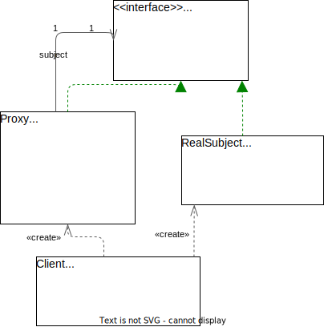
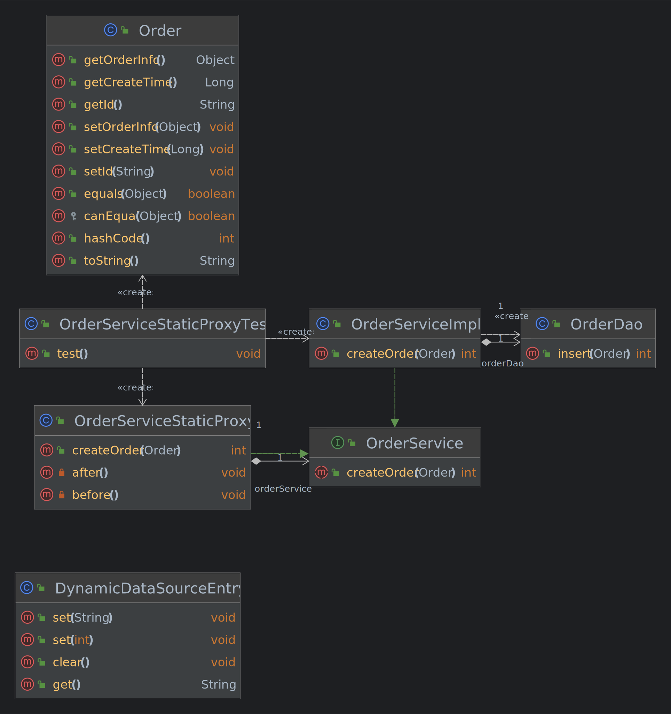

## 0.1 🎨意图

**代理模式** 是一种 **结构型设计模式**， 为其他对象提供一种代理，以控制对这个对象的访问。代理对象在客户端与目标对象之间起到中介作用。  
使用代理模式主要有两个目的：一是 **保护目标对象**，二是 **增强目标对象**。  
  

## 0.2 🎯结构

  

  

**Subject** 是 **顶层接口**，**RealSubject** 是目标对象（**被代理对象**），**Proxy** 是 **代理对象**，**代理对象持有被代理对象的引用**，客户端调用代理对象的方法，实际上调用的是被代理对象的方法，只不过会在被代理对象的方法执行前后增加一些处理逻辑。  
注意💡：**代理对象与被代理对象实现相同的接口**，这样代理对象才能伪装成被代理对象。  

## 0.3 🎉分类

- 静态代理：在程序运行前就已经存在代理类的字节码文件，代理类和委托类的关系在运行前就确定了。
- **动态代理**：编译完后没有代理类的字节码文件，而是 **在运行时动态生成并加载到 JVM 中**。

## 0.4 🎊静态代理

### 0.4.1 🙁问题

为什么要控制对于某个对象的访问呢？ 举个例子： 有这样一个消耗大量系统资源的巨型对象， 你只是偶尔需要使用它， 并非总是需要。  
  
你可以实现延迟初始化：在有需要时再创建对象。对象的所有客户端都要执行延迟初始化代码。不幸的是，这很可能会带来很多重复代码。  
在理想情况下，希望将代码直接放入对象的类中，但这并非总是能实现：比如类可能是第三方封闭库的一部分。

### 0.4.2 🥳解决方案

代理模式建议新建一个与目标对象接口相同的代理类，然后更新应用以将代理对象给所有原始对象客户端。代理类接收到客户端请求后会创建实际的目标对象，并将所有工作委派给它。  
  
代理将自己伪装成数据库对象，可在客户端或实际数据库对象不知情的情况下处理延迟初始化和缓存查询结果的工作。  
这有什么好处呢？如果需要在类的主要业务逻辑前后执行一些工作，无需修改类就能完成这项工作。由于 **代理对象实现的接口与目标对象相同**，因此可以将其传递给任何一个使用目标对象的客户端。

### 0.4.3 🚀案例场景

在分布式业务场景中，通常会对数据库进行分库分表，分库分表之后使用 Java 操作时就可能需要配置多个数据源，此时通过设置数据源路由来动态切换数据源。  

订单类：

```java
@Data  
@NoArgsConstructor  
@AllArgsConstructor  
public class Order {  
    private Object orderInfo;  
    private Long createTime;  
    private String id;  
}
```

订单持久层操作类：

```java
@Slf4j  
public class OrderDao {  
    public int insert(Order order) {  
        log.info("OrderDao 创建 Order 成功！");  
        return 1;  
    }  
}
```

订单业务层接口：

```java
public interface OrderService {  
    /**  
     * 创建订单  
     *  
     * @param order 订单  
     * @return 成功与否  
     */  
    int createOrder(Order order);  
}
```

订单业务层接口实现类：

```java
@Slf4j  
public class OrderServiceImpl implements OrderService {  
    private final OrderDao orderDao = new OrderDao();  
  
    @Override  
    public int createOrder(Order order) {  
        log.info("OrderService 调用 orderDao 创建订单");  
        return orderDao.insert(order);  
    }  
}
```

接下来使用静态代理，主要完成的功能是：根据订单创建时间自动按年份进行分库。  

数据源路由：使用 ThreadLocal 的单例实现。

```java
public class DynamicDataSourceEntry {  
    private static final ThreadLocal<String> local = new ThreadLocal<>();  
  
    private DynamicDataSourceEntry() {  
    }  
    /**  
     * 清空数据源  
     */  
    public static void clear() {  
        local.remove();  
    }  
  
    /**  
     * 获取当前正在使用的数据源名称  
     *  
     * @return 数据源名称  
     */  
    public static String get() {  
        return local.get();  
    }  
  
    /**  
     * 设置已知名字的数据源  
     *  
     * @param source 数据源名称  
     */  
    public static void set(String source) {  
        local.set(source);  
    }  
  
    /**  
     * 根据年份动态设置数据源  
     *  
     * @param year 年份  
     */  
    public static void set(int year) {  
        local.set("DB_" + year);  
    }  
}
```

订单业务层接口实现类的静态代理类：

```java
@Slf4j  
public class OrderServiceStaticProxy implements OrderService {  
    private static final SimpleDateFormat yearFormatter = new SimpleDateFormat("yyyy");  
    private OrderService orderService;  
  
    public OrderServiceStaticProxy(OrderService orderService) {  
        this.orderService = orderService;  
    }  
  
    @Override  
    public int createOrder(Order order) {  
        before();  
        Long createTime = order.getCreateTime();  
        int dbRouter = Integer.parseInt(yearFormatter.format(new Date(createTime)));  
        log.info("静态代理类自动分配到【DB_{}】数据源处理数据", dbRouter);  
        DynamicDataSourceEntry.set(dbRouter);  
        int res = orderService.createOrder(order);  
        after();  
        return res;  
    }  
  
    private void after() {  
        log.info("Proxy after method.");  
    }  
  
    private void before() {  
        log.info("Proxy before method.");  
    }  
}
```

测试类：

```java
public class OrderServiceStaticProxyTest {  
    @Test  
    public void test() {  
        try {  
            SimpleDateFormat simpleDateFormat = new SimpleDateFormat("yyyy/MM/dd");  
            Date date = simpleDateFormat.parse("2022/08/21");  
            Order order = new Order();  
            order.setCreateTime(date.getTime());  
  
            OrderServiceStaticProxy proxy = new OrderServiceStaticProxy(new OrderServiceImpl());  
            proxy.createOrder(order);  
        } catch (Exception e) {  
            throw new RuntimeException(e);  
        }  
    }  
}
```

测试结果如下所示：

```
2022-08-21 23:16:46 INFO  OrderServiceStaticProxy:41 - Proxy before method.
2022-08-21 23:16:46 INFO  OrderServiceStaticProxy:29 - 静态代理类自动分配到【DB_2022】数据源处理数据
2022-08-21 23:16:46 INFO  OrderServiceImpl:18 - OrderService 调用 orderDao 创建订单
2022-08-21 23:16:46 INFO  OrderDao:15 - OrderDao 创建 Order 成功！
2022-08-21 23:16:46 INFO  OrderServiceStaticProxy:37 - Proxy after method.
```

类图如下所示：  
  

## 0.5 🎁动态代理

动态代理与静态代理的基本思路一致，只不过动态代理功能更加强大，随着业务的扩展适应性更强。

### 0.5.1 1、JDK

#### 0.5.1.1 案例场景

再来看看使用 JDK 动态代理的方式实现数据源动态路由业务。创建测试类：

```java
@Slf4j  
public class OrderServiceJDKDynamicProxyTest {  
    private static final SimpleDateFormat YYYY = new SimpleDateFormat("yyyy");  
    private static final SimpleDateFormat YYYY_MM_DD = new SimpleDateFormat("yyyy/MM/dd");  
  
    public static void main(String[] args) {  
        try {  
            Date date = YYYY_MM_DD.parse("2019/08/21");  
            Order order = new Order();  
            order.setCreateTime(date.getTime());  
  
            OrderService orderService = new OrderServiceImpl();  
            Class<?> clazz = orderService.getClass();  
  
            OrderService proxy = (OrderService) Proxy.newProxyInstance(clazz.getClassLoader(), clazz.getInterfaces(), new InvocationHandler() {  
                @Override  
                public Object invoke(Object proxy, Method method, Object[] args) throws Throwable {  
                    try {  
                        before();  
                        Long createTime = (Long) clazz.getMethod("getCreateTime", Order.class).invoke(orderService, order);  
                        int dbRouter = Integer.parseInt(YYYY.format(new Date(createTime)));  
                        log.info("JDK动态代理类自动分配到【DB_{}】数据源处理数据", dbRouter);  
                        DynamicDataSourceEntry.set(dbRouter);  
                        Object res = method.invoke(orderService, args);  
                        after();  
                        return res;  
                    } catch (Exception e) {  
                        e.printStackTrace();  
                    }  
                    return null;  
                }  
            });  
            proxy.createOrder(order);  
        } catch (Exception e) {  
            throw new RuntimeException(e);  
        }  
    }  
  
    private static void after() {  
        log.info("Proxy after method.");  
    }  
  
    private static void before() {  
        log.info("Proxy before method.");  
    }  
}
```

测试结果如下所示：

```
2022-08-22 14:28:15 INFO  OrderServiceJDKDynamicProxyTest:67 - Proxy before method.
2022-08-22 14:28:15 INFO  OrderServiceJDKDynamicProxyTest:45 - JDK动态代理类自动分配到【DB_2019】数据源处理数据
2022-08-22 14:28:15 INFO  OrderServiceImpl:18 - OrderService 调用 orderDao 创建订单
2022-08-22 14:28:15 INFO  OrderDao:15 - OrderDao 创建 Order 成功！
2022-08-22 14:28:15 INFO  OrderServiceJDKDynamicProxyTest:63 - Proxy after method.
```

依然能够达到相同的效果。但是，使用动态代理之后，不仅能够实现 Order 的数据源动态路由，还可以实现其他任何类的数据源路由。当然，有个比较重要的约定，必须实现 `getCreateTime` 方法，因为路由规则是根据时间来运算的，其实可以通过接口规范来达到约束的目的。

#### 0.5.1.2 源码分析

##### 0.5.1.2.1 查看生成的代理类

在测试类的 main 方法中加入如下代码即可，至于原因在后面的源码分析中会说。

```java
System.setProperty("sun.misc.ProxyGenerator.saveGeneratedFiles", "true");
```

点击运行就可以在当前项目目录下找到动态生成的代理类的 class 文件。  
    
JDK 动态生成的代理类如下所示：可以看到 **代理类继承自 Proxy 并且实现了与被代理类相同的接口**。

```java
public final class $Proxy0 extends Proxy implements OrderService {  
    private static Method m1;  
    private static Method m3;  
    private static Method m2;  
    private static Method m4;  
    private static Method m0;  
  
    public $Proxy0(InvocationHandler var1) throws  {  
        super(var1);  
    }  
  
    public final boolean equals(Object var1) throws  {  
        try {  
            return (Boolean)super.h.invoke(this, m1, new Object[]{var1});  
        } catch (RuntimeException | Error var3) {  
            throw var3;  
        } catch (Throwable var4) {  
            throw new UndeclaredThrowableException(var4);  
        }  
    }  
  
    public final Long getCreateTime(Order var1) throws  {  
        try {  
            return (Long)super.h.invoke(this, m3, new Object[]{var1});  
        } catch (RuntimeException | Error var3) {  
            throw var3;  
        } catch (Throwable var4) {  
            throw new UndeclaredThrowableException(var4);  
        }  
    }  
  
    public final String toString() throws  {  
        try {  
            return (String)super.h.invoke(this, m2, (Object[])null);  
        } catch (RuntimeException | Error var2) {  
            throw var2;  
        } catch (Throwable var3) {  
            throw new UndeclaredThrowableException(var3);  
        }  
    }  
  
    public final int createOrder(Order var1) throws  {  
        try {  
            return (Integer)super.h.invoke(this, m4, new Object[]{var1});  
        } catch (RuntimeException | Error var3) {  
            throw var3;  
        } catch (Throwable var4) {  
            throw new UndeclaredThrowableException(var4);  
        }  
    }  
  
    public final int hashCode() throws  {  
        try {  
            return (Integer)super.h.invoke(this, m0, (Object[])null);  
        } catch (RuntimeException | Error var2) {  
            throw var2;  
        } catch (Throwable var3) {  
            throw new UndeclaredThrowableException(var3);  
        }  
    }  
  
    static {  
        try {  
            m1 = Class.forName("java.lang.Object").getMethod("equals", Class.forName("java.lang.Object"));  
            m3 = Class.forName("top.xiaorang.design.pattern.proxy.staticproxy.OrderService").getMethod("getCreateTime", Class.forName("top.xiaorang.design.pattern.proxy.staticproxy.Order"));  
            m2 = Class.forName("java.lang.Object").getMethod("toString");  
            m4 = Class.forName("top.xiaorang.design.pattern.proxy.staticproxy.OrderService").getMethod("createOrder", Class.forName("top.xiaorang.design.pattern.proxy.staticproxy.Order"));  
            m0 = Class.forName("java.lang.Object").getMethod("hashCode");  
        } catch (NoSuchMethodException var2) {  
            throw new NoSuchMethodError(var2.getMessage());  
        } catch (ClassNotFoundException var3) {  
            throw new NoClassDefFoundError(var3.getMessage());  
        }  
    }  
}
```

##### 0.5.1.2.2 代理类如何生成？

从上面动态生成的代理类源码中看出，**生成的代理类继承自 `Proxy` 类**。  
其中我们最熟悉的一个方法可能就是 **`newProxyInstance()`**，**生成并返回一个代理对象**。在 `newProxyInstance()` 方法中最为关键的几行代码如下所示：

```java
public static Object newProxyInstance(ClassLoader loader, Class<?>[] interfaces,  
    InvocationHandler h) throws IllegalArgumentException {
	...
	// 生成代理类
	Class<?> cl = getProxyClass0(loader, intfs);
	// 根据代理类获取构造方法
	final Constructor<?> cons = cl.getConstructor(InvocationHandler.class);
	// 通过代理类的构造器创建代理对象并返回，传入 InvocationHandler 参数    
	return cons.newInstance(new Object[]{h});  
	...
}
```

关于反射如何使用在此处就不再赘述。此时关键点就在于 **`getProxyClass0()`** 方法是如何生成一个代理类的？ 

```java
private static final WeakCache<ClassLoader, Class<?>[], Class<?>>  
    proxyClassCache = new WeakCache<>(new KeyFactory(), new ProxyClassFactory());

private static Class<?> getProxyClass0(ClassLoader loader, Class<?>... interfaces) {   
	// 如果给定加载器定义的代理类实现给定接口存在，这将简单地返回缓存的副本；否则，它将通过代理类工厂 ProxyClassFactory 创建代理类
	return proxyClassCache.get(loader, interfaces);  
}
```

来到 `WeakCache` 类的 `get()` 方法中，如下所示：

```java
public V get(K key, P parameter) {  
    Objects.requireNonNull(parameter);  
    expungeStaleEntries();  
    Object cacheKey = CacheKey.valueOf(key, refQueue);  
  
    // 通过类加载器,获取已加载过的接口元数据和代理类工厂(ProxyClassFactory)
    // 其中，map中的key = 接口元数据，value = 代理类工厂(作用: 创建动态代理对象)
    ConcurrentMap<Object, Supplier<V>> valuesMap = map.get(cacheKey);
    // 初始化操作，如果是第一次，则创建一个空的Map  
    if (valuesMap == null) {  
        ConcurrentMap<Object, Supplier<V>> oldValuesMap  
            = map.putIfAbsent(cacheKey,  
                              valuesMap = new ConcurrentHashMap<>());  
        if (oldValuesMap != null) {  
            valuesMap = oldValuesMap;  
        }  
    }  
  
    // 将所有接口进行hash生成唯一标识   
    Object subKey = Objects.requireNonNull(subKeyFactory.apply(key, parameter)); 
    // 通过唯一标识尝试性获取代理类工厂(ProxyClassFactory) 
    Supplier<V> supplier = valuesMap.get(subKey);  
    Factory factory = null;  
  
    while (true) {
	    // 第一次并不存在代理类工厂，所以不满足条件，走下面的代码生成代理类工厂，第一次循环结束。第二次才会满足条件  
        if (supplier != null) {  
            // 从代理类工厂中获取代理类并返回
            V value = supplier.get();  
            if (value != null) {  
                return value;  
            }  
        }  
        // 创建一个代理类工厂       
        if (factory == null) {  
            factory = new Factory(key, parameter, subKey, valuesMap);  
        }  
  
        if (supplier == null) {
	        // 将代理类工厂放入缓存中  
            supplier = valuesMap.putIfAbsent(subKey, factory);  
            if (supplier == null) {  
                // 已经创建好代理类工厂，为第二次循环做准备，在第二次循环时，可以通过代理类工厂获取代理类 
                supplier = factory;  
            }  
        } else {
	        // 代理类工厂的重试机制
	        // 当从代理类工厂中获取出的代理类为空时，则用新创建的代理类工厂替换掉缓存中旧的代理类工厂
	        // 然后再用新的代理类工厂去创建代理类
            if (valuesMap.replace(subKey, supplier, factory)) {  
                supplier = factory;  
            } else {  
                supplier = valuesMap.get(subKey);  
            }  
        }  
    }  
}
```

###### 0.5.1.2.2.1 细节分析 1：Proxy.KeyFactory

作用：通过所有的接口进行 hash 操作生成唯一标识用来对应代理类工厂。

```java
private static final class KeyFactory implements BiFunction<ClassLoader, Class<?>[], Object> {  
    @Override  
    public Object apply(ClassLoader classLoader, Class<?>[] interfaces) {  
        switch (interfaces.length) {  
            case 1: return new Key1(interfaces[0]); // the most frequent  
            case 2: return new Key2(interfaces[0], interfaces[1]);  
            case 0: return key0;  
            default: return new KeyX(interfaces);  
        }  
    }  
}
```

###### 0.5.1.2.2.2 细节分析 2：Proxy.ProxyClassFactory

作用：真正 **生成代理类** 的地方。

```java
private static final class ProxyClassFactory implements BiFunction<ClassLoader, Class<?>[], Class<?>> {  
    // 所有代理类名称的前缀 
    private static final String proxyClassNamePrefix = "$Proxy";  
  
    // 用于生成唯一代理类名称的下一个数字  
    private static final AtomicLong nextUniqueNumber = new AtomicLong();
    
	@Override
	public Class<?> apply(ClassLoader loader, Class<?>[] interfaces) {
		// 要生成的代理类的名称
	    long num = nextUniqueNumber.getAndIncrement();  
	    String proxyName = proxyPkg + proxyClassNamePrefix + num;
	    // 生成动态代理类的字节码文件.即$Proxy.class  
	    byte[] proxyClassFile = ProxyGenerator.generateProxyClass(proxyName, interfaces, accessFlags);  
	    try { 
		    // 将字节码文件加载到JVM虚拟机内存中，返回生成的代理类 
	        return defineClass0(loader, proxyName, proxyClassFile, 0, proxyClassFile.length);  
	    } catch (ClassFormatError e) {  
	        throw new IllegalArgumentException(e.toString());  
	    }  
	}
}
```

###### 0.5.1.2.2.3 细节分析 3：ProxyGenerator

在该类中最重要的一个方法 **`generateProxyClass`**，**生成并返回代理类的字节码信息**。如果 `saveGeneratedFiles` 标识为 true，即 JVM 参数 `sun.misc.ProxyGenerator.saveGeneratedFiles` 为 true 的话（这也就是上面查看生成的代理类中为啥要加该 JVM 参数的原因），则可以使用 I/O 流将字节码保存到本地文件 `$Proxy{num}.class` 中。

```java
private static final boolean saveGeneratedFiles = (Boolean)AccessController.doPrivileged(new GetBooleanAction("sun.misc.ProxyGenerator.saveGeneratedFiles"));

public static byte[] generateProxyClass(final String var0, Class<?>[] var1, int var2) {  
    ProxyGenerator var3 = new ProxyGenerator(var0, var1, var2); 
    // 生成字节码文件，返回字节数组
    final byte[] var4 = var3.generateClassFile();
    // 将生成的字节码,使用I/O流保存到本地文件  
    if (saveGeneratedFiles) {  
        AccessController.doPrivileged(new PrivilegedAction<Void>() {  
            public Void run() {  
                try {  
                    int var1 = var0.lastIndexOf(46);  
                    Path var2;  
                    if (var1 > 0) {  
                        Path var3 = Paths.get(var0.substring(0, var1).replace('.', File.separatorChar));  
                        Files.createDirectories(var3);  
                        var2 = var3.resolve(var0.substring(var1 + 1, var0.length()) + ".class");  
                    } else {  
                        var2 = Paths.get(var0 + ".class");  
                    }  
  
                    Files.write(var2, var4, new OpenOption[0]);  
                    return null;                } catch (IOException var4x) {  
                    throw new InternalError("I/O exception saving generated file: " + var4x);  
                }  
            }  
        });  
    }  
    return var4;  
}
```

至于 `ProxyGenerator` 类中的 `generateClassFile()` 方法是如何生成代理类的字节码文件的，此处涉及到 JVM 内存和字节码规范方面的知识点，等以后有机会再回过头来完善 (其实就是现在不会😓)。  
参考链接：[# JDK动态代理源码分析: 到生成字节码](https://www.bilibili.com/video/BV1t44y1B77P?share_source=copy_pc)，配套文章：[# jdk动态代理: 从源码,到字节码,到自己手写动态代理](https://mp.weixin.qq.com/s/1zOufG4oonTKlwAo0Bs17Q)

##### 0.5.1.2.3 使用代理类的整体流程

在上面案例的测试类代码中，有这样一句代码 `orderService.createOrder(order);`，调用代理类中的 `createOrder()` 方法，让我们再来看看代理类中 `createOrder()` 方法的具体实现。

```java
public final int createOrder(Order var1) throws  {  
	try {  
		return (Integer)super.h.invoke(this, m4, new Object[]{var1});  
	} catch (RuntimeException | Error var3) {  
		throw var3;  
	} catch (Throwable var4) {  
		throw new UndeclaredThrowableException(var4);  
	}  
} 
```

从上面的代码中可以看到，**调用了父类 `Proxy` 中 `InvocationHandler` 接口成员变量的 `invoke()` 方法**(也就是我们重写的 `invoke()` 方法)。  
传入的参数依次是【代理类本身】，`createOrder()` 方法的 `Method` 对象】，【`createOrder()` 方法的入参】。  
其中，有一个关键的点在于我们使用 Proxy 类中的 `newProxyInstance()` 方法时，利用代理类的构造器创建代理类对象时，构造器传入的参数为 InvocationHandler 实现。

```java
public $Proxy0(InvocationHandler var1) throws  {  
	super(var1);  
} 
```

在代理类的构造器中，又调用父类的构造器，将 `InvocationHandler` 实现传给父类，让 `InvocationHandler` 接口的成员变量 `h` 接收，所以代理类的 `createOrder()` 才可以直接执行父类中成员变量 `h` 的 `invoke()` 方法。  
这就是代理类执行的整个流程，从生成代理类，到使用代理类。

### 0.5.2 2、Cglib

cglib 即 Code Generation Library，做动态代理其实只是 cglib 一方面的应用。其实 cglib 是一个功能强大的高性能高质量代码生成库，它底层依赖于小而快的 **字节码处理框架 ASM**，来扩展 JAVA 类并在运行时实现接口。

#### 0.5.2.1 案例场景

再来看看使用 Cglib 动态代理的方式实现数据源动态路由业务。创建测试类：

```java
@Slf4j  
public class OrderServiceCglibDynamicProxyTest {  
    private static final SimpleDateFormat YYYY = new SimpleDateFormat("yyyy");  
    private static final SimpleDateFormat YYYY_MM_DD = new SimpleDateFormat("yyyy/MM/dd");  
  
    public static void main(String[] args) {  
        try {  
            Date date = YYYY_MM_DD.parse("2019/08/21");  
            Order order = new Order();  
            order.setCreateTime(date.getTime());  
  
            OrderService orderService = new OrderServiceImpl();  
            Class<?> clazz = orderService.getClass();  
  
            Enhancer enhancer = new Enhancer();  
            enhancer.setSuperclass(clazz);  
            enhancer.setCallback((MethodInterceptor) (o, method, objects, methodProxy) -> {  
                try {  
                    before();  
                    Long createTime = (Long) clazz.getMethod("getCreateTime", Order.class).invoke(orderService, order);  
                    int dbRouter = Integer.parseInt(YYYY.format(new Date(createTime)));  
                    log.info("Cglib动态代理类自动分配到【DB_{}】数据源处理数据", dbRouter);  
                    DynamicDataSourceEntry.set(dbRouter);  
                    Object res = methodProxy.invokeSuper(o, objects);  
                    after();  
                    return res;  
                } catch (Exception e) {  
                    e.printStackTrace();  
                }  
                return null;  
            });  
            OrderService proxy = (OrderService) enhancer.create();  
            proxy.createOrder(order);  
        } catch (Exception e) {  
            throw new RuntimeException(e);  
        }  
    }  
  
    private static void after() {  
        log.info("Proxy after method.");  
    }  
  
    private static void before() {  
        log.info("Proxy before method.");  
    }  
}
```

测试结果如下所示：

```
2022-08-22 14:54:35 INFO  OrderServiceCglibDynamicProxyTest:64 - Proxy before method.
2022-08-22 14:54:35 INFO  OrderServiceCglibDynamicProxyTest:42 - Cglib动态代理类自动分配到【DB_2019】数据源处理数据
2022-08-22 14:54:35 INFO  OrderServiceImpl:18 - OrderService 调用 orderDao 创建订单
2022-08-22 14:54:35 INFO  OrderDao:15 - OrderDao 创建 Order 成功！
2022-08-22 14:54:35 INFO  OrderServiceCglibDynamicProxyTest:60 - Proxy after method.
```

#### 0.5.2.2 源码分析

##### 0.5.2.2.1 查看生成的代理类

在测试类的 main 方法中加入如下代码即可，至于原因在后面的源码分析中会说。

```java
System.setProperty(DEBUG_LOCATION_PROPERTY, new File("").getAbsolutePath() + "/cglib");
```

点击运行就可以在当前项目目录下的 cglib 目录中找到动态生成的代理类的 class 文件。  
  
可以看到与 JDK 生成的代理类不同的是，Cglib 生成的 class 文件有三个，依次往下分别是【**代理类**】、【**代理类的 FastClass 类**】和【**被代理类的 FastClass 类**】。  
Cglib 动态生成的代理类如下所示 (截取部分重要的代码)：可以看到 **生成的代理类是继承自被代理类** 的。  需要注意的是💡：**被 `final` 修饰的类和方法都不可被代理**。

```java
public class OrderServiceImpl$$EnhancerByCGLIB$$346db491 extends OrderServiceImpl implements Factory {  
    private static final ThreadLocal CGLIB$THREAD_CALLBACKS;  
    private static final Callback[] CGLIB$STATIC_CALLBACKS;  
    private MethodInterceptor CGLIB$CALLBACK_0;  
    private static final Method CGLIB$getCreateTime$0$Method;  
    private static final MethodProxy CGLIB$getCreateTime$0$Proxy;  
    private static final Object[] CGLIB$emptyArgs;  
    private static final Method CGLIB$createOrder$1$Method;  
    private static final MethodProxy CGLIB$createOrder$1$Proxy;  
  
    static void CGLIB$STATICHOOK1() {  
        CGLIB$THREAD_CALLBACKS = new ThreadLocal();  
        CGLIB$emptyArgs = new Object[0];
        // var0 = 代理类  
        Class var0 = Class.forName("top.xiaorang.design.pattern.proxy.basic.OrderServiceImpl$$EnhancerByCGLIB$$346db491");
        // var1 = 被代理类  
        Class var1;  
        var10000 = ReflectUtils.findMethods(new String[]{"getCreateTime", "(Ltop/xiaorang/design/pattern/proxy/basic/Order;)Ljava/lang/Long;", "createOrder", "(Ltop/xiaorang/design/pattern/proxy/basic/Order;)I"}, (var1 = Class.forName("top.xiaorang.design.pattern.proxy.basic.OrderServiceImpl")).getDeclaredMethods());  
        CGLIB$createOrder$1$Method = var10000[1];  
        CGLIB$createOrder$1$Proxy = MethodProxy.create(var1, var0, "(Ltop/xiaorang/design/pattern/proxy/basic/Order;)I", "createOrder", "CGLIB$createOrder$1");  
    }     
  
    final int CGLIB$createOrder$1(Order var1) {  
        return super.createOrder(var1);  
    }  
  
    public final int createOrder(Order var1) {  
        MethodInterceptor var10000 = this.CGLIB$CALLBACK_0;  
        if (var10000 == null) {  
            CGLIB$BIND_CALLBACKS(this);  
            var10000 = this.CGLIB$CALLBACK_0;  
        }  
        if (var10000 != null) {  
            Object var2 = var10000.intercept(this, CGLIB$createOrder$1$Method, new Object[]{var1}, CGLIB$createOrder$1$Proxy);  
            return var2 == null ? 0 : ((Number)var2).intValue();  
        } else {  
            return super.createOrder(var1);  
        }  
    }  
  
    public static MethodProxy CGLIB$findMethodProxy(Signature var0) {  
        String var10000 = var0.toString();  
        switch (var10000.hashCode()) {  
            case -921643372:  
                if (var10000.equals("getCreateTime(Ltop/xiaorang/design/pattern/proxy/basic/Order;)Ljava/lang/Long;")) {  
                    return CGLIB$getCreateTime$0$Proxy;  
                }  
                break;  
            case -508378822:  
                if (var10000.equals("clone()Ljava/lang/Object;")) {  
                    return CGLIB$clone$5$Proxy;  
                }  
                break;  
            case 1159457639:  
                if (var10000.equals("createOrder(Ltop/xiaorang/design/pattern/proxy/basic/Order;)I")) {  
                    return CGLIB$createOrder$1$Proxy;  
                }  
                break;  
            case 1826985398:  
                if (var10000.equals("equals(Ljava/lang/Object;)Z")) {  
                    return CGLIB$equals$2$Proxy;  
                }  
                break;  
            case 1913648695:  
                if (var10000.equals("toString()Ljava/lang/String;")) {  
                    return CGLIB$toString$3$Proxy;  
                }  
                break;  
            case 1984935277:  
                if (var10000.equals("hashCode()I")) {  
                    return CGLIB$hashCode$4$Proxy;  
                }  
        }  
  
        return null;  
    }  

	// 代理类的构造方法
    public OrderServiceImpl$$EnhancerByCGLIB$$346db491() {  
        CGLIB$BIND_CALLBACKS(this);  
    }  
  
    public static void CGLIB$SET_THREAD_CALLBACKS(Callback[] var0) {  
        CGLIB$THREAD_CALLBACKS.set(var0);  
    }  
  
    private static final void CGLIB$BIND_CALLBACKS(Object var0) {  
        OrderServiceImpl$$EnhancerByCGLIB$$346db491 var1 = (OrderServiceImpl$$EnhancerByCGLIB$$346db491)var0;  
        // 初始化操作，只执行一次
        if (!var1.CGLIB$BOUND) {  
            var1.CGLIB$BOUND = true;  
            // 从 ThreadLocal 中获取 CALLBACKS
            Object var10000 = CGLIB$THREAD_CALLBACKS.get();  
            if (var10000 == null) {
	            // 如果获取不到，则使用 CGLIB$STATIC_CALLBACKS  
                var10000 = CGLIB$STATIC_CALLBACKS;  
                if (var10000 == null) {  
                    return;  
                }  
            }  
		    // CALLBACKS中的第一个方法拦截器赋值给 CGLIB$CALLBACK_0
            var1.CGLIB$CALLBACK_0 = (MethodInterceptor)((Callback[])var10000)[0];  
        }  
  
    } 
  
    static {  
        CGLIB$STATICHOOK1();  
    }  
}
```

###### 0.5.2.2.1.1 细节分析 1：初始化操作

在代理类的 **静态代码块** 中，调用 **`CGLIB$STATICHOOK1()`** 方法执行大量的 **初始化** 操作。其中最值得关注的是使用 `MethodProxy` 类的 `create()` 方法创建 `MethodProxy` 实例，然后赋值给 `CGLIB$createOrder$1$Proxy` ，方法入参依次分别是【被代理类】、【代理类】、【被代理方法返回值的描述信息】、【被代理类中的 `createOrder` 方法名称 】和【代理类中的 `CGLIB$createOrder$1` 方法名称 】。

```java
public static MethodProxy create(Class c1, Class c2, String desc, String name1, String name2) {  
    MethodProxy proxy = new MethodProxy();  
    proxy.sig1 = new Signature(name1, desc); // 被代理类中的方法签名 => void createOrder()  
    proxy.sig2 = new Signature(name2, desc); // 代理类中的方法签名 => void CGLIB$createOrder$1()   
    proxy.createInfo = new CreateInfo(c1, c2); // createInfo用于保存被代理类和代理类的信息   
    return proxy;  
}

private static class CreateInfo {  
    Class c1;  
    Class c2;  
    NamingPolicy namingPolicy;  
    GeneratorStrategy strategy;  
    boolean attemptLoad;  
  
    public CreateInfo(Class c1, Class c2) {  
        this.c1 = c1;  
        this.c2 = c2;  
        AbstractClassGenerator fromEnhancer = AbstractClassGenerator.getCurrent();  
        if (fromEnhancer != null) {  
            this.namingPolicy = fromEnhancer.getNamingPolicy();  
            this.strategy = fromEnhancer.getStrategy();  
            this.attemptLoad = fromEnhancer.getAttemptLoad();  
        }  
  
    }  
}
```

###### 0.5.2.2.1.2 细节分析 2：createOrder() 方法

可以看到，被代理类中的每个方法在代理类中都有两个：

- 其中一个方法是 `CGLIB$createOrder$1()` ，在该方法中直接调用父类 (即被代理类) 中的 `cerateOrder()`；
- 另一个方法就是 `createOrder()` ，该方法比较重要，用于执行原始方法增强逻辑。  

在调用代理类的 `createOrder()` 时，首先会判断方法拦截器类型的 `CGLIB$CALLBACK_0` 变量是否为 null，如果为 null 的话，则调用 `CGLIB$BIND_CALLBACKS()` 方法执行初始化操作，入参为当前代理类，在 `CGLIB$BIND_CALLBACKS()` 方法中会从 ThreadLoacl 类型的 `CGLIB$THREAD_CALLBACKS` 变量中取出第一个方法拦截器赋值给 `CGLIB$CALLBACK_0`。如果不为 null 的话，则直接调用方法拦截器的 `intercept()` 方法 (也就是在测试类中我们重写过的 `intercept()` 方法)，入参依次分别是【当前代理类】、【被代理类中的当前方法】、【`createOrder()` 方法的入参】和【`CGLIB$createOrder$1$Proxy` (细节分析 1：初始化操作中就是针对该变量)】。  
在上面有一个需要注意的点💡： `CGLIB$THREAD_CALLBACKS` 变量是何时赋值的？  
在测试类代码中，**调用 `Enhancer` 类中的 `create()` 方法获取代理对象**。在 `create()` 方法中会经过一系列复杂逻辑 (在这期间已经创建好了代理类)，调用到父类 `AbstractClassGenerator` 中的抽象方法 `nextInstance()`，该方法又被子类 `Enhancer` 重写，兜兜转转，赋值的逻辑最终来到 `Enhancer` 类中的 `nextInstance()` 方法。

```java
protected Object nextInstance(Object instance) {  
    EnhancerFactoryData data = (EnhancerFactoryData) instance;  
  
    if (classOnly) {  
        return data.generatedClass;  
    }  
  
    Class[] argumentTypes = this.argumentTypes;  
    Object[] arguments = this.arguments;  
    if (argumentTypes == null) {  
        argumentTypes = Constants.EMPTY_CLASS_ARRAY;  
        arguments = null;  
    }  
    return data.newInstance(argumentTypes, arguments, callbacks);  
}
```

在 `newInstance()` 方法中，除了通过反射的方式创建代理类对象并返回之外，同时还通过反射的方式调用代理类中的 `CGLIB$SET_THREAD_CALLBACKS` 方法给 `CGLIB$THREAD_CALLBACKS` 变量赋值。

```java
public Object newInstance(Class[] argumentTypes, Object[] arguments, Callback[] callbacks) {
    setThreadCallbacks(callbacks);  
    try {  
        if (primaryConstructorArgTypes == argumentTypes ||  
                Arrays.equals(primaryConstructorArgTypes, argumentTypes)) {  
            return ReflectUtils.newInstance(primaryConstructor, arguments);  
        }
        return ReflectUtils.newInstance(generatedClass, argumentTypes, arguments);  
    } finally {  
        setThreadCallbacks(null);  
    }  
}  
  
private void setThreadCallbacks(Callback[] callbacks) {  
    try {  
        setThreadCallbacks.invoke(generatedClass, (Object) callbacks);  
    } catch (IllegalAccessException e) {  
        throw new CodeGenerationException(e);  
    } catch (InvocationTargetException e) {  
        throw new CodeGenerationException(e.getTargetException());  
    }  
}
```

##### 0.5.2.2.2 代理类如何生成？

可以追踪到 `Enhancer` 类的父类 `AbstractClassGenerator` 中的 `ClassLoaderData()` 方法。

```java
public ClassLoaderData(ClassLoader classLoader) {  
    if (classLoader == null) {  
        throw new IllegalArgumentException("classLoader == null is not yet supported");  
    }  
    this.classLoader = new WeakReference<ClassLoader>(classLoader);  
    Function<AbstractClassGenerator, Object> load =  
            new Function<AbstractClassGenerator, Object>() {  
                public Object apply(AbstractClassGenerator gen) {  
                    Class klass = gen.generate(ClassLoaderData.this);  
                    return gen.wrapCachedClass(klass);  
                }  
            };  
    generatedClasses = new LoadingCache<AbstractClassGenerator, Object, Object>(GET_KEY, load);  
}
```

在 `ClassLoaderData()` 方法中又使用到本类的另一个方法 `generate()`。在该方法中，核心的代码逻辑为 **生成代理类的字节码文件和将字节码文件加载到 JVM 中**。此处涉及到 ASM 技术方面的知识点，等以后有机会再回过头来完善 (其实就是现在不会😓)。 

```java
protected Class generate(ClassLoaderData data) {  
    try {  
        byte[] b = strategy.generate(this);  
        String className = ClassNameReader.getClassName(new ClassReader(b));  
        ProtectionDomain protectionDomain = getProtectionDomain();  
        synchronized (classLoader) { 
            if (protectionDomain == null) {  
                gen = ReflectUtils.defineClass(className, b, classLoader);  
            } else {  
                gen = ReflectUtils.defineClass(className, b, classLoader, protectionDomain);  
            }  
        }  
        return gen;  
    } catch (RuntimeException e) {  
        throw e;  
    } catch (Error e) {  
        throw e;  
    } catch (Exception e) {  
        throw new CodeGenerationException(e);  
    } finally {  
        CURRENT.set(save);  
    }  
}
```

需要注意的是💡，此处除了可以用于 **生成代理类** 之外，还能用于 **生成代理类的 FastClass 类、被代理类的 FastClass 类** (也就是咱们截图看到的三个 class 文件)。不过 **`FastClass` 并不是跟代理类一起生成的，而是在第一次执行 `MethodProxy` 的 `invoke()` 或 `invokeSuper()` 方法时生成的，并放在了缓存中**。

##### 0.5.2.2.3 FastClass

在测试类重写的方法拦截器中，有这样一行代码，`Object res = methodProxy.invokeSuper(o, objects);` 调用 `methodProxy` 的 `invokeSuper()` 方法，传入的参数依次分别是【代理类对象】和【被代理类中该方法所需的参数】。  至于在【细节分析 1：初始化操作】中已经给 `methodProxy` 进行初始化，那就主要看看 `invokeSuper()` 方法的具体实现逻辑：

```java
public Object invokeSuper(Object obj, Object[] args) throws Throwable {  
    try {  
        init();  
        FastClassInfo fci = fastClassInfo;  
        return fci.f2.invoke(fci.i2, obj, args);  
    } catch (InvocationTargetException e) {  
        throw e.getTargetException();  
    }  
}
```

在该方法中，首先会调用 `init()` 方法。值得一提的是，该方法 **使用双重检查锁的方式来创建 fastClassInfo 单例对象**。

```java
private void init() {  
	if (fastClassInfo == null) {  
		synchronized (initLock) {  
			if (fastClassInfo == null) {
				// createInfo 保存了被代理类和代理类的信息  
				CreateInfo ci = createInfo;  
				// 创建一个 FastClassInfo 对象
				FastClassInfo fci = new FastClassInfo(); 
				// 创建被代理类的FastClass类对象 => OrderServiceImpl$$FastClassByCGLIB$$81a41a87 
				fci.f1 = helper(ci, ci.c1);
				// 创建代理类的FastClass类对象 => OrderServiceImpl$$EnhancerByCGLIB$$346db491$$FastClassByCGLIB$$d0660f18  
				fci.f2 = helper(ci, ci.c2);
				
				// 在创建代理类的FastClass和被代理类的FastClass时就已经事先为每个方法根据其方法签名生成了一个下标以及每个下标所要执行的方法
				// 调用时直接通过下标就可以找到对应的方法，性能不就提升了嘛！
				
				// f1为被代理类的FastClass类对象，此时调用该对象的 getIndex 方法，根据方法签名sig1【void createOrder()】获取对应的下标   
				fci.i1 = fci.f1.getIndex(sig1);
				// f2为代理类的FastClass类对象，此时调用该对象的 getIndex 方法，根据方法签名sig2【void CGLIB$createOrder$1()】获取对应的下标  
				fci.i2 = fci.f2.getIndex(sig2);  
				fastClassInfo = fci;  
				createInfo = null;  
			}  
		}  
	}  
}
```

执行完 `init()` 方法之后，紧接着开始执行 `fci.f2.invoke(fci.i2, obj, args);` 代码。在 `init()` 方法中已经知道，f2 为代理类的 FastClass 类对象，调用该对象的 `invoke()` 方法，传入的参数依次分别是【代理类中方法签名 `void CGLIB$createOrder$1()` 对应的下标】、【代理类对象】和【`CGLIB$createOrder$1()` 方法所需要的参数】。

```java
public Object invoke(int var1, Object var2, Object[] var3) throws InvocationTargetException {  
    OrderServiceImpl..EnhancerByCGLIB..346db491 var10000 = (OrderServiceImpl..EnhancerByCGLIB..346db491)var2;  
    int var10001 = var1;  
    try {  
        switch (var10001) {
	        ...  
            case 20:  
			    return new Integer(var10000.CGLIB$createOrder$1((Order)var3[0]));
			...
		}  
    } catch (Throwable var4) {  
        throw new InvocationTargetException(var4);  
    }  
    throw new IllegalArgumentException("Cannot find matching method/constructor");  
}
```

需要注意的是💡：**如果 `invokeSuper()` 方法的第二个参数为【被代理类对象】，则会抛出转换异常，无法将被代理类强转成代理类，因为被代理类是父类**。

------

前面已经分析过 `MethodProxy` 类中的 `invokeSuper()` 方法中的逻辑，再来看看 `invoke()` 方法。

```java
public Object invoke(Object obj, Object[] args) throws Throwable {  
    try {  
        init();  
        FastClassInfo fci = fastClassInfo;  
        return fci.f1.invoke(fci.i1, obj, args);  
    } catch (InvocationTargetException e) {  
        throw e.getTargetException();  
    } catch (IllegalArgumentException e) {  
        if (fastClassInfo.i1 < 0)  
            throw new IllegalArgumentException("Protected method: " + sig1);  
        throw e;  
    }  
}
```

与 `invokeSuper()` 方法非常相似，也是先执行 `init()` 方法，只不过接下来执行的是 `fci.f1.invoke(fci.i1, obj, args);` 代码。在 `init()` 方法中已经知道，f1 为被代理类的 FastClass 类对象，调用该对象的 `invoke()` 方法，传入的参数依次分别是【被代理类中方法签名 `void createOrder()` 对应的下标】、【被代理类对象】和【`createOrder()` 方法所需要的参数】。

```java
public Object invoke(int var1, Object var2, Object[] var3) throws InvocationTargetException {  
    OrderServiceImpl var10000 = (OrderServiceImpl)var2;  
    int var10001 = var1;  
  
    try {  
        switch (var10001) {
	        ...  
            case 0:  
                return new Integer(var10000.createOrder((Order)var3[0]));  
            ...  
        }  
    } catch (Throwable var4) {  
        throw new InvocationTargetException(var4);  
    }  
  
    throw new IllegalArgumentException("Cannot find matching method/constructor");  
}
```

需要注意的是💡：**如果 `invoke()` 方法的第二个参数为【代理类对象】，会出现堆栈溢出，因为会调用代理类中的 `cerateOrder()` 方法， `cerateOrder()` 方法又会调用 `intercept()` 方法，而在 `intercept()` 方法中又会调用 `invoke()` 方法，直接陷入死循环**。  

### 0.5.3 Cglib 与 JDK 动态代理对比

1. JDK 动态代理实现了被代理对象的接口，Cglib 代理继承了被代理对象。
2. JDK 动态代理与 Cglib 动态代理都是在运行期生成字节码文件，JDK 动态代理直接写 Class 字节码，Cglib 动态代理使用 ASM 框架写 Class 字节码，Cglib 动态代理实现更复杂，生成代理类比 JDK 动态代理效率低。
3. JDK 动态代理调用代理方法是通过反射机制调用的，Cglib 代理是通过 FastClass 机制直接调用方法的。在 JDK8 版本之后，JDK 动态代理的效率是高于 Cglib 的，随着每一次 JDK 版本升级，JDK 动态代理效率都有所提升，而 Cglib 则有点跟不上步伐了。
