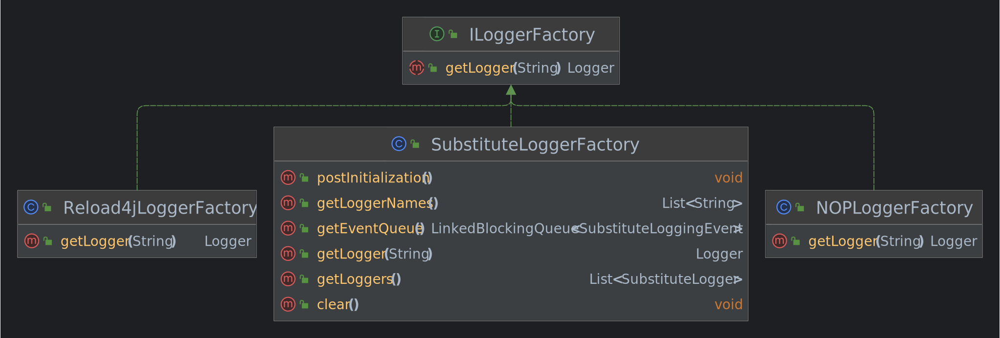

## 🎨意图

**工厂方法模式** 是一种 **创建型设计模式**， 其在 **父类中提供一个创建对象的方法**， 允许 **子类决定实例化对象的类型**。  
  

## 🙁问题

假设你正在开发一款物流管理应用。最初的版本只能处理卡车运输，因此大部分代码都在位于 `卡车` 的类中。
一段时间后，这款应用变得极受欢迎。你每天都能收到十几次来自海运公司的请求，希望应用能够支持海上物流功能。  
  

## 🥳解决方案

工厂方法模式建议使用特殊的工厂方法代替对于对象构造函数的直接调用 （即使用 `new` 运算符）。 不用担心， 对象仍将通过 `new` 运算符创建， 只是该运算符改在工厂方法中调用罢了。 工厂方法返回的对象通常被称作 “产品”。  
  
**子类可以修改工厂方法返回的对象类型**。
乍看之下， 这种更改可能毫无意义： 我们只是改变了程序中调用构造函数的位置而已。 但是， 仔细想一下， 现在你可以 **在子类中重写工厂方法， 从而改变其创建产品的类型**。
但有一点需要 **注意**💡: **仅当这些产品具有共同的基类或者接口时， 子类才能返回不同类型的产品**， 同时 **基类中的工厂方法还应将其返回类型声明为这一共有接口**。  
  
**所有产品都必须实现同一个接口**
举例来说，  `卡车 `Truck和 ` 轮船 `Ship类都必须实现 ` 运输 `Transport 接口， 该接口声明了一个名为 `deliver` 交付的方法。 每个类都将以不同的方式实现该方法： 卡车走陆路交付货物， 轮船走海路交付货物。  `陆路运输 `RoadLogistics类中的工厂方法返回卡车对象， 而 ` 海路运输 `SeaLogistics 类则返回轮船对象。  
  
只要产品实现一个共同的接口，你就可以将其对象传递给客户端代码，而无需提供额外数据。
调用工厂方法的代码 （通常被称为客户端代码） 无需了解不同子类返回实际对象之间的差别。 客户端将所有产品视为抽象的 ` 运输 ` 。 客户端知道所有运输对象都提供 ` 交付`方法， 但是并不关心其具体实现方式。

## 🎯结构

  
1. **产品**（Product）将会 **对接口进行声明**。对于所有由创建者及其子类构建的对象，这些接口都是通用的。
2. **具体产品**（Concrete Prodcuts）是 **产品接口的不同实现**。
3. **创建者**（Creator）类 **声明返回产品对象的工厂方法**。该 **方法的返回对象类型必须与产品接口相匹配**。可以 **将工厂方法声明为抽象方法**，强制要求每个子类以不同方式实现该方法。或者，也 **可以在基础工厂方法中返回默认产品类** 型。
4. **具体创建者**（Concrete Creators）将会 **重写基础工厂方法，使其返回不同类型的产品**。**注意**💡，并不一定每次调用工厂方法都会 **创建** 新的实例。工厂方法也可以返回缓存、对象池或其他来源的已有对象。

## 🚀物流运输

### 1、工程结构

```
├───src
│   ├───main
│   │   ├───java
│   │   │   └───top
│   │   │       └───xiaorang
│   │   │           └───design
│   │   │               └───pattern
│   │   │                   └───factorymethod
│   │   │                       │   Ship.java
│   │   │                       │   Transport.java
│   │   │                       │   Truck.java
│   │   │                       │   
│   │   │                       └───factory
│   │   │                               Logistics.java
│   │   │                               RoadLogistics.java
│   │   │                               SeaLogistics.java
│   │   │
│   │   └───resources
│   │           log4j.properties
│   │
│   └───test
│       └───java
│           └───top
│               └───xiaorang
│                   └───design
│                       └───pattern
│                           └───factorymethod
│                               └───factory
│                                       LogisticsTest.java
```

### 2、代码实现

#### 2.1、定义运输手段接口

```java
public interface Transport {  
    /**  
     * 交付货物  
     */  
    void delivery();  
}
```

#### 2.2、实现运输手段接口

##### 卡车

```java
@Slf4j  
public class Truck implements Transport {  
    @Override  
    public void delivery() {  
        log.info("卡车走陆路交付货物");  
    }  
}
```

##### 轮船

```java
@Slf4j  
public class Ship implements Transport {  
    @Override  
    public void delivery() {  
        log.info("轮船走海路交付货物");  
    }  
}
```

#### 2.3、后勤中心 (抽象工厂)

```java
public abstract class Logistics {  
    /**  
     * 使用何种方式运输  
     *  
     * @return 运输手段  
     */  
    protected abstract Transport createTransport();  
  
    /**  
     * 计划交付货物  
     */  
    public void planDelivery() {  
        Transport transport = createTransport();  
        transport.delivery();  
    }  
}
```

#### 2.4、后勤中心实现

##### 海上运输

```java
public class SeaLogistics extends Logistics {  
    @Override  
    public Transport createTransport() {  
        return new Ship();  
    }  
}
```

##### 陆路运输

```java
public class RoadLogistics extends Logistics {  
    @Override  
    public Transport createTransport() {  
        return new Truck();  
    }  
}
```

### 3、测试验证

测试类：

```java
public class LogisticsTest {  
    @Test  
    public void test() {  
        // 陆路运输  
        Logistics roadLogistics = new RoadLogistics();  
        roadLogistics.planDelivery();  
  
        // 海上运输  
        Logistics seaLogistics = new SeaLogistics();  
        seaLogistics.planDelivery();  
    }  
}
```

结果：

```
2022-08-17 15:28:49 INFO  Truck:16 - 卡车走陆路交付货物
2022-08-17 15:28:49 INFO  Ship:16 - 轮船走海路交付货物
```

## ⚖︎优缺点

- √ 你可以避免创建者和具体产品之间的紧密耦合。
- √ 单一职责原则。你可以将产品创建代码放在程序的单一位置，从而使得代码更容易维护。
- √ 开闭原则。无需更改现有客户端代码，你就可以在程序中引入新的产品类型。
- × 应用工厂方法模式需要引入许多新的子类，代码可能会因此变得更复杂。最好的情况是将该模式引入创建者类的现有层次结构中。

## 🏆源码中的设计模式

### ILoggerFactory

  
