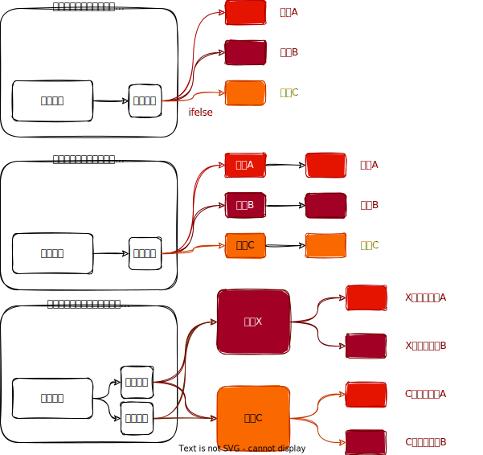

## 🎨意图

**抽象工厂** 是一种创建型设计模式，它 **能创建一系列相关的对象**，而 **无需指定其具体类**。


## 🙁问题

假设你正在开发一款家具商店模拟器。你的代码中包括一些类，用于表示：
1. 一系列相关产品，例如 `椅子 `Chair  ` 沙发 `Sofa和 ` 咖啡桌 `CoffeeTable 。
2. 系列产品的不同变体。 例如， 你可以使用 ` 现代 ` Modern 、 ` 维多利亚 ` Victorian 、` 装饰风艺术 ` ArtDeco 等风格生成 ` 椅子 ` 、 ` 沙发 `和 ` 咖啡桌 ` 。

你需要设法单独生成每件家具对象，这样才能确保其风格一致。如果顾客收到的家具风格不一致，他们可不会开心。

现代风格的沙发和维多利亚风格的椅子不搭。
此外，你也不希望在添加新产品或新风格时修改已有代码。家具供应商对于产品目录的更新非常频繁，你不会想在每次更新时都去修改核心代码。

## 🥳解决方案

首先，**抽象工厂模式**建议为系列中的每件产品明确声明接口（例如椅子、沙发和咖啡桌）。然后，确保所有产品变体都继承这些接口。例如，所有风格的椅子都实现` 椅子 `接口；所有风格的咖啡桌都实现` 咖啡桌 `接口，以此类推。

**同一对象的所有变体都必须放置在同一类层次结构之中**。
接下来，需要声明抽象工厂- 包含系列中所有产品构造方法接口。例如`createChair` 创建椅子、`createSofa` 创建沙发和 `cerateCoffeeTable` 创建咖啡桌。这些方法必须 **返回抽象产品类型**，即之前抽取的那些接口：`椅子 `、` 沙发 `和` 咖啡桌 `等等。

那么该如何处理产品变体呢？对于系列的每个变体，我们都将基于` 抽象工厂 ` 接口创建不同的工厂类。每个工厂类都只能返回特定类别的产品，例如， ` 现代家具工厂 ` ModernFurnitureFactory只能创建 ` 现代椅子 ` ModernChair 、 ` 现代沙发 `ModernSofa和 ` 现代咖啡桌` ModernCoffeeTable 对象。
假设客户端想要工厂创建一把椅子。 客户端无需了解工厂类， 也不用管工厂类创建出的椅子类型。 无论是现代风格， 还是维多利亚风格的椅子， 对于客户端来说没有分别。无论工厂返回的是何种椅子变体， 它都会和由同一工厂对象创建的沙发或咖啡桌风格一致。

## 🎯结构


1. **抽象产品**（Abstract Product）为构成系列产品的一组不同但相关的产品声明接口。
2. **具体产品**（Concrete Product）是抽象产品的多种不同类型实现。所有变体（维多利亚/现代）都必须实现相应的抽象产品 (椅子/沙发)。
3. **抽象工厂**（Abstract Factory）接口声明了一组创建各种抽象产品的方法。
4. **具体工厂**（Concrete Factory）实现抽象工厂的构建方法。每个具体工厂都对应特定产品变体，且仅创建此种产品变体。
5. 尽管具体工厂会对具体产品进行初始化，其构建方法签名必须返回相应的抽象产品。这样工厂类的客户端代码就不会与工厂创建的特定产品变体耦合。**客户端**（Client）只需通过抽象接口调用工厂和产品对象，就能与任何具体工厂/产品变体交互。

## 🚀家具工厂

### 1、工程结构

```
├───src
│   ├───main
│   │   ├───java
│   │   │   └───top
│   │   │       └───xiaorang
│   │   │           └───design
│   │   │               └───pattern
│   │   │                   └───abstractfactory
│   │   │                       ├───chair
│   │   │                       │       ArtDecoChair.java
│   │   │                       │       Chair.java
│   │   │                       │       ModernChair.java
│   │   │                       │       VictorianChair.java
│   │   │                       │
│   │   │                       ├───coffeetable
│   │   │                       │       ArtDecoCoffeeTable.java
│   │   │                       │       CoffeeTable.java
│   │   │                       │       ModernCoffeeTable.java
│   │   │                       │       VictorianCoffeeTable.java
│   │   │                       │
│   │   │                       ├───factory
│   │   │                       │       ArtDecoFurnitureFactory.java
│   │   │                       │       FurnitureFactory.java
│   │   │                       │       ModernFurnitureFactory.java
│   │   │                       │       VictorianFurnitureFactory.java
│   │   │                       │
│   │   │                       └───sofa
│   │   │                               ArtDecoSofa.java
│   │   │                               ModernSofa.java
│   │   │                               Sofa.java
│   │   │                               VictorianSofa.java
│   │   │
│   │   └───resources
│   │           log4j.properties
│   │
│   └───test
│       └───java
│           └───top
│               └───xiaorang
│                   └───design
│                       └───pattern
│                           └───abstractfactory
│                               └───factory
│                                       FurnitureFactoryTest.java

```

### 2、代码实现

#### 2.1、椅子

```java
public interface Chair {  
    /**  
     * 是否有腿  
     *  
     * @return true:有，false:无  
     */  
    boolean hasLegs();  
  
    /**  
     * 坐椅子  
     */  
    void sitOn();  
}
```

##### 现代风格的椅子

```java
@Slf4j  
public class ModernChair implements Chair {  
    @Override  
    public boolean hasLegs() {  
        return true;  
    }  
  
    @Override  
    public void sitOn() {  
        log.info("坐在摩登风格的椅子上");  
    }  
}
```

##### 维多利亚风格的椅子

```java
@Slf4j  
public class VictorianChair implements Chair {  
    @Override  
    public boolean hasLegs() {  
        return false;  
    }  
  
    @Override  
    public void sitOn() {  
        log.info("坐在维多利亚风格的椅子上");  
    }  
}
```

##### 装饰风艺术风格的椅子

```java
@Slf4j  
public class ArtDecoChair implements Chair {  
    @Override  
    public boolean hasLegs() {  
        return true;  
    }  
  
    @Override  
    public void sitOn() {  
        log.info("坐在装饰风艺术风格的椅子上");  
    }  
}
```

#### 2.2、沙发

```java
public interface Sofa {  
    /**  
     * 躺在沙发上  
     */  
    void lying();  
}
```

##### 现代风格的沙发

```java
@Slf4j  
public class ModernSofa implements Sofa {  
    @Override  
    public void lying() {  
        log.info("躺在摩登风格的沙发上");  
    }  
}
```

##### 维多利亚风格的沙发

```java
@Slf4j  
public class VictorianSofa implements Sofa {  
    @Override  
    public void lying() {  
        log.info("躺在维多利亚风格的沙发上");  
    }  
}
```

##### 装饰风艺术风格的沙发

```java
@Slf4j  
public class ArtDecoSofa implements Sofa {  
    @Override  
    public void lying() {  
        log.info("躺在装饰风艺术风格的沙发上");  
    }  
}
```

#### 2.3、咖啡桌

```java
public interface CoffeeTable {  
    /**  
     * 喝咖啡  
     */  
    void drink();  
}
```

##### 现代风格的咖啡桌

```java
@Slf4j  
public class ModernCoffeeTable implements CoffeeTable {  
    @Override  
    public void drink() {  
        log.info("在摩登风格的咖啡桌上喝咖啡");  
    }  
}
```

##### 维多利亚风格的咖啡桌

```java
@Slf4j  
public class VictorianCoffeeTable implements CoffeeTable {  
    @Override  
    public void drink() {  
        log.info("在维多利亚风格的咖啡桌上喝咖啡");  
    }  
}
```

##### 装饰风艺术风格的咖啡桌

```java
@Slf4j  
public class ArtDecoCoffeeTable implements CoffeeTable {  
    @Override  
    public void drink() {  
        log.info("在装饰风艺术风格的咖啡桌上喝咖啡");  
    }  
}
```

#### 2.4、家具厂

```java
public abstract class FurnitureFactory {  
    /**  
     * 生产一把椅子  
     *  
     * @return 椅子  
     */  
    protected abstract Chair createChair();  
  
    /**  
     * 生产一个咖啡桌  
     *  
     * @return 咖啡桌  
     */  
    protected abstract CoffeeTable createCoffeeTable();  
  
    /**  
     * 生成一个沙发  
     *  
     * @return 沙发  
     */  
    protected abstract Sofa createSofa();  
  
    /**  
     * 出厂测试  
     */  
    public void test() {  
        Chair chair = createChair();  
        chair.sitOn();  
        Sofa sofa = createSofa();  
        sofa.lying();  
        CoffeeTable coffeeTable = createCoffeeTable();  
        coffeeTable.drink();  
    }  
}
```

##### 现代风格的家具厂

```java
public class ModernFurnitureFactory extends FurnitureFactory {  
    @Override  
    public Chair createChair() {  
        return new ModernChair();  
    }  
  
    @Override  
    public CoffeeTable createCoffeeTable() {  
        return new ModernCoffeeTable();  
    }  
  
    @Override  
    public Sofa createSofa() {  
        return new ModernSofa();  
    }  
}
```

##### 维多利亚风格的家具厂

```java
public class VictorianFurnitureFactory extends FurnitureFactory {  
    @Override  
    public Chair createChair() {  
        return new VictorianChair();  
    }  
  
    @Override  
    public CoffeeTable createCoffeeTable() {  
        return new VictorianCoffeeTable();  
    }  
  
    @Override  
    public Sofa createSofa() {  
        return new VictorianSofa();  
    }  
}
```

##### 装饰风艺术风格的家具厂

```java
public class ArtDecoFurnitureFactory extends FurnitureFactory {  
    @Override  
    public Chair createChair() {  
        return new ArtDecoChair();  
    }  
  
    @Override  
    public CoffeeTable createCoffeeTable() {  
        return new ArtDecoCoffeeTable();  
    }  
  
    @Override  
    public Sofa createSofa() {  
        return new ArtDecoSofa();  
    }  
}
```

### 3、测试验证

测试类：

```java
public class FurnitureFactoryTest {  
    @Test  
    public void test() {  
        // 摩登风格  
        FurnitureFactory modernFurnitureFactory = new ModernFurnitureFactory();  
        modernFurnitureFactory.test();  
  
        // 维多利亚风格  
        FurnitureFactory victorianFurnitureFactory = new VictorianFurnitureFactory();  
        victorianFurnitureFactory.test();  
  
        // 装饰风艺术风格  
        FurnitureFactory artDecoFurnitureFactory = new ArtDecoFurnitureFactory();  
        artDecoFurnitureFactory.test();  
    }  
}
```

结果：

```
2022-08-17 17:27:39 INFO  ModernChair:21 - 坐在摩登风格的椅子上
2022-08-17 17:27:39 INFO  ModernSofa:16 - 躺在摩登风格的沙发上
2022-08-17 17:27:39 INFO  ModernCoffeeTable:16 - 在摩登风格的咖啡桌上喝咖啡
2022-08-17 17:27:39 INFO  VictorianChair:21 - 坐在维多利亚风格的椅子上
2022-08-17 17:27:39 INFO  VictorianSofa:16 - 躺在维多利亚风格的沙发上
2022-08-17 17:27:39 INFO  VictorianCoffeeTable:16 - 在维多利亚风格的咖啡桌上喝咖啡
2022-08-17 17:27:39 INFO  ArtDecoChair:21 - 坐在装饰风艺术风格的椅子上
2022-08-17 17:27:39 INFO  ArtDecoSofa:16 - 躺在装饰风艺术风格的沙发上
2022-08-17 17:27:39 INFO  ArtDecoCoffeeTable:16 - 在装饰风艺术风格的咖啡桌上喝咖啡
```

## 📌工厂模式分类对比



## ⚖︎优缺点

- √ 你可以确保同意工厂生产的产品相互匹配。
- √ 你可以避免客户端和具体产品代码的耦合。
- √ 单一职责原则。你可以将产品生成代码放在程序的单一位置，从而使得代码更容易维护。
- √ 开闭原则。无需更改现有客户端代码，你就可以在程序中引入新产品变体。
- × 由于采用该模式需要向应用中引入众多接口和类，代码可能会因此变得更复杂。
