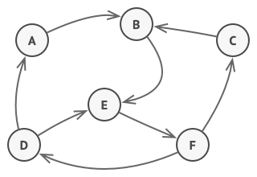
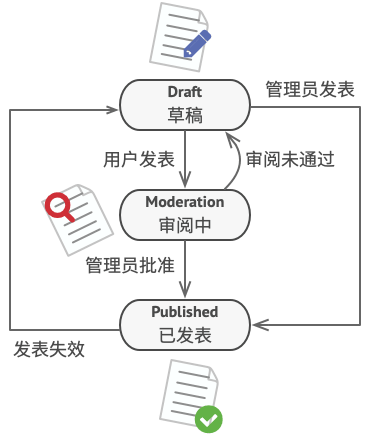
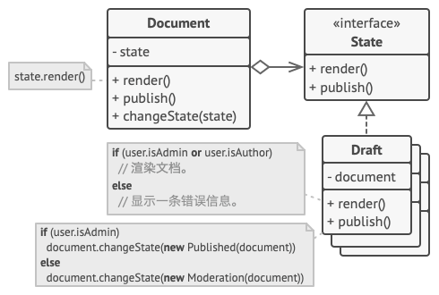
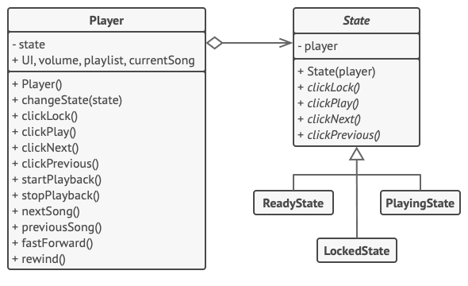

## 1. 🎨意图

**状态模式** 是一种行为设计模式，让你能在一个对象的内部状态变化时改变其行为，使其看上去就像改变了自身所属的类一样。  


## 2. 🙁问题

状态模式与 **有限状态机** 的概念紧密相关。  
  
其主要思想是程序在任意时刻仅可处在几种 **有限** 的 **状态** 中。在任何一个特定状态中，程序的行为都不相同，且可瞬间从一个状态切换到另一个状态。不过，根据当前状态，程序可能会切换到另外一种状态，也可能会保持当前状态不变。这些数量有限且预先定义的状态切换规则被称为 **转移**。  
你还可将该方法应用在对象上。假如你有一个有一个 `Document` 文档类。文档可能会处于 `Draft` 草稿、`Moderation` 审阅中和 `Published` 已发布三种状态的一种。文档的 `publish` 发布方法在不同状态的行为略有不同：

- 处于 `草稿` 状态时，它会将文档转移到审阅中状态。
- 处于 `审阅中` 状态时，如果当前用户是管理员，它会公开发布文档。
- 处于 `已发布` 状态时，它不会进行任何操作。  
  
状态机通常由众多条件运算符（`if` 或 `switch`）实现，可根据对象的当前状态选择相应的行为。”状态“通常只是对象中的一组成员变量值。即使你之前从未听说过有限状态机，你也很可能已经实现过状态模式。下面的代码应该能帮助你回忆起来。

```java
class Document is
    field state: string
    // ……
    method publish() is
        switch (state)
            "draft":
                state = "moderation"
                break
            "moderation":
                if (currentUser.role == "admin")
                    state = "published"
                break
            "published":
                // 什么也不做。
                break
    // ……
```

当我们逐步在 `文档` 类中添加更多状态和依赖于状态的行为后，基于条件语句的状态机就会暴露其最大的弱点。为了能根据当前状态选择完成相应行为的方法，绝大部分方法中会包含复杂的条件语句。修改其转换逻辑可能会涉及到修改所有方法中的状态条件语句，导致代码的维护工作非常艰难。  
这个问题会随着项目进行变得越发严重。我们很难在设计阶段预测到所有可能的状态和转换。随着时间推移，最初仅包含有限条件语句的简洁状态机可能会变成臃肿的一团乱码。

## 3. 🥳解决方案

**状态模式** 建议 **对象的所有可能状态新建一个类**，然后 **将所有状态的对应行为抽取到这些类中**。  
**原始对象** 被称为 **上下文（context）**，**它并不会自行实现所有行为**，而是会 **保存一个指向表示当前状态的状态对象的引用，且将所有与状态相关的工作委派给该对象**。  
  
如需 **将上下文转换为另外一种状态**，则需 **将当前活动的状态对象替换为另外一个代表新状态的对象**。采用这种方式是有前提的：**所有状态类都必须遵循同样的接口，而且上下文必须仅通过接口与这些对象进行交互**。  
这个结构可能看上去与策略模式相似，但有一个关键性的不同 -- 在状态模式中，特定状态知道其他所有状态的存在，且能触发从一个状态到另一个状态的转换；策略模式则几乎完全不知道其他策略的存在。

## 4. 🚗真实世界类比

智能手机的按键和开关会根据设备当前状态完成不同行为：

- 当手机处于解锁状态时，按下按键将执行各种功能。
- 当手机处于锁定状态时，按下任何按键都将解锁屏幕。
- 当手机电量不足时，按下任何按键都将显示充电页面。

## 5. 🎯结构


1. **上下文**（Context）**保存了对于一个具体状态对象的引用，并会将所有与该状态相关的工作委派给它**。上下文通过状态接口与状态对象交互，且会 **提供一个设置器用于传递新的状态对象**。
2. **状态**（State）接口会声明特定于状态的方法。这些方法应能被其他具体状态所理解，因为你不希望某些状态所拥有的方法永远不会被调用。
3. **具体状态**（Concrete States）会自行实现特定于状态的方法。为了避免多个状态中包含相似代码，你可以提供一个封装有部分通用行为的 **中间抽象类**。**状态对象可存储对于上下文的反向引用**。状态可以通过该引用从上下文获取所需信息，并且能触发状态转移。
4. 上下文和具体状态都可以设置上下文的下个状态，并可通过替换连接到上下文的状态对象来完成实际的状态转换。

## 6. 🚀案例一

  
在本例中，状态模式允许媒体播放器根据当前的回放状态进行不同的控制行为。播放器主类包含一个指向状态对象的引用，它将完成播放器的绝大部分工作。某些行为可能会用一个状态对象替换另一个状态对象，改变播放器对用户交互的回应方式。

```java
public class Player {  
    private final List<String> playList = new ArrayList<>();  
    private int currentTrack = 0;  
    private State state;  
    private boolean playing = false;  
  
    public Player() {  
        this.state = new ReadyState(this);  
        setPlaying(true);  
        for (int i = 1; i <= 12; i++) {  
            playList.add("Track " + i);  
        }  
    }  
  
    public String startPlayback() {  
        return "Playing " + playList.get(this.currentTrack);  
    }  
  
    public String nextTrack() {  
        this.currentTrack++;  
        if (this.currentTrack > playList.size() - 1) {  
            this.currentTrack = 0;  
        }  
        return "Playing " + playList.get(this.currentTrack);  
    }  
  
    public String prevTrack() {  
        this.currentTrack--;  
        if (this.currentTrack < 0) {  
            this.currentTrack = playList.size() - 1;  
        }  
        return "Playing " + playList.get(this.currentTrack);  
    }  
  
    public void setCurrentTrackAfterStop() {  
        this.currentTrack = 0;  
    }  
  
    public State getState() {  
        return state;  
    }  
  
    public void setState(State state) {  
        this.state = state;  
    }  
  
    public boolean isPlaying() {  
        return playing;  
    }  
  
    public void setPlaying(boolean playing) {  
        this.playing = playing;  
    }  
}
```

```java
public abstract class State {  
    protected final Player player;  
  
    public State(Player player) {  
        this.player = player;  
    }  
  
    public abstract String play();  
  
    public abstract String stop();  
  
    public abstract String next();  
  
    public abstract String prev();  
}
```

```java
public class LockedState extends State {  
    public LockedState(Player player) {  
        super(player);  
    }  
  
    @Override  
    public String play() {  
        player.setState(new ReadyState(player));  
        return "Ready";  
    }  
  
    @Override  
    public String stop() {  
        if (player.isPlaying()) {  
            player.setState(new ReadyState(player));  
            return "Stop playing...";  
        }  
        return "Locked...";  
    }  
  
    @Override  
    public String next() {  
        return "Locked...";  
    }  
  
    @Override  
    public String prev() {  
        return "Locked...";  
    }  
}
```

```java
public class ReadyState extends State {  
    public ReadyState(Player player) {  
        super(player);  
    }  
  
    @Override  
    public String play() {  
        String action = player.startPlayback();  
        player.setState(new PlayingState(player));  
        return action;  
    }  
  
    @Override  
    public String stop() {  
        player.setState(new LockedState(player));  
        return "Locked...";  
    }  
  
    @Override  
    public String next() {  
        return "Locked...";  
    }  
  
    @Override  
    public String prev() {  
        return "Locked...";  
    }  
}
```

```java
public class PlayingState extends State {  
    public PlayingState(Player player) {  
        super(player);  
    }  
  
    @Override  
    public String play() {  
        player.setState(new ReadyState(player));  
        return "Paused...";  
    }  
  
    @Override  
    public String stop() {  
        player.setState(new LockedState(player));  
        player.setCurrentTrackAfterStop();  
        return "Stop Playing...";  
    }  
  
    @Override  
    public String next() {  
        return player.nextTrack();  
    }  
  
    @Override  
    public String prev() {  
        return player.prevTrack();  
    }  
}
```

```java
public class UI {  
    private static final JTextField textField = new JTextField();  
    private final Player player;  
  
    public UI(Player player) {  
        this.player = player;  
    }  
  
    public void init() {  
        JFrame frame = new JFrame("网易云音乐");  
        frame.setDefaultCloseOperation(JFrame.EXIT_ON_CLOSE);  
        JPanel context = new JPanel();  
        context.setLayout(new BoxLayout(context, BoxLayout.Y_AXIS));  
        frame.getContentPane().add(context);  
        JPanel buttons = new JPanel(new FlowLayout(FlowLayout.CENTER));  
        context.add(textField);  
        context.add(buttons);  
  
        // Context delegates handling user's input to a state object. Naturally,  
        // the outcome will depend on what state is currently active, since all        
        // states can handle the input differently.        
        JButton play = new JButton("Play");  
        play.addActionListener(e -> textField.setText(player.getState().play()));  
        JButton stop = new JButton("Stop");  
        stop.addActionListener(e -> textField.setText(player.getState().stop()));  
        JButton next = new JButton("Next");  
        next.addActionListener(e -> textField.setText(player.getState().next()));  
        JButton prev = new JButton("Prev");  
        prev.addActionListener(e -> textField.setText(player.getState().prev()));  
        frame.setVisible(true);  
        frame.setSize(300, 100);  
        buttons.add(play);  
        buttons.add(stop);  
        buttons.add(next);  
        buttons.add(prev);  
    }  
}
```

```java
public class PlayerTest {  
    public static void main(String[] args) {  
        UI ui = new UI(new Player());  
        ui.init();  
    }  
}
```

## 7. 🚀案例二：使用 Spring 状态机实现订单状态流程

> Spring 状态机官方文档地址：[Spring Statemachine - Reference Documentation](https://docs.spring.io/spring-statemachine/docs/current/reference/)  
> 参考文档：[Spring StateMachine - 代码天地](https://www.codetd.com/article/1010726) [Spring StateMachine基础版-学习笔记 - x-zeros - 博客园](https://www.cnblogs.com/Zero-Jo/p/13891075.html)

### 7.1. 状态机

有限状态机是一种用来进行对象行为建模的工具，其主要作用是描述对象在它的声明周期所经历的状态序列，以及如何响应来自外界的各种事件。  
在电商场景（订单、物流、售后）、社交（IM 消息投递）、分布式集群管理（分布式计算平台任务编排）等场景都有大规模的使用。

#### 7.1.1. 状态机的要素

状态机可归纳为 4 个要素：**现态、条件、动作、次态**。“现态”和“条件”是因，“动作”和“次态”是果。

- 现态：指当前所处的状态
- 条件：又称“事件”，当一个条件被满足后，将会触发一个动作，或者执行一次状态的迁移
- 动作：条件满足后执行的动作。动作执行完毕后，可以迁移到新的状态，也可以仍旧保持原状态。动作不是必须的，当条件满足后，也可以不执行任何动作，直接迁移到新的状态。
- 次态：条件满足后要迁移的新状态。“次态”是相对于“现态”而言的，“次态”一旦被激活，就转换成“现态”。

#### 7.1.2. 状态机动作类型

- 进入动作：在进入状态时进行
- 退出动作：在退出状态时进行
- 输入动作：依赖于当前状态和输入条件进行
- 转移动作：在进行特定转移时进行

### 7.2. Spring Statemachine

> 以下只贴出部分代码，本案例的完整代码在 [GitHub - xihuanxiaorang/design-pattern-study: 重学Java设计模式](https://github.com/xihuanxiaorang/design-pattern-study) 仓库中的 `state-01` 模块，有需要的小伙伴可以自行查看。 

#### 7.2.1. 引入依赖

```xml
<dependency>  
    <groupId>org.springframework.boot</groupId>  
    <artifactId>spring-boot-starter</artifactId>  
</dependency>  
<dependency>  
    <groupId>org.springframework.statemachine</groupId>  
    <artifactId>spring-statemachine-starter</artifactId>  
    <version>3.2.0</version>  
</dependency>  
<dependency>  
    <groupId>org.projectlombok</groupId>  
    <artifactId>lombok</artifactId>  
</dependency>  
<dependency>  
    <groupId>org.springframework.boot</groupId>  
    <artifactId>spring-boot-starter-test</artifactId>  
    <scope>test</scope>  
</dependency>
```

#### 7.2.2. 添加配置

```java
@Configuration  
@EnableStateMachine(name = "orderStateMachine")  
public class OrderStateMachineConfig extends StateMachineConfigurerAdapter<OrderStatus, OrderEvent> {  
    /**  
     * 配置状态  
     *  
     * @param states  
     * @throws Exception  
     */    @Override  
    public void configure(StateMachineStateConfigurer<OrderStatus, OrderEvent> states) throws Exception {  
        states  
                .withStates()  
                .initial(OrderStatus.WAIT_PAYMENT)  
                .states(EnumSet.allOf(OrderStatus.class));  
    }  
  
    /**  
     * 配置状态转换事件关系  
     *  
     * @param transitions  
     * @throws Exception  
     */    @Override  
    public void configure(StateMachineTransitionConfigurer<OrderStatus, OrderEvent> transitions) throws Exception {  
        transitions  
                .withExternal().source(OrderStatus.WAIT_PAYMENT).target(OrderStatus.WAIT_DELIVER).event(OrderEvent.PAYED)  
                .and()  
                .withExternal().source(OrderStatus.WAIT_DELIVER).target(OrderStatus.WAIT_RECEIVE).event(OrderEvent.DELIVERY)  
                .and()  
                .withExternal().source(OrderStatus.WAIT_RECEIVE).target(OrderStatus.FINISH).event(OrderEvent.RECEIVED);  
    }  
  
    /**  
     * 持久化配置  
     * 实际使用中，可以配合redis等，进行持久化操作  
     *  
     * @return  
     */  
    @Bean  
    public StateMachinePersister<OrderStatus, OrderEvent, Order> stateMachinePersister() {  
        return new DefaultStateMachinePersister<>(new StateMachinePersist<OrderStatus, OrderEvent, Order>() {  
            @Override  
            public void write(StateMachineContext<OrderStatus, OrderEvent> context, Order order) throws Exception {  
                //此处并没有进行持久化操作  
            }  
  
            @Override  
            public StateMachineContext<OrderStatus, OrderEvent> read(Order order) throws Exception {  
                //此处直接获取order中的状态，其实并没有进行持久化读取操作  
                return new DefaultStateMachineContext<>(order.getStatus(), null, null, null);  
            }  
        });  
    }  
}
```

#### 7.2.3. 添加订单状态监听器

```java
@Component  
@WithStateMachine(name = "orderStateMachine")  
public class OrderStateListener {  
    private static final Logger LOGGER = LoggerFactory.getLogger(OrderStateListener.class);  
  
    @OnTransition(source = "WAIT_PAYMENT", target = "WAIT_DELIVER")  
    public boolean payTransition(Message<OrderEvent> message) {  
        Order order = (Order) message.getHeaders().get("order");  
        assert order != null;  
        order.setStatus(OrderStatus.WAIT_DELIVER);  
        LOGGER.debug("支付 {}", order);  
        return true;    }  
  
    @OnTransition(source = "WAIT_DELIVER", target = "WAIT_RECEIVE")  
    public boolean deliverTransition(Message<OrderEvent> message) {  
        Order order = (Order) message.getHeaders().get("order");  
        assert order != null;  
        order.setStatus(OrderStatus.WAIT_RECEIVE);  
        LOGGER.debug("发货 {}", order);  
        return true;    }  
  
    @OnTransition(source = "WAIT_RECEIVE", target = "FINISH")  
    public boolean receiveTransition(Message<OrderEvent> message) {  
        Order order = (Order) message.getHeaders().get("order");  
        assert order != null;  
        order.setStatus(OrderStatus.FINISH);  
        LOGGER.debug("收货 {}", order);  
        return true;    }  
}
```

#### 7.2.4. 在订单服务中使用

```java
@Service  
public class OrderServiceImpl implements OrderService {  
    private static final Logger LOGGER = LoggerFactory.getLogger(OrderServiceImpl.class);  
    private final StateMachine<OrderStatus, OrderEvent> orderStateMachine;  
    private final StateMachinePersister<OrderStatus, OrderEvent, Order> orderStateMachinePersister;  
    private final OrderRepository orderRepository;  
    private Integer orderId = 1;  
  
    public OrderServiceImpl(StateMachine<OrderStatus, OrderEvent> orderStateMachine, StateMachinePersister<OrderStatus, OrderEvent, Order> orderStateMachinePersister, OrderRepository orderRepository) {  
        this.orderStateMachine = orderStateMachine;  
        this.orderStateMachinePersister = orderStateMachinePersister;  
        this.orderRepository = orderRepository;  
    }  
  
    @Override  
    public Order creat() {  
        Integer orderId = generateOrderId();  
        Order order = Order.builder().id(orderId).status(OrderStatus.WAIT_PAYMENT).build();  
        return orderRepository.save(orderId, order);  
    }  
  
    @Override  
    public Order pay(Integer id) {  
        Order order = orderRepository.get(id);  
        if (order != null) {  
            LOGGER.debug("尝试支付订单{}", order);  
            Message<OrderEvent> message = MessageBuilder.withPayload(OrderEvent.PAYED).setHeader("order", order).build();  
            if (!sendEvent(message, order)) {  
                LOGGER.debug("订单{}支付失败，状态异常！", order);  
            }  
        }  
        return order;  
    }  
  
    @Override  
    public Order deliver(Integer id) {  
        Order order = orderRepository.get(id);  
        if (order != null) {  
            LOGGER.debug("尝试发货{}", order);  
            Message<OrderEvent> message = MessageBuilder.withPayload(OrderEvent.DELIVERY).setHeader("order", order).build();  
            if (!sendEvent(message, order)) {  
                LOGGER.debug("尝试发货{}失败，状态异常！", order);  
            }  
        }  
        return order;  
    }  
  
    @Override  
    public Order receive(Integer id) {  
        Order order = orderRepository.get(id);  
        if (order != null) {  
            LOGGER.debug("尝试收货{}", order);  
            Message<OrderEvent> message = MessageBuilder.withPayload(OrderEvent.RECEIVED).setHeader("order", order).build();  
            if (!sendEvent(message, order)) {  
                LOGGER.debug("尝试收货{}失败，状态异常！", order);  
            }  
        }  
        return order;  
    }  
  
    @Override  
    public List<Order> getAllOrders() {  
        return orderRepository.findAll();  
    }  
  
    private synchronized boolean sendEvent(Message<OrderEvent> message, Order order) {  
        boolean result = false;  
        try {  
            orderStateMachine.start();  
            orderStateMachinePersister.restore(orderStateMachine, order);  
            TimeUnit.SECONDS.sleep(1);  
            result = orderStateMachine.sendEvent(message);  
            orderStateMachinePersister.persist(orderStateMachine, order);  
        } catch (Exception e) {  
            e.printStackTrace();  
        } finally {  
            orderStateMachine.stop();  
        }  
        return result;  
    }  
  
    private Integer generateOrderId() {  
        return orderId++;  
    }  
}
```

#### 7.2.5. 测试类

```java
@SpringBootTest  
class State01ApplicationTests {  
    private static final Logger LOGGER = LoggerFactory.getLogger(State01ApplicationTests.class);  
    @Autowired  
    private OrderService orderService;  
  
    @Test  
    void contextLoads() throws InterruptedException {  
        orderService.creat();  
        orderService.creat();  
  
        orderService.pay(1);  
  
        Thread t1 = new Thread(() -> {  
            orderService.deliver(1);  
            orderService.receive(1);  
        }, "t1");  
        t1.start();  
  
        orderService.pay(2);  
        orderService.deliver(2);  
        orderService.receive(2);  
        t1.join();  
        LOGGER.debug("{}", orderService.getAllOrders());  
    }  
}
```

测试结果如下所示：  


## 8. 🚀案例三：极客小工具

> Q：除了在日常开发中使用状态模式解决业务需求之外，有没有其他以一种有趣的方式来使用状态模式呢？  
> A：有的，具体可以查看这一篇文章 [极客小工具](../杂记/极客小工具/README.md)，在该篇文章中详细地介绍了状态模式与 Spring Shell 是怎样结合使用来设计出一个实用的小工具。

## 9. 🎉应用场景

🐞 **如果对象需要根据自身当前状态进行不同行为，同时状态的数量非常多且与状态相关的代码会频繁变更的话，可使用状态模式**。  
⚡模式建议你将所有特定于状态的代码抽取到一组独立的类中。这样依赖，你可以在独立于其他状态的情况下添加新状态或修改已有状态，从而减少维护成本。

--- 

🐞 **如果某个类需要根据成员变量的当前值改变自身行为，从而需要使用大量的条件语句时，可使用该模式**。  
⚡状态模式会将这些条件语句的分支抽取到相应状态类的方法中。同时，你还可以清除主要类中与特定状态的相关的临时变量和帮手方法代码。

---

🐞 **当相似状态和基于条件的状态机转换中存在许多重复代码时，可使用状态模式**。  
⚡状态模式让你能够生成状态类层次结构，通过将公用代码抽取到抽象基类中来减少重复。

## 10. 📝实现方式

1. 确定哪些类是上下文。它可能是包含依赖于状态的代码的已有类；如果特定于状态的代码分散在多个类中，那么它可能是一个新的类。
2. 声明状态接口。虽然你可能会需要完全复制上下文中声明的所有方法，但最好是仅把关注点放在那些可能包含特定于状态的行为的方法上。
3. 为每个实际状态创建一个继承于状态接口的类。然后检查上下文中的方法并将与特定状态相关的所有代码抽取到新建的类中。在将代码移动到状态类的过程中，你可能会发现它依赖于上下文中的一些私有成员。你可以采用以下几种变通方式：
	- 将这些成员变量或方法设为共有。
	- 将需要抽取的上下文行为更改为上下文中的共有方法，然后在状态类中调用。这种方式简陋却便捷，你可以稍后再对其进行修补。
	- 将状态类嵌套在上下文类中。这种方式需要你所有的编程语言支持嵌套类。
4. 在上下文类中添加一个状态接口类型的引用成员变量，以及一个用于修改该成员变量值的公有设置器。
5. 再次检查上下文中的方法，将空的条件语句替换为相应的状态对象方法。
6. 为切换上下文状态，你需要创建某个状态类实例并将其传递给上下文。你可以在上下文、各种状态或客户端中完成这项工作。无论在何处完成这项工作，该类都将依赖于其所实例化的具体类。

## 11. ⚖︎优缺点

- ✔️ **单一职责原则**。将与特定状态相关的代码放在单独的类中。
- ✔️ **开闭原则**。无需修改已有状态类和上下文就能引入新状态。
- ✔️ 通过消除臃肿的状态机条件语句简化上下文代码。
- ❌ 如果状态机只有很少的几个状态，或者很少发生改变，那么应用该模式可能会显得小题大做。
