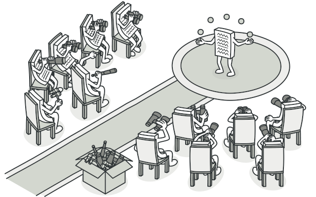
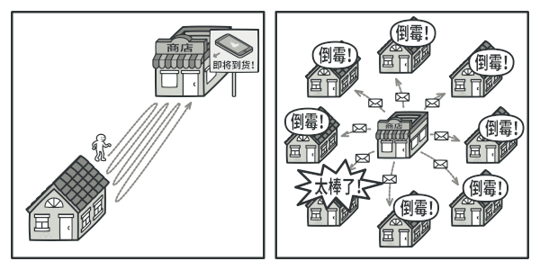
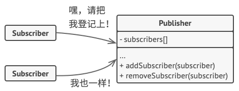
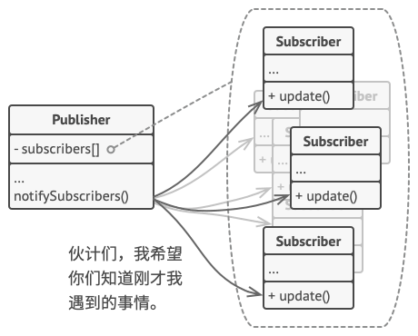

> 对于观察者模式其实在 Spring 中运用的非常 nice！对于在 Spring 中是如何使用观察者模式不清楚的小伙伴，可以查看 [Spring事件监听机制及其原理分析](../Spring/源码/Spring事件监听机制及其原理分析/README.md) 这一篇文章。

## 1. 🎨意图

**观察者模式** 是一种行为设计模式，允许你定义一种订阅机制，可在对象事件发生时通知多个 “观察” 该对象的其他对象。  


## 2. 🙁问题

假如你有两种类型的对象： `顾客` 和 `商店` 。 顾客对某个特定品牌的产品非常感兴趣 （例如最新型号的 iPhone 手机）， 而该产品很快将会在商店里出售。  
顾客可以每天来商店看看产品是否到货。 但如果商品尚未到货时， 绝大多数来到商店的顾客都会空手而归。  
  
另一方面， 每次新产品到货时， 商店可以向所有顾客发送邮件 （可能会被视为垃圾邮件）。 这样， 部分顾客就无需反复前往商店了， 但也可能会惹恼对新产品没有兴趣的其他顾客。  
我们似乎遇到了一个矛盾： 要么让顾客浪费时间检查产品是否到货， 要么让商店浪费资源去通知没有需求的顾客。

## 3. 🥳解决方案

拥有一些值得关注的状态的对象通常被称为 **目标**，由于它要将自身的状态改变通知给其他对象，咱们也将其称为 **发布者（publisher）**。所以希望关注发布者状态变化的其他对象被称为 **订阅者（subscribers）**。  
观察者模式建议你 **为发布者添加订阅机制**，让每个对象都能订阅或取消订阅发布者事件流。不要害怕！这并不像听上去那么复杂。实际上，该机制包括 1）一个用于存储订阅者对象引用的列表成员变量；2）几个用于添加或删除该列表中订阅者的公有方法。  
  
现在，无论何时发生了重要的发布者事件，它都要遍历订阅者并调用其对象的特定通知方法。  
实际应用中可能会有十几个不同的订阅者类跟踪着同一个发布者类的事件，你不会希望发布者与所有这些类相耦合的。此时如果他人使用发布者类，那么你甚至会对其中的一些类一无所知。  
因此，**所有订阅者都必须实现相同的接口，发布者仅通过该接口与订阅者交互**。接口中必须声明通知方法及其参数，这样发布者在发出通知时还能传递一些上下文数据。  
  

## 4. 🚗真实世界类比

  
如果你订阅了一份杂志或报纸，那就不需要再去报摊查询新出版的刊物了。出版社（即应用中的”发布者“）会在刊物出版后（甚至提前）直接将最新一期寄送至你的邮箱中。  
出版社负责维护订阅者列表，了解订阅者对哪些刊物感兴趣。当订阅者希望出版社停止寄送新一期的杂志时，他们可以随时从该列表中退出。  

## 5. 🎯结构


1. **发布者** （Publisher） 会向其他对象发送值得关注的事件。 事件会在发布者自身状态改变或执行特定行为后发生。 发布者中包含一个允许新订阅者加入和当前订阅者离开列表的订阅构架。
2. 当新事件发生时， 发送者会遍历订阅列表并调用每个订阅者对象的通知方法。 该方法是在订阅者接口中声明的。
3. **订阅者** （Subscriber） 接口声明了通知接口。 在绝大多数情况下， 该接口仅包含一个 `update` 更新方法。 该方法可以拥有多个参数， 使发布者能在更新时传递事件的详细信息。
4. **具体订阅者** （Concrete Subscribers） 可以执行一些操作来回应发布者的通知。 所有具体订阅者类都实现了同样的接口， 因此发布者不需要与具体类相耦合。
5. 订阅者通常需要一些上下文信息来正确地处理更新。 因此， 发布者通常会将一些上下文数据作为通知方法的参数进行传递。 发布者也可将自身作为参数进行传递， 使订阅者直接获取所需的数据。
6. **客户端** （Client） 会分别创建发布者和订阅者对象， 然后为订阅者注册发布者更新。

## 6. 🚀案例

  
在本例中，观察者模式在文本编辑器的对象之间建立了间接的合作关系。每当 `编辑器`（Editor）对象改变时，它都会通知其订阅者。`邮件通知监听器`（EmailNotificationListener）和 `日志开启监听器`（LogOpenListener）都将通过执行其基本行为来对这些通知做出反应。  
订阅者类不与编辑器类相耦合，且能在需要时在其他应用中复用。`编辑器` 类仅依赖于抽象订阅者接口。这样就能允许在不改变编辑器代码的情况下添加新的订阅者类型。

### 6.1. 事件管理器

用于维护事件监听器以及发布事件。

```java
public class EventManager {  
    private final Map<EventType, List<EventListener>> listeners = new ConcurrentHashMap<>();  
  
    public void subscribe(EventType eventType, EventListener eventListener) {  
        List<EventListener> eventListeners = listeners.getOrDefault(eventType, new ArrayList<>());  
        eventListeners.add(eventListener);  
        listeners.put(eventType, eventListeners);  
    }  
  
    public void unsubscribe(EventType eventType, EventListener eventListener) {  
        List<EventListener> eventListeners = listeners.get(eventType);  
        if (eventListeners != null && eventListeners.size() > 0) {  
            eventListeners.remove(eventListener);  
        }  
    }  
  
    public void notify(EventType eventType, File file) {  
        List<EventListener> eventListeners = listeners.get(eventType);  
        if (eventListeners != null && eventListeners.size() > 0) {  
            for (EventListener listener : eventListeners) {  
                listener.update(eventType, file);  
            }  
        }  
    }  
}
```

### 6.2. 编辑器

持有事件管理器，当自身状态改变或执行特定行为后通过事件管理器发布相应的事件。

```java
public class Editor {  
    private final EventManager eventManager;  
    private File file;  
  
    public Editor(EventManager eventManager) {  
        this.eventManager = eventManager;  
    }  
  
    public void openFile(String filePath) {  
        this.file = new File(filePath);  
        eventManager.notify(EventType.OPEN, this.file);  
    }  
  
    public void saveFile() throws Exception {  
        if (this.file == null) {  
            throw new Exception("Please open a file first");  
        }  
        eventManager.notify(EventType.SAVE, this.file);  
    }  
}
```

### 6.3. 监听器接口

```java
public interface EventListener {  
    void update(EventType eventType, File file);  
}
```

### 6.4. 邮件通知监听器

```java
public class EmailNotificationListener implements EventListener {  
    private static final Logger LOGGER = LoggerFactory.getLogger(EmailNotificationListener.class);  
    private final String email;  
  
    public EmailNotificationListener(String email) {  
        this.email = email;  
    }  
  
    @Override  
    public void update(EventType eventType, File file) {  
        LOGGER.debug("Email to {}: Someone has performed {} operation with the following file: {}", email, eventType, file.getName());  
    }  
}
```

### 6.5. 日志开启监听器

```java
public class LogOpenListener implements EventListener {  
    private static final Logger LOGGER = LoggerFactory.getLogger(LogOpenListener.class);  
    private final File log;  
  
    public LogOpenListener(String fileName) {  
        this.log = new File(fileName);  
    }  
  
    @Override  
    public void update(EventType eventType, File file) {  
        LOGGER.debug("Save to log {}: Someone has performed {} operation with the following file: {}", log, eventType, file.getName());  
    }  
}
```

### 6.6. 事件类型枚举

```java
public enum EventType {  
    OPEN,  
    SAVE  
}
```

### 6.7. 测试类

```java
public class ApiTest {  
    @Test  
    public void test() {  
        EventManager eventManager = new EventManager();  
        eventManager.subscribe(EventType.OPEN, new LogOpenListener("/path/to/log/file.txt"));  
        eventManager.subscribe(EventType.SAVE, new EmailNotificationListener("15019474951@163.com"));  
  
        Editor editor = new Editor(eventManager);  
        try {  
            editor.openFile("test.txt");  
            editor.saveFile();  
        } catch (Exception e) {  
            throw new RuntimeException(e);  
        }  
    }  
}
```
测试结果如下所示：  


## 7. 🎉应用场景

🐞 **当一个对象状态的改变需要改变其他对象，或实际对象是事先未知的或动态变化的时，可使用观察者模式**。  
⚡ 当你使用图形用户界面类时通常会遇到一个问题。比如，你创建了自定义按钮类并允许客户端在按钮中注入自定义代码，这样当用户按下按钮时就会触发这些代码。观察者模式允许任何实现了订阅者接口的对象订阅发布者对象的事件通知。你可在按钮中添加订阅机制，允许客户端通过自定义订阅类注入自定义代码。

---

🐞 **当应用中的一些对象必须观察其他对象时，可使用该模式。但仅能在有限事件内或特定的情况下使用**。  
⚡订阅列表是动态的，因此订阅者可随时加入或离开该列表。

## 8. 📝实现方式

1. 仔细检查你的业务逻辑，试着将其拆分称为两个部分：独立于其他代码的核心功能将作为发布者；其他代码则将转化为一组订阅类。
2. 声明订阅者接口。该接口至少应声明一个 `update` 方法。
3. 声明发布者接口并定义一些接口来在列表中添加或删除订阅对象。记住发布者必须通过订阅者接口与它们进行交互。
4. 确定存放实际订阅列表的位置并实现订阅方法。通常所有类型的发布者代码看上去都一样，因此将列表放置在直接扩展自发布者接口的抽象类中是显而易见的。具体发布者会扩展该类从而继承所有的订阅行为。但是，如果你需要在现有的类层次结构中应用该模式，则可以考虑使用组合的方式：将订阅逻辑放入一个独立的对象，然后让所有实际订阅者使用该对象。
5. 创建具体发布者类。每次发布者发生了重要事件时都必须通知所有的订阅者。
6. 在具体订阅者类中实现通知更新的方法。绝大部分订阅者需要一些与事件相关的上下文数据。这些数据可作为通常方法的参数来传递。但还有另一种选择。订阅者接收到通知后直接从通知中获取所有数据。在这种情况下，发布者必须通过更新方法将自身传递出去。另一种不太灵活的方式是通过构造函数将发布者与订阅者永久性地连接起来。
7. 客户端必须生成所需地全部订阅者，并在相应的发布者处完成注册工作。

## 9. ⚖︎优缺点

- ✔️**开闭原则**，你无需修改发布者代码就能引入新的订阅者类 （如果是发布者接口则可轻松引入发布者类）。
- ✔️你可以在运行时建立对象之间的联系。
- ❌订阅者的通知顺序是随机的。
